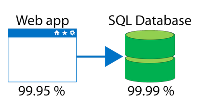
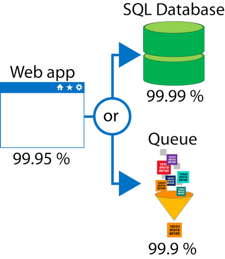

When combining SLAs across different service offerings, the resultant SLA is a called a *Composite SLA*. The resulting composite SLA can provide higher or lower uptime values, depending on your application architecture.

Consider an App Service web app that writes to Azure SQL Database. At the time of this writing, these Azure services have the following SLAs:

- App Service Web Apps is 99.95 percent.
- SQL Database is 99.99 percent.



**Maximum downtime you would expect for this example application**

In the example above, if either service fails the whole application will fail. In general, the individual probability values for each service are independent. However, the composite SLA value for this application is:

```
99.95 percent × 99.99 percent = approx 99.94 percent
```

This means the combined probability of failure value is lower than the individual SLA values. This isn't surprising, because an application that relies on multiple services has more potential failure points.

Conversely, you can improve the composite SLA by creating independent fallback paths. For example, if **SQL Database** is unavailable, you can put transactions into a **Queue** for processing at a later time.



With the design shown in the image above, the application is still available even if it can't connect to the database. However, it fails if both the SQL Database **and** the Queue fail simultaneously. If the expected percentage of time for a simultaneous failure is `0.0001 × 0.001`, i.e. `(1.0 - 0.9999) x (1.0 - 0.999)`, the composite SLA for this combined path would be:

```
Database *OR* Queue = 1.0 − (0.0001 × 0.001) = 99.99999 percent
```

Therefore, the total composite SLA is:

```
Web app *AND* (Database *OR* Queue) = 99.95 percent × 99.99999 percent = ~ 99.95 percent
```

However, there are tradeoffs to using this approach such as, the application logic is more complex, you are paying for the queue, and there may be data-consistency issues which you need to consider.
