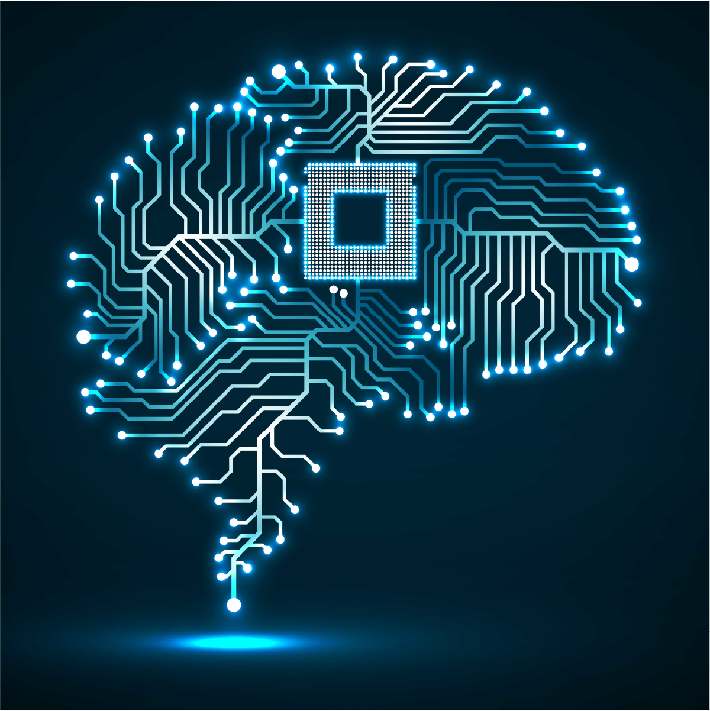

Since the main job of a computer is to compute, the main "brain" (called a microprocessor) on a computer is the "central processing unit" or CPU. There are other chips in a computer all attached to a circuit board called the motherboard. But it's the CPU that does most of the thinking when it comes to how a computer works.

## The Central Processing Unit

All computers need at least one CPU--even a smartwatch. Modern CPUs are built to think about billions of commands per second. This gives them a lot of power to do really hard things in less than a second.

### How a Computer Thinks

All computer problems can be broken down into a very simple language, a digital language: 0 and 1. This means that the computer turns lots of switches on and off very fast. This simple idea was discovered by a man named Alan Turing and his machine is called a Turing Machine.

In many ways, a light switch is a digital machine. The light switch can be on or off. We can tell whether it's on or off just by looking at it. The light switch is simple, but imagine many light switches working together. That's what a computer does.

### Digital Processing

All modern computers are digital machines turning switches--lots of switches--on and off very rapidly to do all the magical things a computer does. It turns those billions of on and off switches into sights, sounds, words, and even motion.

## One More Processor

While the CPU is the main brain in a modern computer, there's another rising star worth talking about. The graphics processing unit (GPU) makes all those cool graphics you see on screen. But it's also very fast. If you thought the CPU was fast, graphics processors are even faster.

GPUs were first designed to create all those wonderful things you see on the screen. Because it had to handle graphic processing, which is very complex, the GPU had to be very fast. So scientists came up with new chips to handle graphics. When things get fast, they also tend to cost more money. This means that graphics chips are used only for special jobs.

Though the GPU had this one job to do at first, scientists started seeing other uses for the GPU. Because of its speed, some people started using the GPU for very complex math problems. Mining something like Bitcoin has been a primary use, but scientists are using GPUs to solve complex problems about the weather, for example.

The GPU will come up in topics about cloud computing. The GPU is a resource many cloud providers are turning to in order to help speed up computing over the internet.
