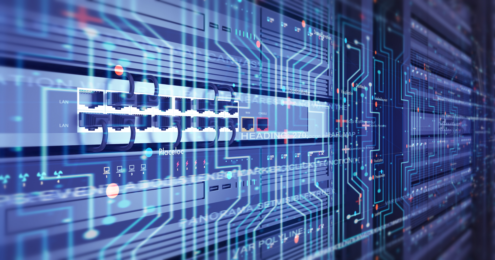

Computers are pretty powerful all by themselves. But things got really cool when humans figured out how to get computers to "talk" to one another. Computers talking with one another by sending data back and forth is called "networking." When a bunch of computers can talk to one another, it's called a network.

## The Network Adapter

Modern computers have these special things inside called "chips" that allow them to talk to each other. These special computer chips are called a network adapter.

The network adapter in a computer is what talks to the other computers. Well, it's one of the parts that does the talking. We'll talk about another part of the computer that handles different types of data later.

## Local Networks

A local network is a set of computers joined together. A router is a special computer that controls who can join and how those computers talk to each other. It's "local" because the network only includes those computers that are allowed to join it.

Think of a local network like your home refrigerator. Only certain people can get food out of it. They have to be allowed in your home and given access to it. It's "local" in that sense. Your grocery store is "open" in that anyone can go in and buy items.

## The Internet

Probably the network most people know about is the internet. You may not have thought about it quite this way before, but the internet is a huge network -- probably the biggest one that exists. The internet makes it easy for people from all over the world to send data to each other and that makes it a network.

### A Special Piece of Hardware

Local networks need a network adapter that enables computers on them to talk. Talking to the internet requires a special part called a modem. A modem works a lot like a local network adapter (in fact, the modem is a kind of network adapter). Modems are found in mobile phones as well as the type of computer your internet service provider (ISP) uses to connect your home to the internet.

### Network Adapters and Modems Working Together

When your library or store provides a "WiFi name and password," they give you access to their local network. When you connect to WiFi, you connect to their network using your network adapter on your phone, tablet, or laptop. Their WiFi connection then "talks to" their modem, and the modem talks to the internet. You can connect to the internet at home this way too.

Some businesses have what are called "open networks." These networks allow you to connect without having to enter a password.

Your mobile phone has both a network adapter and a modem. When you're on WiFi, you're connected to a network adapter that then talks to a modem to get on the internet. When you're mobile and using your phone company's cell network, you're using the modem only on the phone.
