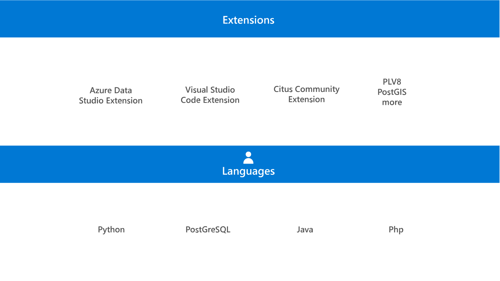

PostgreSQL is a client/server relational database management system (RDMS). PostgreSQL also supports a wide range of extensions, such as the Citus extension in the Azure Cosmos DB for PostgreSQL option. After an extension is loaded into the database, it functions like any built-in feature.

PostgreSQL also has its own query language called pgsql. In addition, PostgreSQL supports procedural languages such as Ruby on Rails.



## Client/server architecture

PostgreSQL is based on a client/server architecture. The server stores, manages, and returns data to client programs. Client programs request data using pgSQL, or one of the procedural languages that PostgreSQL supports, such as PL/pgSQL.

A PostgreSQL session consists of three parts:

- The postmaster
- The client application
- The server

### Postmaster

The Postmaster is the supervisory daemon process that manages a PostgreSQL server. The postmaster daemon manages communication among the various server processes including initializing the server, shutting down the server, handling connection requests, and performing other background processes. In Azure Database for PostgreSQL, you don't have access to the file system, or to the Postmaster process.

### Client applications

Clients run queries and interact with databases on an Azure Database for PostgreSQL server. To run queries, you need a client tool such as Azure Data Studio, DBeaver, pgAdmin, or psql. You'll learn about client tools in the next module.

### Server processes

**Cluster** - a single PostgreSQL server can host multiple user databases. PostgreSQL refers to this collection of databases as a *cluster*. Each database is separate from the other, and users and applications interact with a single database. Users are created at the cluster or server level.

Data for these databases is stored in the cluster's data directory called **PGDATA**. The **PGDATA** data directory includes a file containing the version of PostgreSQL being run, **pg_tblspc** which contains links to tablespaces, and **pg_xlog** which contains the write ahead log files.

> [!NOTE]
> Azure Databases for PostgreSQL is a service which manages storage and the underlying file system. As a user of this server you don't have direct access to the PGDATA directory, or any of its subdirectories.

In addition to the databases you create, there are three system databases:

- **postgres** - the default database. After your server creates, you connect to the postgres database.
- **azure_maintenance** - the database that manages service processes. You don't have direct access to this database.
- **azure_sys** - the Query Store database. You must not modify the **azure_sys** database or its schemas. Changing anything in **azure_sys** prevents Query Store and other performance features from functioning correctly.

**Schemas** - A schema is a named grouping of database objects. Large databases with many objects benefit from organizing objects into schemas. For example, creating a schema for sales related objects, and a schema for client related objects makes it easier to find the correct object.

**Server parameters** - PostgreSQL has several configuration files, which determine how the database engine should work. The main PostgreSQL configuration file is called **postgresql.conf**.

Azure Database for PostgreSQL replaced these configuration files with **Server parameters**, which can be accessed via the Azure postal, or using the Azure CLI.

To view or amend server parameters in the Azure portal:

1. Navigate to your Azure Database for PostgreSQL server.
1. From the left menu, under **Settings**, select **Server parameters**.
1. Use the search bar to filter the list of parameters or select the page number you require.

**Storage** - Azure Database for PostgreSQL manages the data storage for you and is provisioned at the server level. Whether you select Burstable, General purpose, or Memory optimized compute tier, you can use between 32 GB and 16 TB of storage. To provision more storage, navigate to your Azure Database for PostgreSQL server, and from the **Overview** section select your **Configuration**. The **Compute + Storage** section is displayed. Under Storage, and Storage size (in GB) use the slider to select the amount of storage you want to be provisioned.

The amount of storage you provision defines the I/O capacity available to your Azure Database for PostgreSQL server. You can monitor your I/O consumption in the Azure portal or by using Azure CLI commands. The relevant metrics to monitor are [storage limit, storage percentage, storage used, and IO percent](/azure/postgresql/flexible-server/concepts-monitoring).

> [!NOTE]
> You can increase the amount of storage after you have created your Azure Database for PostgreSQL server, but you cannot reduce the amount of storage.

**Tablespaces** - With an on-premises implementation of PostgreSQL you can create **tablespaces** which are linked to the main storage area called PGDATA using the **pg_tblspc** subdirectory. Azure Database for PostgreSQL doesn't support tablespaces: all tables are created in the main storage area.

**System catalogs** - PostgreSQL contains many system tables and views that store information about database objects. For example, **pg_database** returns all databases on a server and **pg_class** stores statistics about tables.

> [!NOTE]
> Azure Database for PostgreSQL allows access to some, but not all system catalogs.

**Extensions** - PostgreSQL supports a range of extensions that extend the core functionality of the database engine. These extensions are made available on a repository called the PostgreSQL Extensions Network (PGXN).

To use a PostgreSQL extension, it must be installed in your database. To install an extension, run the **[CREATE EXTENSION](https://www.postgresql.org/docs/current/static/sql-createextension.html)** command from the psql tool to load the extension into your database. For example:

```sql
SELECT create_extension('postgis');
```

To find out which extensions support Azure Database for PostgreSQL, run the following query:

```sql
SELECT * FROM pg_available_extensions;
```

All Azure Database for PostgreSQL servers include the [**pg_stat_statements** extension](https://www.postgresql.org/docs/current/pgstatstatements.html). This extension is already installed to provide functionality for tracking execution statistics of SQL statements. The server parameter **pg_stat_statements.track** defines what statements are counted by the extension. The options are:

- **Top** - tracks all statements issued directly by clients (default).
- **None** - no statements are tracked.
- **All** - tracks all statements including nested statements, and statements invoked by functions.

> [!NOTE]
> There is performance overhead on the server to log each SQL statement. If you are not actively using **pg_stat_statements**, set this parameter to none. Also note that some third-party monitoring services might rely on **pg_stat_statements**.

**Query optimizer** - PostgreSQL uses a cost-based query optimization method. The parser checks the query syntax and separates the query into different parts. The parser creates a parse tree and passes the query to the rewriter, which applies rules to the query. The planner figures out the best way to execute the query before the query is executed.

**Backend processes** - PostgreSQL process- per-transaction model. When a new user connects, PostgreSQL authenticates the user and creates a backend server process to handle the connection. The client only interacts with the server process when submitting queries and receiving queries result.
