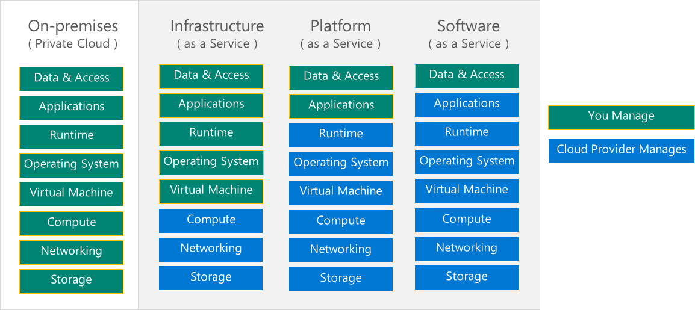

The importance of understanding the **shared responsibility model** is essential for customers who are moving to the cloud. Cloud providers offer considerable advantages for security and compliance efforts, but these advantages do not absolve the customer from protecting their users, applications, and service offerings. 

The shared responsibility model ensures cloud workloads are run securely and in a well-managed way. Depending on the service you are using, the cloud provider is responsible for some aspects of the workload management, and the customer or end user is responsible for other aspects of the workload management, and in some cases, both share a responsibility. 

The following list of cloud service types describes the management responsibilities for the user and the cloud provider as compared to on-premises systems:

- IaaS requires the most user management of all the cloud services. The user is responsible for managing the operating systems, data, and applications.
- PaaS requires less user management. The cloud provider manages the operating systems, and the user is responsible for the applications and data they run and store.
- SaaS requires the least amount of management. The cloud provider is responsible for managing everything, and the end user just uses the software.

> [!div class="checklist"]
> * It is important that cloud users understand what they are responsible for, to ensure their workloads are managed correctly and don't suffer any down time. 

