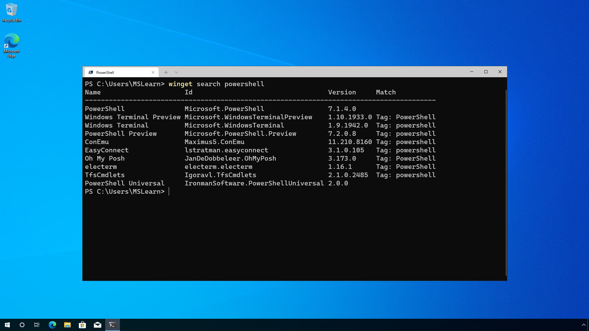
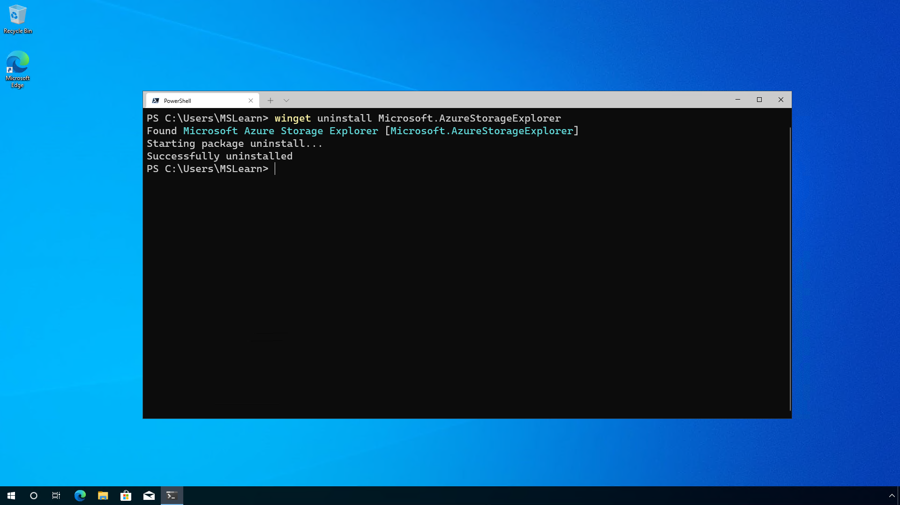

## Find software to install

Windows Package Manager has a large amount of software that you can call on to install on to your computer.  In order, utilize that repository of software one of the first things you can do is utilize the **search** command that is part of Windows Package Manager to identify those software packages.

Opening a command prompt session, or PowerShell session or Windows Terminal window type in the command:

```CMD
winget search
```

Which will show you a list of ALL the software that can be installed.  In order to narrow that down to the software you are looking to install you can use the name of the software, a partial word, or a type of software you are searching for.

An example would be to use:

```CMD
winget search powershell
```

Which would return a list of software relating to PowerShell.  The results display the Name of the software, the ID that is used to uniquely identify each. 

 

## Install software

Using your search results, you will have identified the software that you wish to install.  From the search results you should take a note of the ID, which will be the second column from left.  You will use the to install the correct software you are looking for.

To install the latest generally available version of PowerShell, you would use the command:

```CMD
winget install Microsoft.PowerShell
```

If you wanted to install the Preview version of PowerShell you would use the command:

```CMD
winget install Microsoft.PowerShell.Preview
```

Using the correct ID will ensure that the correct software is installed for you.  If there is any ambiguity, you will be prompted to further filter the install command to an exact application.

#### Installing multiple pieces of software at once

You can install multiple pieces of software at a time within a single command.  Below is an example of installing the [Azure Storage Explorer](https://azure.microsoft.com/features/storage-explorer/), [Visual Studio Code](https://code.visualstudio.com/) and, the [Azure CLI](/cli/azure/) tools:

```CMD
winget install Microsoft.AzureStorageExplorer; winget install Microsoft.VisualStudioCode;  winget install Microsoft.AzureCLI
```

#### Options

The **winget install** has additional options that can be used to help customize the install experience to meet your needs.

| Option  | Description |
|-------------|-------------|  
| **-m, --manifest** |  Must be followed by the path to the manifest (YAML) file. You can use the manifest to run the install experience from a [local YAML file](https://docs.microsoft.com/windows/package-manager/winget/install#local-install). |
| **--id**    |  Limits the install to the ID of the application.   |  
| **--name**   |  Limits the search to the name of the application. |  
| **--moniker**   | Limits the search to the moniker listed for the application. |  
| **-v, --version**  |  Enables you to specify an exact version to install. If not specified, latest will install the highest versioned application. |  
| **-s, --source**   |  Restricts the search to the source name provided. Must be followed by the source name. |  
| **--scope**   |  Allows you to specify if the installer should target user or machine scope. |  
| **-e, --exact**   |   Uses the exact string in the query, including checking for case-sensitivity. It will not use the default behavior of a substring. |  
| **-i, --interactive** |  Runs the installer in interactive mode. The default experience shows installer progress. |  
| **-h, --silent** |  Runs the installer in silent mode. This suppresses all UI. The default experience shows installer progress. |  
| **--locale** | Specifies which locale to use (BCP47 format). |
| **-o, --log**  |  Directs the logging to a log file. You must provide a path to a file that you have the write rights to. |
| **--override** | A string that will be passed directly to the installer.    |
| **-l, --location** |    Location to install to (if supported). |
| **--force** | Overrides the installer hash check. Not recommended. |

## Demonstration

The following video demonstrates the process of installing software using Windows Package Manager on a Windows 10 computer.

 >[!VIDEO https://www.microsoft.com/videoplayer/embed/RWLCL0]

## Uninstall software

Uninstalling software from your computer using Windows Package Manager is similar to installing software.  The command begins with **winget uninstall** and then the software name or ID is added to uninstall it.

If you wished to uninstall the Azure Storage Explorer tool, you should issue the command:

```CMD
winget uninstall Microsoft.AzureStorageExplorer
```
 

#### Options

The **winget uninstall** has additional options that can be used to help customize the uninstall experience to meet your needs.

| Option      | Description |
|-------------|-------------|  
| **-m, --manifest** |   Must be followed by the path to the manifest (YAML) file. You can use the manifest to run the uninstall experience from a [local YAML file](https://docs.microsoft.com/windows/package-manager/winget/install#local-install). |
| **--id**    |  Limits the uninstall to the ID of the application.   |  
| **--name**   |  Limits the search to the name of the application. |  
| **--moniker**   | Limits the search to the moniker listed for the application. |  
| **-v, --version**  |  Enables you to specify an exact version to uninstall. If not specified, latest will uninstall the highest versioned application. |  
| **-s, --source**   |  Restricts the search to the source name provided. Must be followed by the source name. |  
| **-e, --exact**   |   Uses the exact string in the query, including checking for case-sensitivity. It will not use the default behavior of a substring. |  
| **-i, --interactive** |  Runs the uninstaller in interactive mode. The default experience shows uninstaller progress. |  
| **-h, --silent** |  Runs the uninstaller in silent mode. This suppresses all UI. The default experience shows uninstaller progress. |  
| **-o, --log**  |  Directs the logging to a log file. You must provide a path to a file that you have the write rights to. |

---