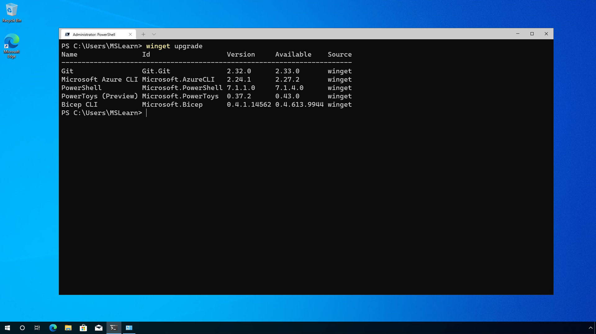
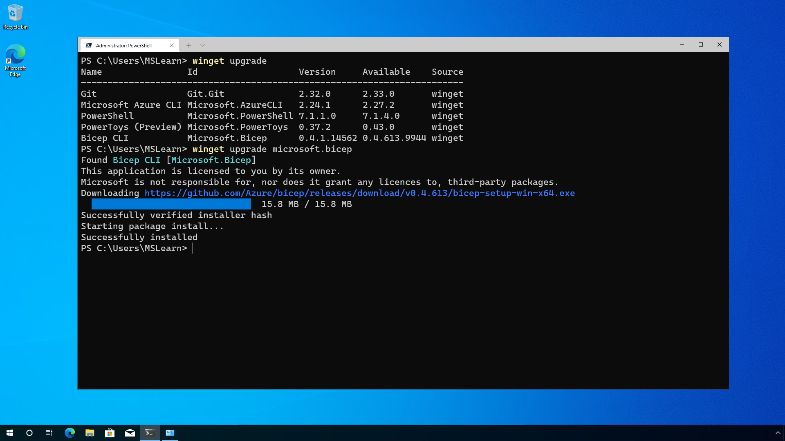

## Which software needs an update?

Windows Package Manager has a command that can help identify which pieces of software have an update available.  The **winget upgrade** command will list out the software that is available for an upgrade through Windows Package Manager.

 

In the above example we can see the software that is installed, the version installed and the newer version that can be installed.

## Update individual software

Once you've determined which software has updates available, you can update some or all of those items. 

For example, you could upgrade the [Microsoft Bicep](/azure/azure-resource-manager/bicep/overview) version you have installed and ignore the rest because you are working on a project that calls for the latest version of Bicep and you need to address that issue as soon as possible.

In that case we would issue the command:

```CMD
winget upgrade microsoft.bicep
```

 

Which would result in the latest version being installed of Microsoft Bicep.

You can also update to a specific version if you don't want to jump to the latest version.  [Microsoft PowerToys](/windows/powertoys/) has several versions available, so to skip to a newer version than is installed but not quite the latest version you can use the following command:

```CMD
winget upgrade microsoft.powertoys -v 0.41.3
```

## Update all software

To update all the software to the latest version, run the command:

```CMD
winget upgrade --all
```

Issuing the above command will instruct Windows Package Manager to update all pieces of software that has an available update.

This is a great command that you can use on regular intervals to ensure you keep your software up to date.