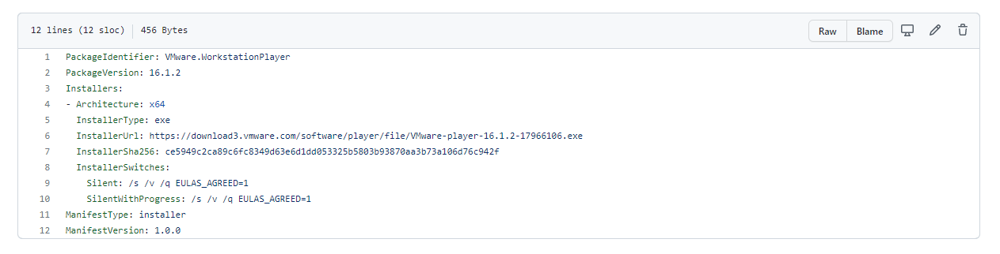
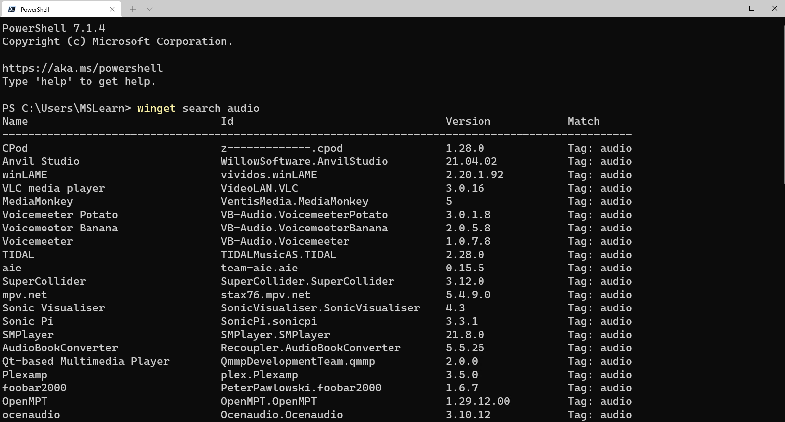
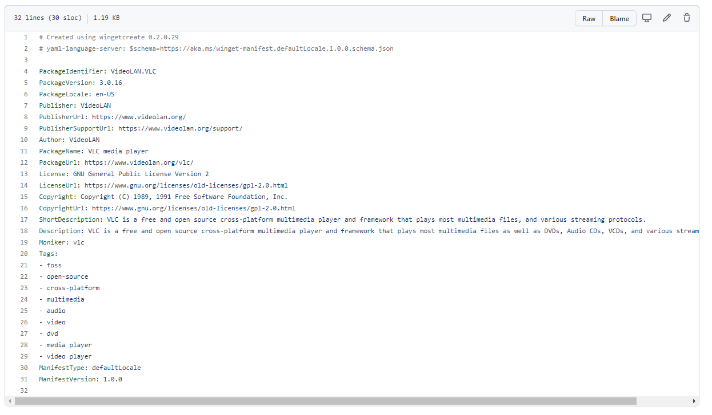
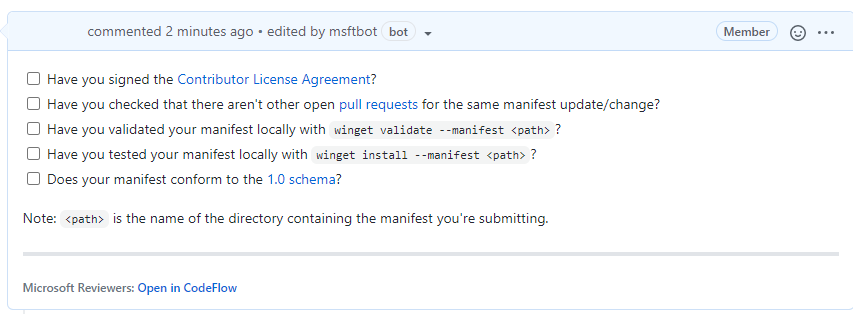

## Getting involved

If you’ve ran the **winget search \<somepackage\>** command and not found the package or piece of software that you want to install, then you can help to add it to the repository to help you and others in the future.
First, you need to check the following things:
-	GitHub account
-	Windows Package Manager currently supports installers in the following formats: MSIX, MSI, and EXE, if the piece of software you want to install doesn’t have one of those kinds of installers it can’t be added to the repository.
-	If the software comes in MSIX, MSI or EXE format it’s worth checking to see if someone else has already submitted it for consideration, you can do that by checking the current [Pull Requests being worked on within the Community Repository](https://github.com/microsoft/winget-pkgs/pulls).
-	If the software comes in MSIX, MSI or EXE format and someone else hasn’t already submitted it you need to make sure you have both the Windows Package Manager and Windows Package Manager Manifest Creator installed on your machine.

Now that checklist has been completed, it’s time to start to build the manifest files needed.

You can start from scratch creating your own manifest files, however there is a tool that can help you with the process that can make the whole process a lot easier.  The tool is called [Windows Package Manager Manifest Creator](https://github.com/microsoft/winget-create).  It can be installed from Windows Package Manager with this command: 


```CMD
winget install microsoft.wingetcreate
```

## Getting started

To kick start you should enter the command **wingetcreate new**

The tool will prompt you for the URL or URLs of the software package, this should be a publicly accessible URL and not something stored locally by yourself.

The tool will start to query the file and pull out some information. It will start by suggesting a package identifier, package version, default language, the architecture the package will install on (think x86, x64, etc.), publisher name, package name, package license and a description for the package.  All this information helps people find and install the software.

### Custom silent switches

If the piece of software, you are trying to package up requires a bespoke install switch to make it install silently without any user input you can configure the Windows Package Manager Manifest Creator tool should prompt you for that information, but equally you can manually edit that information within the *installer.yaml* file.

If we take the VMware Workstation Player as an example, we can see within its installer.yaml file it has a couple of configuration lines:

 [](../media/vmware-installer-file.png#lighbox)

### Tags

Another thing that can be done when submitting is adding in tags in your manifest files.  Tags will help packages/software be found when folks are searching through the winget search command.



Below is a screenshot of what the tags input looks like within the yaml file: 

[](../media/videolan-yaml-tags.png#lightbox)

These tags help expand the search results beyond the software maker or name of the software.

### Validating and testing

Now that you’ve setup the manifest files it’s time to validate them and test they work as they should before you are ready to submit to the repository.

The first thing to do is validate the manifest files, it will check the syntax and configures it confirms to the standards that it should.  If you’ve went through the **wingetcreate** new process and made no manual changes to the files, then it should pass validation.  However, if you have made some manual changes then there might be changes you need to make to pass the validation test.

The command to use to validate your manifest is:

```CMD
winget validate –manifest <manifest path>
```

The path to your manifest file will vary depending on your setup, however it should have been displayed to you at the end of the **wingetcreate** process.

Once you’ve had the output from the validate command and everything is okay, you can now move on to testing the manifest installs the package/piece of software that you’ve set it up to do. You might have to test this on a separate machine or utilize the [Windows Sandbox environment](/windows/security/threat-protection/windows-sandbox/windows-sandbox-overview) if you already have it installed to test this properly.

The command you need to use is **winget install –manifest \<manifest path\>**.

This should complete without any issue and install the software as it should.  However, if there are any issues, then you will need to look at resolving them and going through the process again until it works as expected.

### Submitting the manifest

Now the manifest is validated and tested it’s time to submit your contribution to the Microsoft team to check and merge into the repository for the rest of the community to take advantage of.  

The first thing to do is set up a Token, that is a GitHub personal access token that can help avoid you having to put your password into the command line for authentication to GitHub.  If you haven’t set up a token before you can use this great guide from the GitHub team – [Creating a personal access token](https://docs.github.com/github/authenticating-to-github/keeping-your-account-and-data-secure/creating-a-personal-access-token).

Once you have the token you need to store it into your command-line tool for winget to use, you do this with the command:

```CMD
wingetcreate –store <token> 
```

You are now ready to submit your creation to the Microsoft team for review.  To do this you should issue the command:

```CMD
wingetcreate submit <path to manifest>
```

This will create a repository store within you GitHub profile and then create a pull request on the [Windows Package Manager repository](https://github.com/microsoft/winget-pkgs).

When that command is complete, it will open a browser session to the pull request (PR). Here you will be asked to complete a checklist.

 

It will also start to kick off some automated tests, validating the manifest and testing it does what it should do.  You can close your browser and check on this later, or you can watch it update its progress.

If any issues are detected you will have to address them, otherwise someone from the Windows Package Manager will check over the submission and either approve or give feedback on improvements.

The team do have SLAs that they are working to, to ensure that your submissions are reviewed within a timely manner.

---