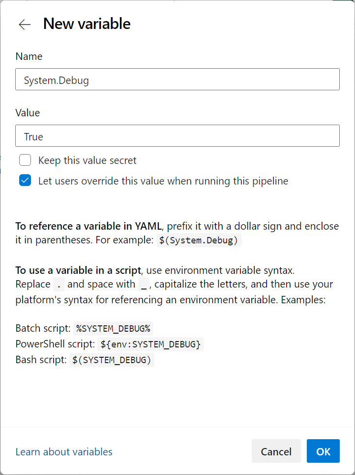

When building and deploying applications with Azure Pipelines, it's crucial to ensure pipeline agents don't inadvertently log sensitive information like passwords, API keys, or other secrets. It can happen if sensitive information is printed to the console during the build or deployment process, leading to serious security risks.

In this unit, learn and review how to configure Azure Pipelines and YAML pipelines to restrict agent logging of secrets using best practices and secure methods.

## Log of secrets

Azure Pipelines attempts to scrub secrets from logs wherever possible. This filtering is on a best-effort basis and can't catch every way in which secrets can be leaked. Avoid echoing secrets to the console, using them in command line parameters, or logging them to files.

## Use the audit service

Many pipeline events are recorded in the Auditing service. Review the audit log periodically to ensure no malicious changes have slipped past. Visit `https://dev.azure.com/ORG-NAME/_settings/audit` to get started.

## Ways to restrict agent logging of secrets

When working with Azure Pipelines, it's common to use service connections, which add a new layer of security for sensitive information such as usernames, passwords, and API keys. Without service connections or other best practices, pipelines are left unsecured and their information can be easily accessed and exposed in pipeline logs, leading to potential data breaches and security risks.

By following these suggestions and the ones we covered in other units, you can ensure that your sensitive information is kept safe and your pipeline remains a trusted and reliable tool for your organization.

- **Use Azure Key Vault:** You can store sensitive information, such as passwords and API keys, separately from your pipeline in Azure Key Vault. You can reference these secrets in your pipeline without revealing them in the pipeline logs. To use Azure Key Vault, you can create a new Azure Key Vault instance, add your secrets to the vault, and then reference them in your pipeline using the Azure Key Vault task.
- **Use Variable Groups:** Variable Groups are a convenient way to store and manage variables used across multiple pipelines. You can create a new variable group, add sensitive information as variables, and then reference them in your pipeline. By marking these variables as "secret," you can ensure they aren't displayed in the pipeline logs.
- **Use Environment Variables:** You can also use environment variables to store your sensitive information. Environment variables are a way to store data that can be accessed by processes running on the same machine. In Azure Pipelines, you can define pipeline, job, or task environment variables. By marking these variables as "secret," you can ensure they aren't displayed in the pipeline logs.

Regardless of your chosen method, it's crucial to ensure that your sensitive information isn't easily accessible in your pipeline logs.

## Use agent-level logging restrictions

Another way to restrict agent logging of secrets is to use agent-level logging restrictions. These restrictions can prevent specific commands or log levels from being printed to the console, which can further reduce the risk of exposing sensitive information.

To use agent-level logging restrictions, follow these steps:

1. Edit your pipeline.
2. Select Variables.
3. Add a new variable with the name `System.Debug` and value true.
    
4. Save the new variable.
5. Run your pipeline to see the logs.

The setting `System.Debug=False` turns off verbose logs for all runs. With the Enable system diagnostics checkbox, you can also configure verbose logs for a single run. For more information, see [Review logs to diagnose pipeline issues.](https://learn.microsoft.com/azure/devops/pipelines/troubleshooting/review-logs)

## Use the issecret parameter

The `issecret` parameter allows you to mask secrets in the agent logs.

To set a variable as a script with a logging command, you need to pass the `issecret` flag.

When `issecret` is set to true, the value of the variable will be saved as secret and masked out from log.

Set the secret variable `mySecretVal`.

```YAML
- powershell: |
    Write-Host "##vso[task.setvariable variable=mySecretVal;issecret=true]secretvalue"
```

Get the secret variable mySecretVal.

```YAML
- powershell: |
    Write-Host "##vso[task.setvariable variable=mySecretVal;issecret=true]secretvalue"
- powershell: |
    Write-Host $(mySecretVal)
```

Output of PowerShell variable.

```CMD
***
Finishing: Powershell

```

## Challenge yourself

Create a new YAML pipeline with a task that logs a secret variable to the agent logs. Configure the pipeline to mask the secret in the logs by using the `issecret` parameter.

For more information about secrets, see:

- [Set secret variables.](https://learn.microsoft.com/azure/devops/pipelines/process/set-secret-variables)
- [How to securely use variables and parameters in your pipeline.](https://learn.microsoft.com/azure/devops/pipelines/security/inputs/)
- [Plan how to secure your YAML pipelines.](https://learn.microsoft.com/azure/devops/pipelines/security/approach/)
- [Recommendations to securely structure projects in your pipeline.](https://learn.microsoft.com/azure/devops/pipelines/security/projects/)
