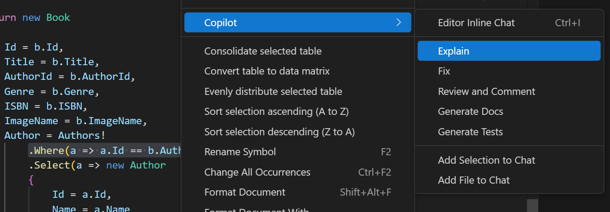

Developers use GitHub Copilot to brainstorm new apps or features, explore coding tools and techniques, evaluate issues and potential fixes, and explain complex or unfamiliar code. GitHub Copilot can help you understand the purpose and behavior of your code, making it easier to work with and maintain.

Each of the following GitHub Copilot features can be used to analyze or explain code:

- Chat view: Use the Chat view to ask questions about your code projects, coding topics, and general technology concepts.
- Inline chat: Start an inline chat session directly from the editor to ask about specific code sections.
- Smart actions: Run the Explain smart action to explain selected code without even having to write a prompt.
- Quick Chat: Ask a quick question and get back into what you're doing.

## Use the Chat view in Ask mode to analyze and explain code

The Chat view in Visual Studio Code is used to manage chat conversations between you and the AI pair programmer. By default, the Chat view is located in the Secondary Side Bar on the right side of the Visual Studio Code window. When you submit a prompt, the AI pair programmer responds with natural language descriptions, code snippets, and other relevant information. Responses are displayed in the Chat view.

To access the Chat view, you can select the **Toggle Chat** button (Copilot icon), select **Open Chat** from the GitHub Copilot menu, or use the **Ctrl+Alt+I** keyboard shortcut. The Chat view defaults to Ask mode, but retains the most recently selected mode when you toggle between open and hidden.

You can use the Chat view in Ask mode for a wide range of topics. For example:

- Ask questions about coding and technology concepts ("What is a linked list?", "top 10 popular web frameworks")
- Brainstorm ideas on how to best solve a coding problem ("How to add auth to my project?")
- Explain a block of code ("@workspace /explain", "What does this code do?")
- Propose code fixes ("@workspace /fix", "This method gives a FileNotFoundException")
- Ask about VS Code settings (@vscode how do I disable the minimap?)

The Ask mode supports the following interface features:

- Chat view toolbar: The Chat view toolbar is located in the top right corner of the Chat view. You can use the toolbar to manage the chat history, start a new chat, open the Chat view in another location, or hide the Chat view. Hover your mouse pointer over the toolbar button icons to see a description.

- Chat response area: The Chat response area is the space below the Chat view toolbar where GitHub Copilot displays responses. Responses include code suggestions, explanations, interactive elements, and other information related to your prompt.

- Add Context button: The Add Context button is located in bottom section of the Chat view. You can use this button search for resources that add context to Chat session. The resources can be anything from internal project files to public repositories on GitHub that are external to your organization.

- Ask Copilot: The Ask Copilot text box is where you enter your prompts. When using the Ask mode, prompts can include chat participants, slash commands, and chat variables.

    In Ask mode, you can use chat participants to specify the context of your questions. For example, you can use `@workspace` to indicate that the context is your workspace files.

- Chat with Extension button: The Chat with Extension button is located below the Ask Copilot textbox. GitHub Copilot Extensions are a type of GitHub App that integrates the power of external tools into GitHub Copilot Chat. You can use this button to select from a list of Copilot Extensions. The default extensions provide a combination of Chat participants and Slash commands that provide context for your prompts.

- Start Voice Chat button: The Start Voice Chat button is located below the Ask Copilot textbox. You can use this button to enable or disable voice interactions with GitHub Copilot. When voice interactions are enabled, you can use your voice to ask GitHub Copilot questions.

- Chat Mode menu: The Chat Mode dropdown menu is located to the right of the Voice and Extension buttons. You can use this menu to switch between Ask, Edit, and Agent modes.

- Pick Model menu: The Pick Model menu is located to the right of the Chat Mode menu. You can use this button to select the model that GitHub Copilot uses to generate code suggestions. The default mode is GPT-4o. Model selections may be limited based on your GitHub Copilot subscription, your GitHub Copilot settings, and the models available in your region.

- Send and Dispatch menu: The Send and Dispatch menu is located to the right of the Pick Model menu. You can use this button to submit your prompt to GitHub Copilot and receive a response. The menu includes several options for how your prompt is submitted.

## Use inline chat to analyze and explain code

The inline chat feature allows you to start a chat session directly from the editor. The inline chat is useful when you want to ask questions about specific code (sections, lines, or variables) without leaving the editor. Responses are displayed in the inline chat window.

To access the inline chat, you can select **Editor Inline Chat** from the GitHub Copilot menu, or use the **Ctrl+I** keyboard shortcut. Use the Escape key to close the inline chat window.

You can use the inline chat to inquire about general coding topics, but it's best suited for asking questions to the code in the active editor. For example:

- Explain a block of code ("/explain How are the parameters of the XYZ method used?", "/explain #selection")
- Examine an issue ("/explain Why does this code throw an exception?", "/explain How can I fix this issue?")
- Ask questions about coding or technology concepts ("/explain Can LINQ be used to improve readability?")

The inline chat supports the following features:

- Ask Copilot: The Ask Copilot text box is where you enter your prompts. When using the inline chat, prompts can include slash commands and chat variables, but chat participants are not supported.

- Chat with Extension button: The Chat with Extension button is located below the Ask Copilot textbox. GitHub Copilot Extensions are a type of GitHub App that integrates the power of external tools into GitHub Copilot Chat. You can use this button to select from a list of Copilot Extensions. The default extensions provide a combination of Chat participants and Slash commands that provide context for your prompts.

- Start Voice Chat button: The Start Voice Chat button is located to the right of the Chat with Extension button. You can use this button to enable or disable voice interactions with GitHub Copilot. When voice interactions are enabled, you can use your voice to ask GitHub Copilot questions or request code suggestions.

- Pick Model menu: The Pick Model menu is located to the right of the Chat Mode menu. You can use this button to select the model that GitHub Copilot uses to generate code suggestions. The default mode is GPT-4o. Model selections may be limited based on your GitHub Copilot subscription, your GitHub Copilot settings, and the models available in your region.

- Send and Dispatch menu: The Send and Dispatch menu is located to the right of the Pick Model menu. You can use this button to submit your prompt to GitHub Copilot and receive a response. The menu includes several options for how your prompt is submitted.

## Use the Explain smart action to explain code

The Explain smart action is used to explain code that's open in the editor. You can narrow the focus by selecting a code block, a single code line, or a variable. When there's no code selected, the explanation refers to the active file. The Explain smart action displays responses in the Chat view.

To access the Explain smart action, you can right-click in the active code editor, select **Copilot**, and then select **Explain**.

## Use the Quick Chat window to analyze and explain code

The Quick Chat feature allows you to ask a quick question and get back into what you're doing. The Quick Chat feature is useful when you want to ask a quick question without influencing the chat history that you're building in the Chat view. Responses are displayed in the Quick Chat window.

To access the Quick Chat window, you can select **Quick Chat** from the GitHub Copilot menu, or use the **Ctrl+Shift+Alt+L** keyboard shortcut.

The Quick Chat windows supports the same Context features provided by the Chat view in Ask mode, but it doesn't provide a way to manage the chat history. The Quick Chat window is designed for quick questions and answers, so it doesn't include all of the features provided by the Chat view.

You can use the Quick Chat for the same types of questions as the Chat view in Ask mode. However, the Quick Chat is best suited for quick questions that aren't part of a larger conversation.

## Summary

GitHub Copilot provides several features that can be used to analyze and explain code. The Chat view, inline chat, Explain smart action, and Quick Chat window all provide ways to ask questions about your code projects, coding topics, and general technology concepts. By using these features, you can gain a better understanding of your code and improve your coding skills.
