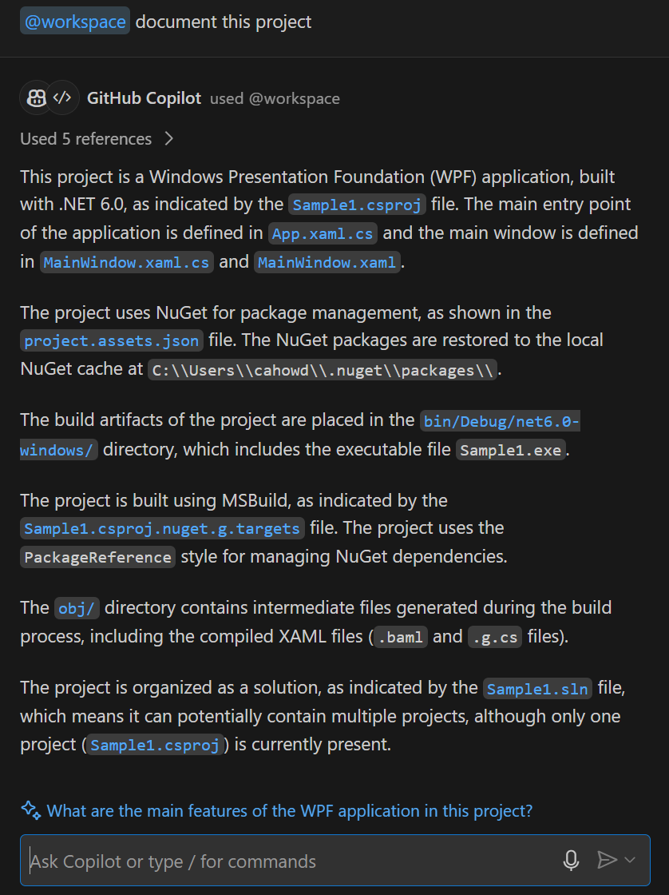
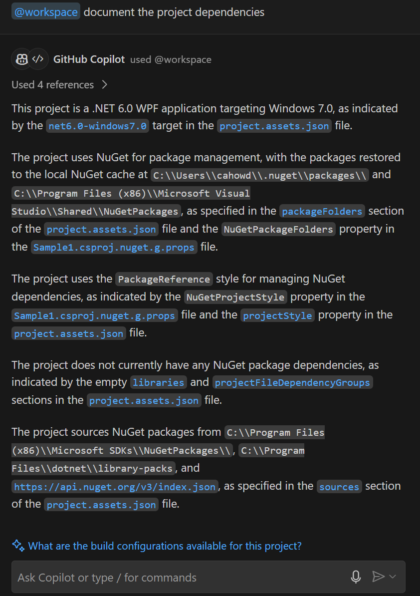

Creating documentation is an important part of software development. Inline documentation helps developers understand the codebase, its purpose, and how to use it. Project documentation provides interested parties with information that's essential for understanding the project's scope and purpose.

Project documentation often includes the following sections:

- **Project Overview**: A high-level summary of the project, its purpose, and its goals.
- **Project Requirements**: A list of the project's requirements, including functional and nonfunctional requirements.
- **Project Constraints**: Any constraints that affect the project, such as time, budget, or technical constraints.
- **Project Dependencies**: A list of the project's dependencies, including libraries, frameworks, and other components that the project relies on.
- **Project Summary**: A brief summary of the project, its purpose, and its goals.

In this exercise, you use GitHub Copilot Chat to generate project documentation for the `APL2007M2Sample1` project.

> [!IMPORTANT]
> Always review the documentation generated by GitHub Copilot. You need to verify accuracy and completeness. The documentation generated by GitHub Copilot is a starting point. You may need to add, remove, or modify the content to meet the specific needs of your project.

### Generate project documentation for the APL2007M2Sample1 project

Project documentation can be generated in Visual Studio Code using the Chat view and `@workspace` participant. You can include natural language descriptions to generate specific sections of the project documentation, such as the project overview, requirements, constraints, dependencies, and summary. You can also use GitHub Copilot Chat to generate specific types of documentation files, such as a `readme.md` file.

1. Ensure that you have the `APL2007M2Sample1` project open in Visual Studio Code.

1. On the Visual Studio Code activity bar, select **Chat**.

1. In the Chat view, to generate documentation for the workspace, enter the following prompt:

    ```output
    @workspace document this project
    ```

1. Take a minute to review the project documentation generated for the `APL2007M2Sample1` project.

    The response generated by Copilot Chat should be similar to the following information:

    

    Notice that the suggested project documentation is similar to the project explanation generated in the previous unit.

    By appending prompts like "document the project constraints" or "document the project dependencies," you can get detailed information about the project.

1. In the Chat view, to generate documentation that describes the project dependencies, enter the following prompt:

    ```output
    @workspace document the project dependencies
    ```

1. Take a minute to review the project dependencies documentation.

    The response generated by Copilot Chat should be similar to the following information:

    

    GitHub Copilot Chat can help you document any aspect of your projects. You can use the Chat view to generate documentation for specific files, classes, or functions within the project. The size and complexity of the project helps determine the level of detail required.

    If time permits, use the Chat view to generate documentation for the following project sections:

    - Project requirements
    - Project constraints
    - Project architecture
    - Project design
    - Project testing
    - Project deployment
    - Project summary

    You can tailor the project documentation generated by Copilot Chat to the specific needs of your project and its stakeholders.

1. In the Chat view, to generate a README for the `APL2007M2Sample1` project, enter the following prompt:

    ```output
    @workspace generate a readme document that can be used as a repo description
    ```

1. Take a minute to review the README generated for the `APL2007M2Sample1` project.

    

    The README file content generated by Copilot Chat provides a high-level overview of the project with several sections that are often included in this type of file.

    You can adjust the prompt to specify the README sections preferred by your organization. You can also write individual prompts to generate specific sections of a README document.

    > [!NOTE]
    > If you want the README document formatted as a markdown file, you can enter a prompt that's similar to the following prompt: `generate readme project documentation formatted using a raw markdown format`.

### Summary

In this exercise, you used GitHub Copilot Chat to generate project documentation for the `APL2007M2Sample1` project. By using the Chat view and the `@workspace` participant, you were able to generate documentation for the project overview, requirements, constraints, dependencies, and summary. You also generated a README file for the `APL2007M2Sample1` project. By using Copilot Chat to generate project documentation, you can create a high-level overview that helps other developers understand the project and its goals. Remember to review the documentation generated by Copilot Chat to ensure accuracy and completeness.
