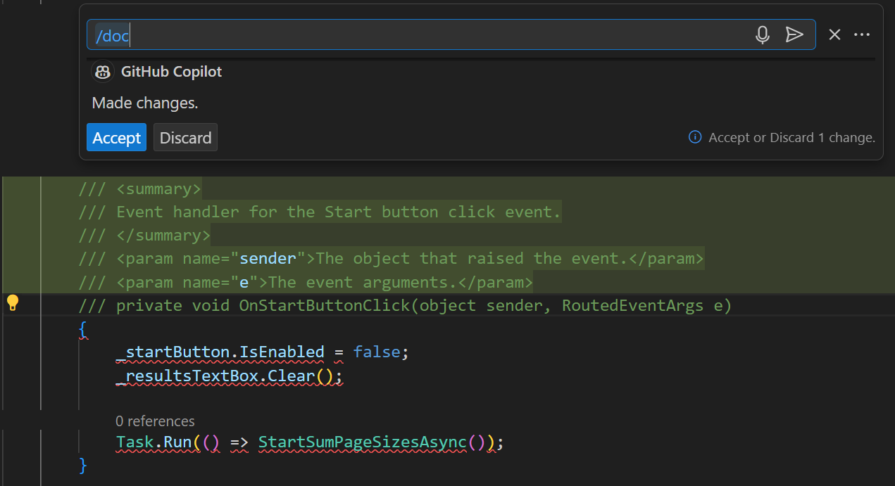
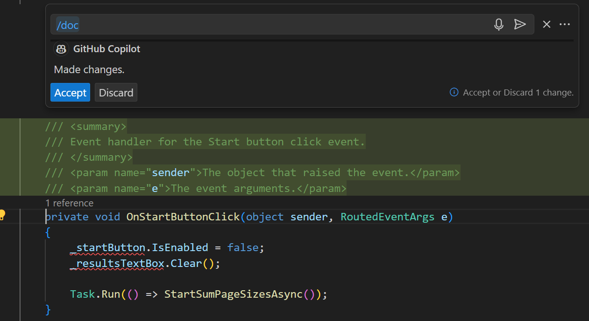
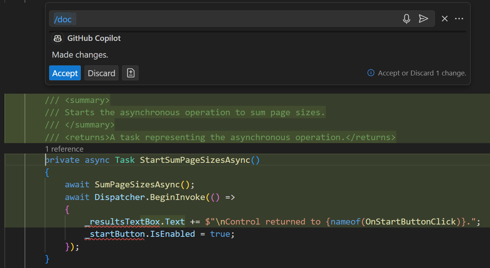

Documenting your code is an important aspect of the software development process. Inline documentation (code comments) help developers understand the codebase, its purpose, and how to use it.

GitHub Copilot Chat can help you document your code quickly and accurately. You have a few options for generating inline documentation using GitHub Copilot Chat:

- Construct your own natural language prompt that can be used to generate specific documentation.
- Use the `/doc` command during an inline chat session to generate comments for selected code.
- Use the **Generate Docs** smart action to generate comments for selected code.

Properly documenting your code creates a more readable and maintainable codebase that's easier for other developers to understand and work with.

### Generate inline code documentation using the Chat view

In this exercise, you use GitHub Copilot Chat to generate inline code documentation for the `APL2007M2Sample1` project.

Use the following steps to complete this section of the exercise:

1. Ensure that you have the `APL2007M2Sample1` project open in Visual Studio Code.

1. Open the `MainWindow.xaml.cs` file.

1. Select all of the code starting from the namespace declaration to the end of the file.

1. Open the Chat view.

1. To see how GitHub Copilot Chat would document the selected code, enter the following prompt:

    ```output
    @workspace #selection generate inline code documentation for the selected code
    ```

1. Take a minute to review the suggested code documentation.

    The generated response should look similar to the following code sample:

    ```csharp
    namespace ParallelAsyncExample
    {
        public partial class MainWindow : Window
        {
            // HttpClient instance to make web requests
            private readonly HttpClient _client = new HttpClient { MaxResponseContentBufferSize = 1_000_000 };
    
            // List of URLs to process
            private readonly IEnumerable<string> _urlList = new string[]
            {
                // ...
            };
    
            // Event handler for start button click
            private void OnStartButtonClick(object sender, RoutedEventArgs e)
            {
                _startButton.IsEnabled = false;
                _resultsTextBox.Clear();
    
                // Start the asynchronous operation
                Task.Run(() => StartSumPageSizesAsync());
            }
    
            // Method to start the asynchronous operation and update the UI when it's done
            private async Task StartSumPageSizesAsync()
            {
                await SumPageSizesAsync();
                await Dispatcher.BeginInvoke(() =>
                {
                    _resultsTextBox.Text += $"\nControl returned to {nameof(OnStartButtonClick)}.";
                    _startButton.IsEnabled = true;
                });
            }
    
            // Method to process all URLs and sum the sizes of the returned pages
            private async Task SumPageSizesAsync()
            {
                var stopwatch = Stopwatch.StartNew();
    
                // Create a task for each URL
                IEnumerable<Task<int>> downloadTasksQuery =
                    from url in _urlList
                    select ProcessUrlAsync(url, _client);
    
                Task<int>[] downloadTasks = downloadTasksQuery.ToArray();
    
                // Wait for all tasks to complete and sum the results
                int[] lengths = await Task.WhenAll(downloadTasks);
                int total = lengths.Sum();
    
                await Dispatcher.BeginInvoke(() =>
                {
                    stopwatch.Stop();
    
                    _resultsTextBox.Text += $"\nTotal bytes returned:  {total:#,#}";
                    _resultsTextBox.Text += $"\nElapsed time:          {stopwatch.Elapsed}\n";
                });
            }
    
            // Method to process a single URL
            private async Task<int> ProcessUrlAsync(string url, HttpClient client)
            {
                try
                {
                    // Download the page and get its size
                    byte[] byteArray = await client.GetByteArrayAsync(url);
                    await DisplayResultsAsync(url, byteArray);
                    return byteArray.Length;
                }
                catch (Exception ex)
                {
                    // Handle any exceptions
                    await Dispatcher.BeginInvoke(() =>
                    {
                        _resultsTextBox.Text += $"\nError downloading {url}: {ex.Message}\n";
                    });
                    return 0; // Return 0 to indicate failure
                }
            }
    
            // Method to display the results for a single URL
            private Task DisplayResultsAsync(string url, byte[] content) =>
                Dispatcher.BeginInvoke(() =>
                    _resultsTextBox.Text += $"{url,-60} {content.Length,10:#,#}\n")
                          .Task;
    
            // Dispose the HttpClient when the window is closed
            protected override void OnClosed(EventArgs e) => _client.Dispose();
        }
    }
    ```

    The response includes suggested code comments and *a portion* of the associated code. Some of your code may be omitted for brevity. You could manually move code comments into the actual code file.

    Inline chat provides a more direct approach for adding comments to your code.

### Generate inline code documentation using inline chat

1. Scroll to the top of the `MainWindow.xaml.cs` file.

1. Select the `OnStartButtonClick` method.

1. To open an inline chat, press `Ctrl` + `I`.

1. To generate inline documentation for the `OnStartButtonClick` method, enter the following prompt:

    ```output
    /doc
    ```

1. Take a minute to review the code documentation generated.

    

    Notice that the suggested documentation for the `OnStartButtonClick` method includes a summary and descriptions of the two parameters. When a method includes a return value, a description of the return value would also be included.

    > [!IMPORTANT]
    > Always review the suggested updates to your code before accepting. In the screenshot showing the generated code documentation, the method declaration has been commented out. If you discover an issue in a suggested code update, you can either discard the update or attempt to correct the issue before accepting the suggested code update.

1. If your suggested update comments out the method declaration, position the cursor on the code line, and then use the Backspace key to remove the comment characters.

    After you backspace over the comment characters, the method declaration should be restored.

    

    Once you're satisfied with the suggestion, you can add the generated comments to your code.

1. To insert the generated documentation into your code, select **Accept**.

    You can always select **Discard** if you want to reject the suggested update.

### Generate inline code documentation using the **Generate Docs** smart action

The **Generate Docs** smart action is another way to generate inline code documentation. You can use this smart action to generate comments that describe the selected code.

Use the following steps to complete this section of the exercise:

1. In the Visual Studio Code editor, select the `StartSumPageSizesAsync` method.

1. Right-click the selected code block, select **Copilot**, and then select **Generate Docs**.

1. Take a minute to review the suggested code comments.

    If necessary, edit the suggested update.

    

    Notice that the **Generate Docs** smart action and inline chat produce similar results.

1. Once your review is complete, select **Discard**.

    Rather than adding inline comments to each method individually, you can generate comments for the entire class.

1. Select all of the methods *inside* the `MainWindow` class.

1. Right-click the selection, select **Copilot**, and then select **Generate Docs**.

    Wait for the documentation to be generated.

1. Review the suggested changes.

    Notice that the generated documentation includes comments for each of the methods.

    > [!IMPORTANT]
    > If you find issues in the generated documentation, modify the suggested changes before continuing.

1. Select **Accept**.

    Each of the methods in the `MainWindow` class now includes generated comments.

### Summary

In this exercise, you used GitHub Copilot Chat to generate inline code documentation for the `APL2007M2Sample1` app. You learned how to generate inline code documentation using the Chat view, inline chat, and the **Generate Docs** smart action. By generating code comments, you can create a more readable and maintainable codebase that's easier for other developers to understand and work with. Inline code documentation is an essential part of software development that helps developers understand the codebase, its purpose, and how to use it.
