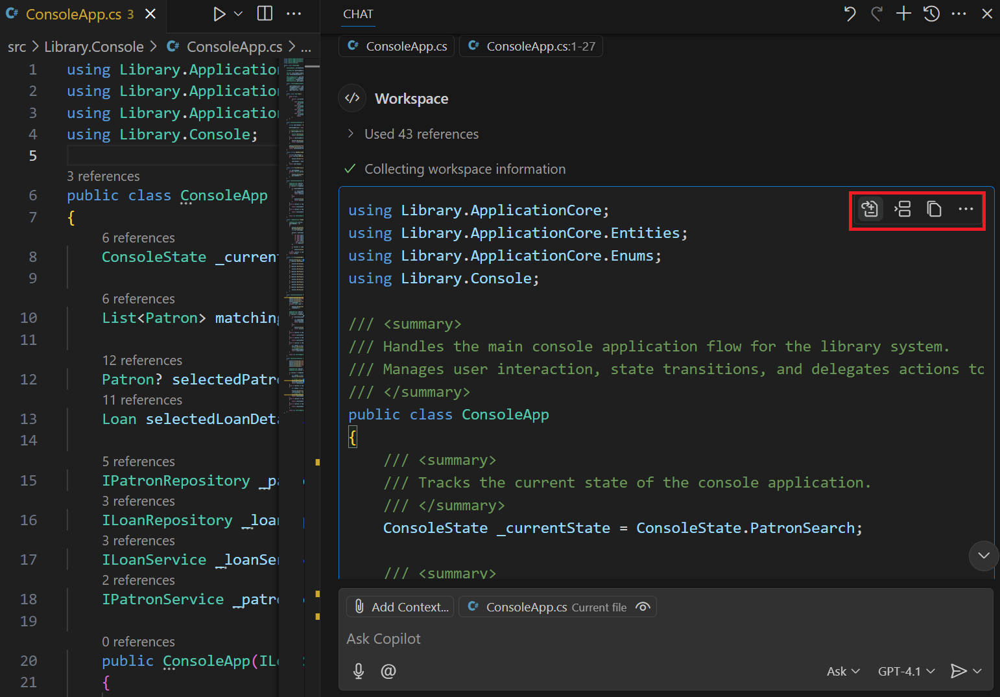
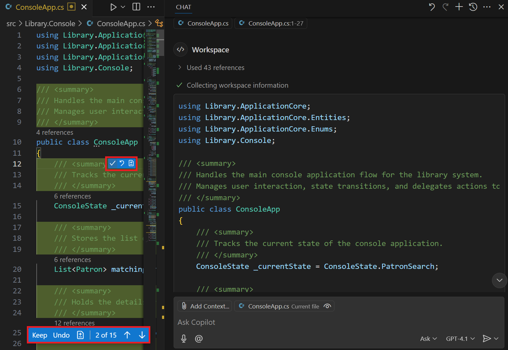
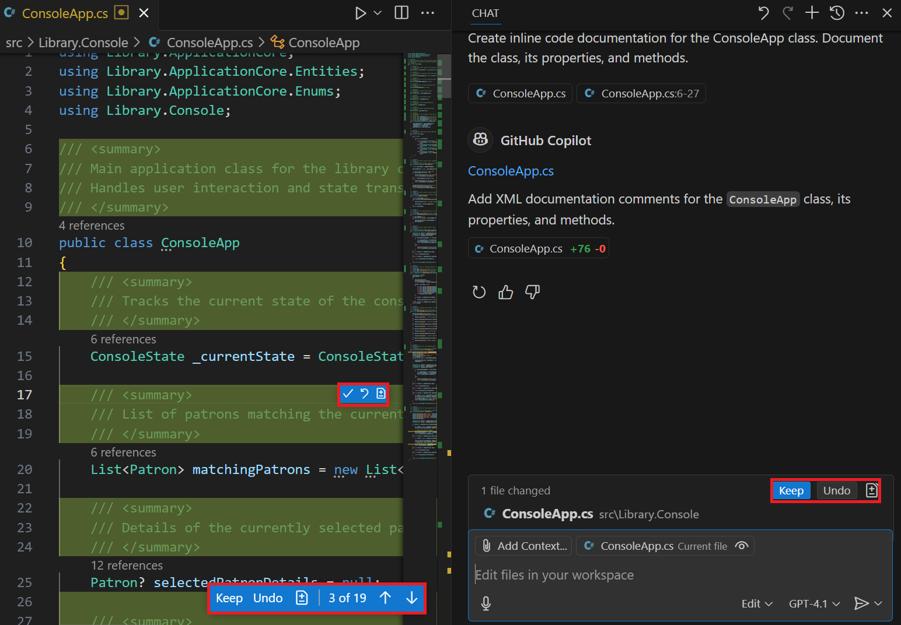
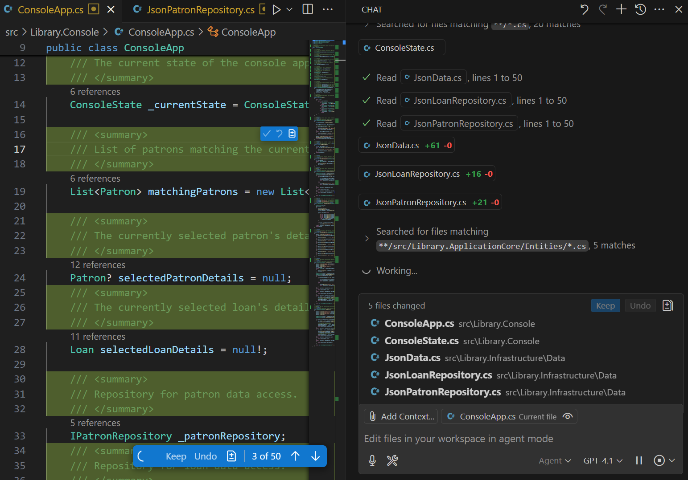
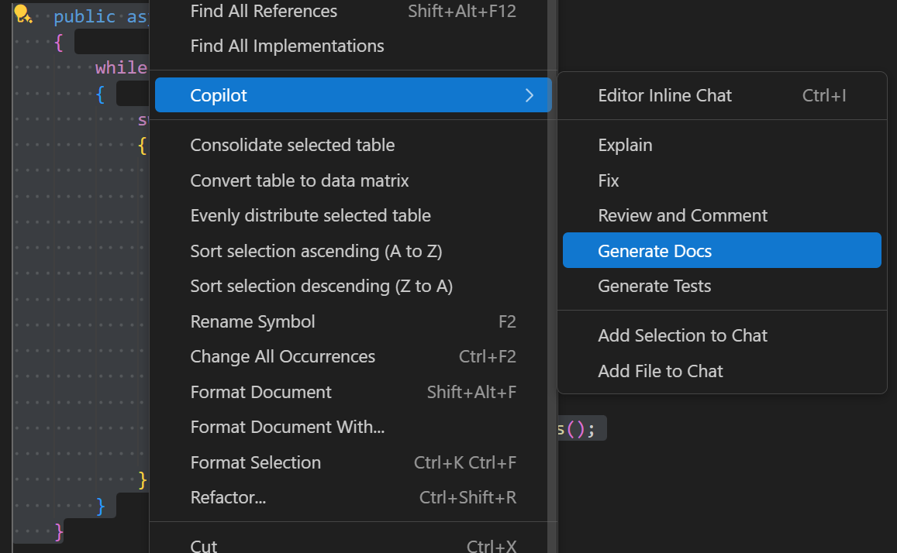
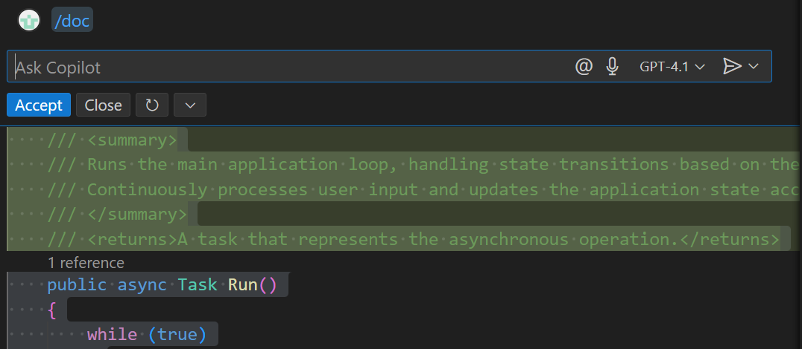
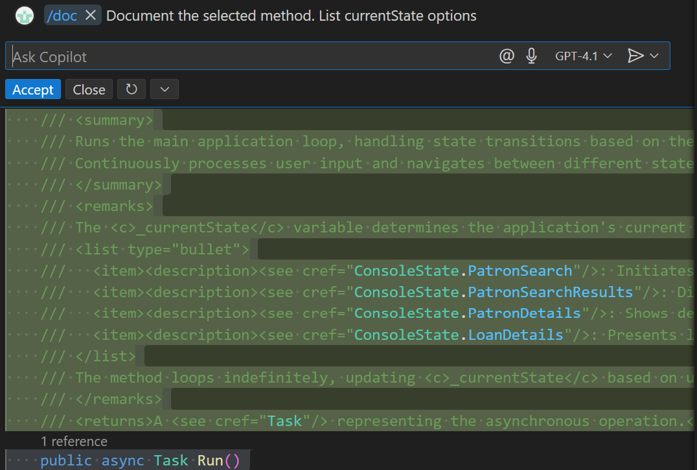

Properly documenting your code creates a more readable and maintainable codebase that's easier for other developers to understand and work with.

GitHub Copilot Chat can help you document code quickly, accurately, and consistently.

Each of the following GitHub Copilot features can be used to create inline code documentation:

- Chat view: Use the Chat view can be used in Ask, Edit, and Agent mode.
- Inline chat: Use an inline chat session to document specific code (classes, methods, or code blocks) without leaving the editor.
- Smart actions: Run the Generate Docs smart action to explain selected code without even having to write a prompt.

## Generate inline code documentation using the Chat view

The Chat View can be used to generate inline code documentation for a project, code file, class, or method. You can review the suggested documentation and request updates as needed before updating the code file.

Each of the three modes of the Chat view (Ask, Edit, and Agent) can be used to generate inline code documentation. The cost of using Agent mode is higher than the other modes, which may be a consideration.

### Generate inline code documentation using the Chat view in Ask mode

The Ask mode can be used to evaluate your code and suggest inline code documentation for projects, classes, or methods. You can review the suggested inline documentation and generate updates as needed before adding documentation to the code file.

1. Open the Chat view in Ask mode.

1. Add context to the chat prompt. For example, add a markdown file that provides documentation guidelines.

1. Enter a prompt to generate inline code documentation. For example, you can enter the following prompt:

   ```plaintext
   @workspace /doc Create inline code documentation for the ConsoleApp class.
   ```

1. Review the suggested inline code documentation in the Chat view.

    

1. Once you're satisfied with the proposed documentation, you can apply the suggested documentation into the corresponding code file.

    Hover the mouse pointer over the suggested documentation to see the **Apply**, **Insert**, and **Copy** buttons. The **Apply** button is used to apply the suggested documentation to the code file.

    You can use the **Insert** button to insert the suggestion into the editor at the current cursor position, or the **Copy** button to copy the suggestion to the clipboard.

1. After you apply the suggested documentation to your code file, you can navigate through the updates to accept, reject, or modify individual suggestions.

    

    Use the up and down arrows on the bottom menu bar to navigate through the suggested updates.

    As you navigate through the suggestions, you can keep or undo individual suggestions using the popup menu that appears when you hover over the suggestion.

    You can also manually modify suggestions as needed.

1. To accept or reject all of the suggestions, select the **Keep** or **Undo** button on the bottom menu bar.

    You can continue to update the documentation as needed in the code editor.

### Generate inline code documentation using the Chat view in Edit mode

The Chat view in Edit mode can be used to generate inline code documentation for code file, class, or method. You can review the suggested inline documentation and request updates as needed before updating the code file.

1. Open the Chat view in Ask mode.

1. Add context to the chat prompt. For example, select the **Add Context** button and then select **Open Editors** to add the open editor tabs to the chat.

1. Enter a prompt to generate inline code documentation.

    For example, you can enter the following prompt:

    ```plaintext
    Create inline code documentation for the ConsoleApp class. Document the class, its properties, and methods.
    ```

    Edit mode doesn't support the `@workspace` chat participant or the `/doc` slash command, so you need to provide a detailed prompt.

1. Review the suggested inline code documentation in the editor.

    

1. Navigate through the updates to accept, reject, or modify individual suggestions.

1. To accept or reject all of the suggestions, select the **Keep** or **Undo** button on the bottom menu bar. You can also select the **Keep** or **Undo** buttons in the Chat view to accept or reject all of the suggestions.

    You can continue to update the documentation as needed in the code editor.

### Generate inline code documentation using the Chat view in Agent mode

The Chat view in Agent mode can be used to generate inline code documentation for a project, code file, class, or method. You can review the suggested inline documentation and request updates as needed before updating the code file.

1. Open the Chat view in Agent mode.

1. Add context to the chat prompt. For example, use the **Add Context** button to add source code folders to the chat.

1. Enter a prompt that defines your documentation tasks.

    For example, you can enter the following prompt:

    ```plaintext
    Create inline code documentation for all C# class files in the specified context. Document the class, properties, and methods. Do not add documentation to JSON, markdown, or other file types. Do not document UnitTest project files in the Test folder. Ensure that the solution builds without errors after the documentation is added.
    ```

    Agent mode doesn't support the `@workspace` chat participant or the `/doc` slash command, so you need to provide a detailed prompt.

1. The agent displays status messages in the Chat view as it completes the requested tasks.

    

    The agent may also request additional context or ask for assistance to complete the requested tasks. For example, the agent may ask for permission before running a command in the terminal.

1. Wait for the agent to complete the requested documentation tasks, then review the updated files the editor.

    

    When Agent mode is finished, it displays a summary of the tasks it completed. You can review the updated files in the editor.

1. Navigate through the updates to accept, reject, or modify individual suggestions.

    To accept or reject all of the suggestions, select the **Keep** or **Undo** button on the bottom menu bar. You can also select the **Keep** or **Undo** buttons in the Chat view to accept or reject all of the suggestions.

    You can continue to update the documentation as needed in the code editor.

## Generate inline code documentation using the "Generate Docs" smart action

The **Generate Docs** smart action can be used to generate inline code documentation for classes, methods, or complex code blocks. It's a quick way to generate documentation without needing to write a prompt. The **Generate Docs** smart action is available in the context menu when you right-click selected code in the editor.

The **Generate Docs** smart action suggests inline code documentation directly in the code editor.

1. Open the code file in the editor.

1. Select the code that you want to document.

1. Right-click the selected code, select **Copilot**, and then select the **Generate Docs** smart action.

    

1. Review the suggested inline code documentation in the editor.

    

1. Use the **Accept** button accept the suggested update or **Close** to reject the update.

    You can also use the **Rerun** button to rerun the prompt with or without updates.

## Generate inline code documentation using inline chat

The inline chat feature can be used to generate inline code documentation for classes, methods, or complex code blocks. The prompt is used to specify context or to provide specific instructions. You can also use the `/doc` slash command without a text prompt if you want.

Inline chat suggests inline code documentation directly in the code editor.

1. Open the code file in the editor.

1. Select the code that you want to document.

1. Start an inline chat session.

    Use the **Ctrl+I** keyboard shortcut or select the **Editor Inline Chat** from the **Chat** menu.

1. Enter a prompt to generate inline code documentation.

    For example, you can document a method and request specific details:

    ```plaintext
    Document the selected method. List currentState options
    ```

1. Review the suggested inline code documentation in the editor.

    

1. Use the **Accept** button accept the suggested update or **Close** to reject the update.

    You can also use the **Rerun** button to rerun the prompt with or without updates.

### Summary

GitHub Copilot helps you generate inline code documentation quickly and accurately. The Chat view, inline chat, and smart action features provide various levels of interaction directly within the Visual Studio Code environment.
