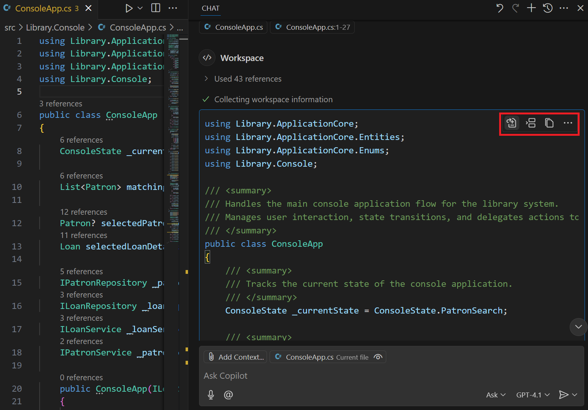
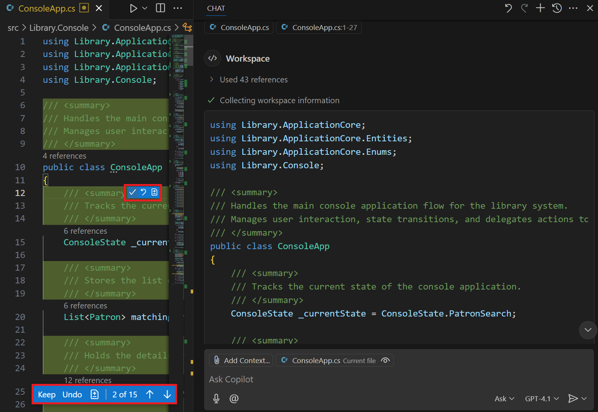
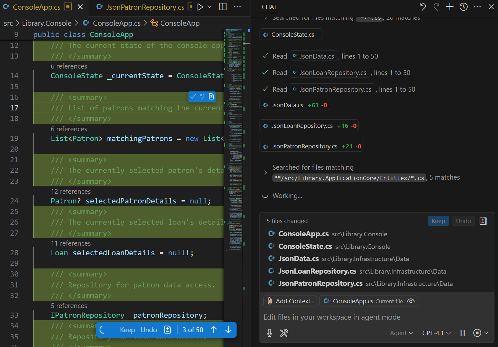
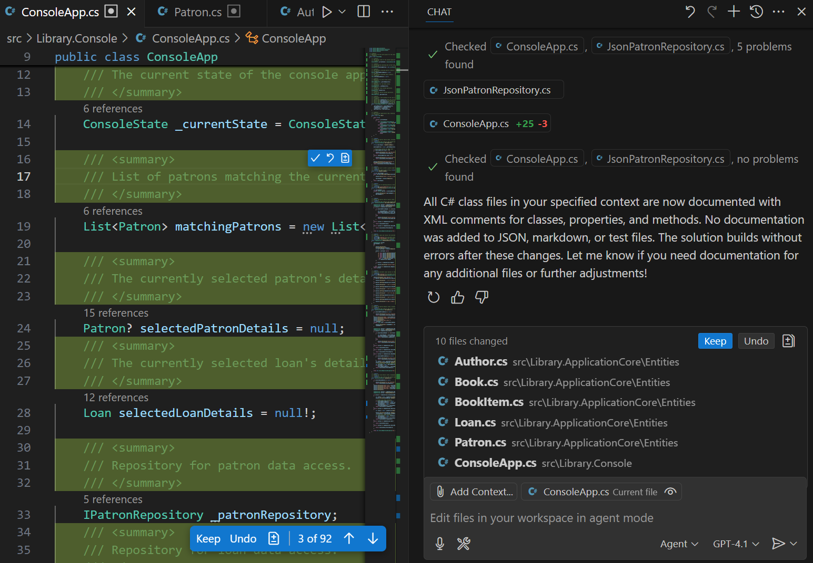

Properly documenting your code creates a more readable and maintainable codebase that's easier for other developers to understand and work with.

GitHub Copilot Chat can help you document code quickly, accurately, and consistently.

Each of the following GitHub Copilot features can be used to create inline code documentation:

- Chat view: Use the Chat view in Ask, Agent, or Plan mode.
- Inline chat: Use an inline chat session to document specific code (classes, methods, or code blocks) without leaving the editor.

## Generate inline code documentation using the Chat view

The Chat View can be used to generate inline code documentation for a project, code file, class, or method. You can review the suggested documentation and request updates as needed before updating the code file.

Each of the three modes of the Chat view (Ask, Agent, and Plan) can be used to generate inline code documentation. The cost of using Agent mode is higher than the other modes, which may be a consideration.

### Generate inline code documentation using the Chat view in Ask mode

The Ask mode can be used to evaluate your code and suggest inline code documentation for projects, classes, or methods. You can review the suggested inline documentation and generate updates as needed before adding documentation to the code file.

1. Open the Chat view in Ask mode.

1. Add context to the chat prompt. For example, add a markdown file that provides documentation guidelines.

1. Enter a prompt to generate inline code documentation. For example, you can enter the following prompt:

   ```plaintext
   Suggest inline code documentation for the ConsoleApp class.
   ```

1. Review the suggested inline code documentation in the Chat view.

    

1. Once you're satisfied with the proposed documentation, you can apply the suggested documentation into the corresponding code file.

    Hover the mouse pointer over the suggested documentation to see the **Apply in Editor**, **Insert at Cursor**, and **Copy** buttons. The **Apply in Editor** button is used to apply the suggested documentation to the code file.

    You can use the **Insert at Cursor** button to insert the suggestion into the editor at the current cursor position, or the **Copy** button to copy the suggestion to the clipboard.

1. After you apply the suggested documentation to your code file, you can navigate through the updates to accept, reject, or modify individual suggestions.

    

    Use the up and down arrows on the bottom menu bar to navigate through the suggested updates.

    As you navigate through the suggestions, you can keep or undo individual suggestions using the popup menu that appears when you hover over the suggestion.

    You can also manually modify suggestions as needed.

1. To accept or reject all of the suggestions, select the **Keep** or **Undo** button on the bottom menu bar.

    You can continue to update the documentation as needed in the code editor.

### Generate inline code documentation using the Chat view in Plan mode

The Chat view in Plan mode can be used to create a detailed plan for generating inline code documentation across your project. The Plan mode analyzes your codebase and produces a step-by-step plan that can be handed off to agent mode for execution.

1. Open the Chat view in Plan mode.

1. Enter a prompt that describes your inline documentation tasks.

    For example, you can enter the following prompt:

    ```plaintext
    Create a plan for adding inline code documentation to the codebase. Document classes, properties, and methods. Identify all files that need documentation updates.
    ```

1. Review the implementation plan.

    After a few moments, the Plan agent outputs a plan in the Chat view. The plan provides a high-level summary and a breakdown of steps, including any open questions for clarification.

1. Once the plan is complete, select **Start Implementation** to hand off the plan to agent mode, or select **Open in Editor** to save the plan as a Markdown file for later use.

    When you select **Start Implementation**, GitHub Copilot switches to agent mode and begins adding inline code documentation based on the approved plan.

1. Review the updated files in the editor. Navigate through the updates to accept, reject, or modify individual suggestions.

1. To accept or reject all of the suggestions, select the **Keep** or **Undo** button on the bottom menu bar. You can also select the **Keep** or **Undo** buttons in the Chat view to accept or reject all of the suggestions.

    You can continue to update the documentation as needed in the code editor.

### Generate inline code documentation using the Chat view in Agent mode

The Chat view in Agent mode can be used to generate inline code documentation for a project, code file, class, or method. You can review the suggested inline documentation and request updates as needed before updating the code file.

1. Open the Chat view in Agent mode.

1. Add context to the chat prompt. For example, use the **Attach Context** button (paperclip icon) to add source code folders to the chat.

1. Enter a prompt that defines your documentation tasks.

    For example, you can enter the following prompt:

    ```plaintext
    Create inline code documentation for all C# class files in the specified context. Document the class, properties, and methods. Do not add documentation to JSON, markdown, or other file types. Do not document UnitTest project files in the Test folder. Ensure that the solution builds without errors after the documentation is added.
    ```

1. The agent displays status messages in the Chat view as it completes the requested tasks.

    

    The agent may also request more context or ask for assistance to complete the requested tasks. For example, the agent may ask for permission before running a command in the terminal.

1. Wait for the agent to complete the requested documentation tasks, then review the updated files the editor.

    

    When Agent mode is finished, it displays a summary of the tasks it completed. You can review the updated files in the editor.

1. Navigate through the updates to accept, reject, or modify individual suggestions.

    To accept or reject all of the suggestions, select the **Keep** or **Undo** button on the bottom menu bar. You can also select the **Keep** or **Undo** buttons in the Chat view to accept or reject all of the suggestions.

    You can continue to update the documentation as needed in the code editor.

## Generate inline code documentation using inline chat

The inline chat feature can be used to generate inline code documentation for classes, methods, or complex code blocks. The prompt is used to specify context or to provide specific instructions.

Inline chat suggests inline code documentation directly in the code editor.

1. Open the code file in the editor.

1. Select the code that you want to document.

1. Start an inline chat session.

    Use the **Ctrl+I** keyboard shortcut or select the **Open Inline Chat** from the **Chat** menu.

1. Enter a prompt to generate inline code documentation.

    For example, you can document a method and request specific details:

    ```plaintext
    Document the selected method. List currentState options
    ```

1. Review the suggested inline code documentation in the editor.

1. Use the **Keep** button accept the suggested update or **Undo** to reject the update.

### Summary

GitHub Copilot helps you generate inline code documentation quickly and accurately. The Chat view and inline chat features provide various levels of interaction directly within the Visual Studio Code environment.
