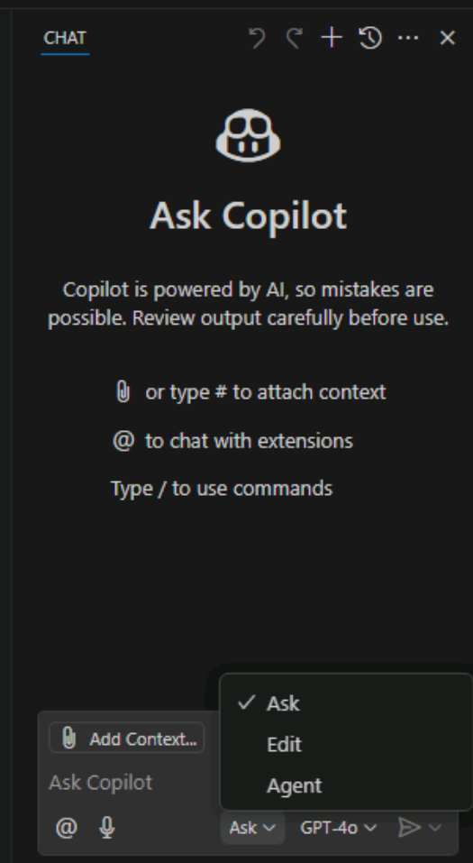
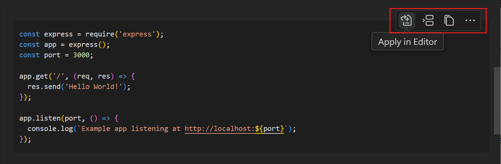
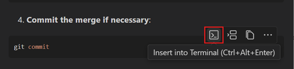
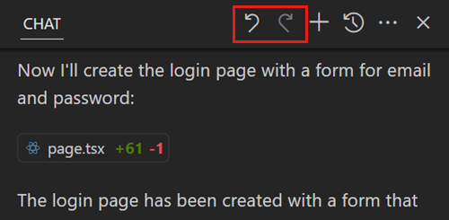
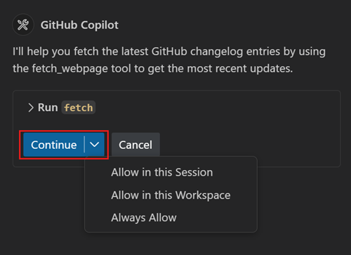

The Chat view in Visual Studio Code is used to manage chat conversations between you and the AI pair programmer. By default, the Chat view is located in the Secondary Side Bar on the right side of the Visual Studio Code window.

The Chat view interface includes three sections: a toolbar near the top, a display area in the center, and an input and control menu at the bottom.

To open the Chat view, you can select the **Toggle Chat** button (Copilot icon), or use the **Ctrl+Alt+I** keyboard shortcut.

## Select an agent

The Chat view provides the following built-in agents:

- **Agent**: Use the Agent to start an agentic coding workflow. You can use the Agent to autonomously edit code, run commands, and perform tasks in your workspace.
- **Plan**: Use the Plan agent to create a structured, step-by-step implementation plan for a task. The Plan agent analyzes your request, breaks it down into discrete steps, and produces a detailed plan that can be handed off to the Agent for implementation.
- **Ask**: Use the Ask agent to ask questions about your codebase or technology concepts. You can use the Ask agent to explain code, suggest revisions or fixes, or provide information related to the codebase.

To switch agents, open the agent picker at the bottom of the Chat view, and then select **Agent**, **Plan**, or **Ask**.

> [!IMPORTANT]
> When you use the Chat view in agent mode, GitHub Copilot may make multiple premium requests to complete a single task. Premium requests can be used by user-initiated prompts and follow-up actions Copilot takes on your behalf. The total number of premium requests used is based on the complexity of the task, the number of steps involved, and the model selected.

## Add context to your chat session

Improving the context of your prompts improves the relevance of GitHub Copilot's responses.

There are two ways to specify context directly within your prompts:

- Specify the context within the natural language text of your prompt.
- Include chat variables, such as `#selection`, within your prompt.

In addition to these options, the Chat view provides two other ways to add context:

- You can use a drag-and-drop operation to add files from Visual Studio Code's EXPLORER view to the Chat view.
- You can select the **Add Context** button in the chat input field to add context to your prompt

When you select the **Add Context** button, a menu appears that allows you to select from the available context types. The following context types can be listed:

- Files & Folders: This option allows you to add files and folders from your workspace to the chat prompt. You can select one or more files or folders to add as context.
- Instructions: This option allows you to select a custom instructions file that describes common guidelines or rules to get responses that match your specific coding practices and tech stack.
- Problems: This option allows you to add problems from the Problems tab to the chat prompt. You can select one or more problems to add as context.
- Symbols: This option allows you to add Visual Studio Code symbol constructs to the chat prompt. You can select one or more symbols to add as context.
- Screenshot Window: This option allows you to take a screenshot of the current window and add it to the chat prompt.
- Terminal command output: This option allows you to add the output of the last command run in the terminal to the chat prompt.
- Search results: This option allows you to add search results from the Search view to the chat prompt. You can select one or more search results to add as context.
- Test failures: This option allows you to add details from test failures to the chat prompt.
- Tools: This option allows you to add tools, for example the #fetch tool, to the chat prompt. You can select one or more tools to add as context.
- Recent Files (list of files you have recently opened in Visual Studio Code).

## Use **Ask**

The Ask agent is optimized for asking questions about your code projects, coding topics, and general technology concepts. The Ask agent is useful when you need to gain an understanding of a codebase, brainstorm ideas, or get help with coding tasks. When you enter a prompt, the AI pair programmer responds with natural language descriptions, code snippets, and other relevant information to help you with your coding tasks. Responses are displayed in the Chat view.

### Manage the Ask agent's code suggestions

When the chat response contains code blocks, you can apply them individually to the corresponding file in your workspace. GitHub Copilot performs a smart apply and inserts the changes in the right location within the file.

To apply a code block to your codebase, hover over the code block and select the **Apply in Editor** button. Copilot tries to apply the proposed changes to your existing code.

Alternatively, you can also copy the code or insert it at the current cursor position. Hover over the code block and select the corresponding action.

Depending on the language extension, code blocks in chat responses might support IntelliSense, similar to the experience in the editor.

If a code block contains a shell command, you can run it directly in the integrated terminal with the Insert into Terminal (Ctrl+Alt+Enter) action.

## Use **Plan**

The Plan agent is optimized for creating structured, step-by-step implementation plans for complex tasks. The Plan agent is useful when you want to break down a large task into discrete steps before making changes. When you enter a prompt, the Plan agent analyzes your request, evaluates the codebase, and produces a detailed implementation plan with individual steps.

Once the plan is generated, the Chat view displays the structured plan with a list of steps. You can review the plan, provide feedback, and refine the steps before proceeding. When you're satisfied with the plan, you can hand it off to the Agent for implementation.

### Revert edits

After completing a series of code updates, you may decide that you need to roll back some of the changes. For example, you may want to use a different implementation strategy, or GitHub Copilot may have gone down the wrong path when generating edits.

You can use the **Undo Last Edit** control in the Chat view title bar to revert the last edits and return to the state before sending the last request. After you perform an undo of the last edit, you can redo those edits again by using the **Redo Last Edit** control in the Chat view title bar.

## Use **Agent**

The Agent allows you to specify a high-level task, and let AI autonomously evaluate the request, plan the work needed, and apply the changes to your codebase. The Agent uses a combination of code editing and tool invocation to accomplish the task you specified. As it processes your request, it monitors the outcome of edits and tools, and iterates to resolve any issues that arise. Code updates are made directly in the editor as iterations are processed. Task progress is monitored and updates are displayed in the Chat view.

The Agent uses tools to accomplish specialized tasks while processing a user request. For example, listing the files in a directory, editing a file in your workspace, running a terminal command, or getting the output from the terminal.

### Confirm tool invocations and terminal commands

Before Copilot runs a terminal command or a tool that isn't built in, it requests confirmation to continue. Confirmation is required because the tools might run locally on your machine and perform actions that modify files or data.

Use the **Continue** button's dropdown options to automatically confirm the specific tool for the current session, workspace, or all future invocations.

## Summary

The Chat view in Visual Studio Code is used to manage chat conversations between you and the AI pair programmer. The Chat view interface includes three sections: a toolbar near the top, a display area in the center, and an input and control menu at the bottom. The Chat view provides three built-in agents: Agent, Plan, and Ask. You can add context to your chat session by specifying context within your prompts, using chat variables, or using the **Add Context** button. The Ask agent is optimized for asking questions about your code projects, coding topics, and general technology concepts. The Plan agent is optimized for creating structured, step-by-step implementation plans for complex tasks. The Agent allows you to specify a high-level task and let AI autonomously evaluate the request, plan the work needed, and apply the changes to your codebase.
