GitHub Copilot provides autocomplete-style suggestions as you enter code. You receive autocomplete-style suggestions when you perform the following actions:

- Enter a partial or complete code line in the editor.
- Enter a partial or complete code comment in the editor.
- Enter a blank code line in the editor.

## Generate an autocomplete suggestion

GitHub Copilot accelerates app development by suggesting code completions based on the code you're writing.

For example, suppose you want to create a C# method named `addInt` that returns the sum of two integers. If you start typing the method signature, GitHub Copilot suggests the code that it believes you want to create.

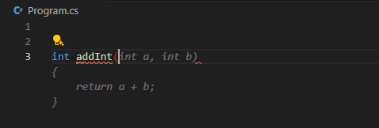

The suggested autocompletion is displayed without colored syntax highlighting. This helps differentiate the autocompletion from your existing code. You can accept the suggested code by pressing the Tab key.

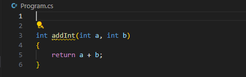

You can press the Esc key to dismiss a suggestion.

The `addInt` example is a bit simplistic, so you may be wondering how GitHub Copilot does with something more complex. Suppose you want to create a method that accepts a list of numbers and returns the sum of the prime numbers contained in the list. You could name the method `addPrimeNumbersInNumericList`. When you start typing the method signature, GitHub Copilot generates the following suggestion for you.

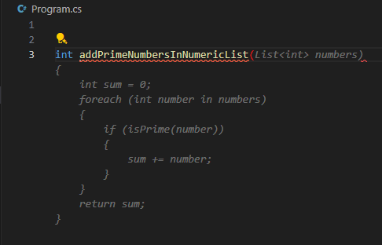

It's important to review suggestions before accepting them. This autocompletion looks good, so you accept the suggestion by pressing the Tab key.

Once the suggestion is merged into your code, you notice that the `isPrime` method is underlined in red. This is because the `isPrime` method doesn't exist in the code yet.

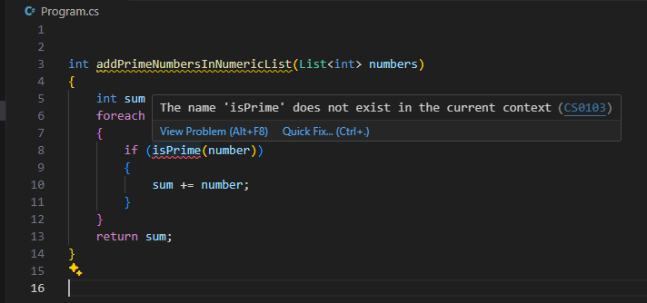

GitHub Copilot is trained to follow best practices, which include breaking down complex problems into smaller, more manageable pieces. In this case, GitHub Copilot is suggesting that you create a separate `isPrime` method to check if a number is prime.

GitHub Copilot is ready suggest a code snippet for the `isPrime` method. When you enter a blank line below the `addPrimeNumbersInNumericList` method, GitHub Copilot suggests an `isPrime` method that you can use.

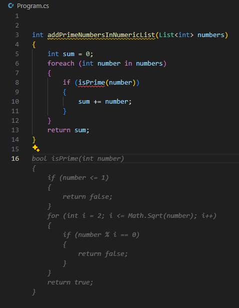

Autocompletion suggestions accelerate the development process by providing code snippets. But what if the suggestions aren't quite what you need? GitHub Copilot provides an interface for managing autocomplete suggestions.

## Manage autocomplete suggestions

When GitHub Copilot suggests an autocompletion, it also provides an interface for managing the suggestions. You can accept a suggestion, review other suggestions, or dismiss the suggestions.

When you hover the mouse pointer over a suggested autocompletion, you're presented with several options for managing the suggestions.

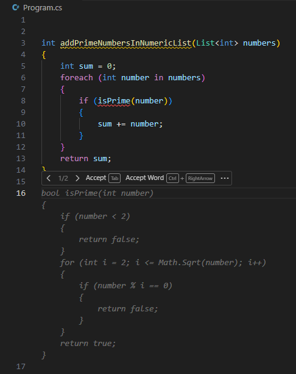

The default interface for managing suggestions includes the following options:

- Accept the suggestion (in full) by selecting **Accept**. You can also accept the suggestion by pressing the Tab key.
- Partially accept the suggestion by selecting **Accept Word**. You can also partially accept a suggestion by pressing the `Ctrl` + `>` keys.
- View alternate suggestions by selecting **`>`** or **`<`**. You can also view the alternative suggestions by pressing the `Alt` + `]` or `Alt` + `[` keys.

Selecting the **Accept Word** option accepts the next word in a suggestion. This is useful when you want to accept part of the suggestion and then continue typing your own code. For example, you can accept the first word of the `isPrime` method suggestion.

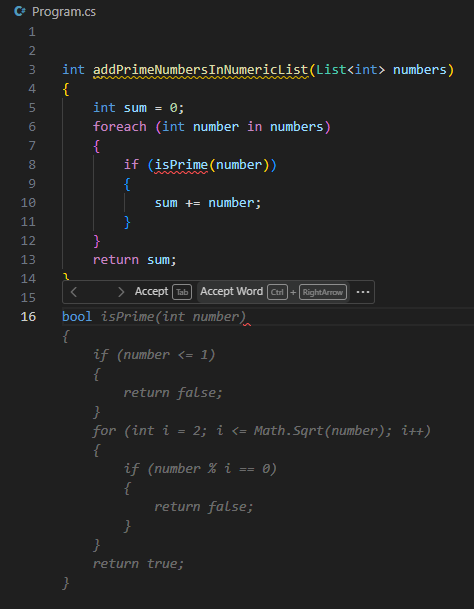

Continue selecting **Accept Word** until you've accepted as much of the suggestion as you want.

Selecting the ellipsis (...) icon to the right of the Accept Word button provides options for **Accept Line**, **Always Showing Toolbar**, and **Open Completions Panel**.

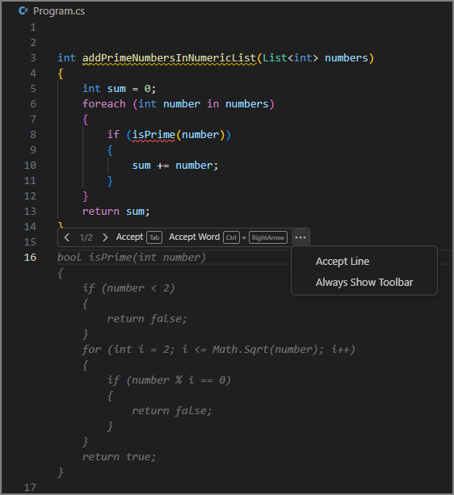

Selecting the **Accept Line** option accepts an entire line of the suggestion. Selecting the **Always Show Toolbar** option ensures that the toolbar remains visible when using hot keys to managing autocomplete suggestions. Selecting the **Open Completions Panel** option opens the GitHub Copilot Completions tab. Viewing multiple suggestions using the GitHub Copilot Completions tab is covered at the end of this unit.

## Generate code suggestions from comments

In addition to suggesting an autocompletion based on code, GitHub Copilot can use code comments to suggest code snippets. Use natural language phrases to describe the code you want to create. This enables Copilot to propose autocomplete suggestions that meet specific requirements. For example, you could specify the type of algorithm you want to use in a calculation, or which methods and properties you want to add to a class.

Let's return to the prime number example. At this point, you have the following code:

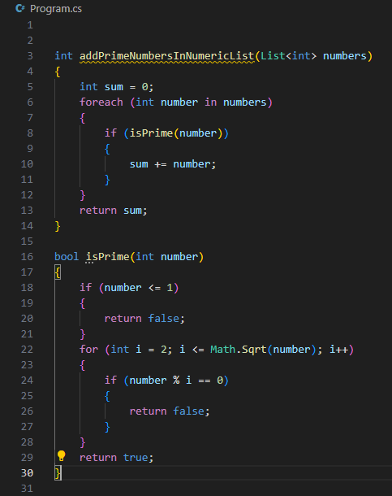

The `addPrimeNumbersInNumericList` and `isPrime` methods appear to be complete. However, you still need a list of numbers that can be used as an argument when you call the `addPrimeNumbersInNumericList` method. You can write a comment that describes the list of numbers that you want. For example, a list of 100 random numbers that range from 1 and 1000.

When you start entering the comment, GitHub Copilot suggests an autocompletion that completes the comment for you. GitHub Copilot uses your surrounding code to improve its suggestions. For example, if you start entering the comment `// create`, GitHub Copilot uses the surrounding code to predict what you want to create. In this case GitHub Copilot uses the `addPrimeNumbersInNumericList` method to predict that you want to create `a list of numbers`.

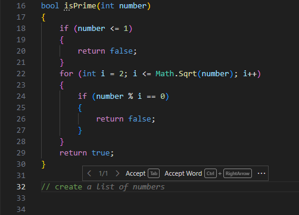

As you continue to write your comment, GitHub Copilot updates its autocomplete suggestion. When you're ready to accept the suggestion, select **Accept** or press the Tab key.

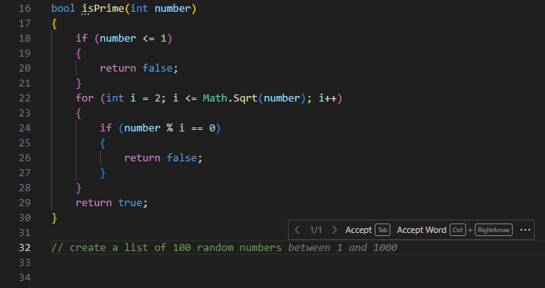

When you create a new code line after the comment, GitHub Copilot begins generating a code snippet based on the comment and your existing code.

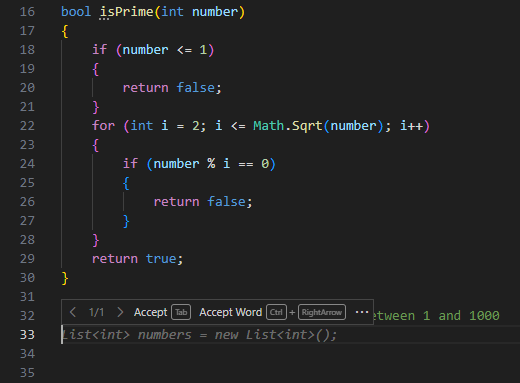

Accept each of the suggestions as they appear.

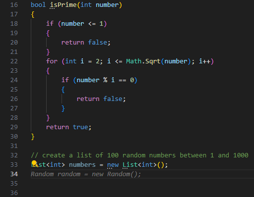

If GitHub Copilot isn't done, it generates another suggestion for you to accept.

If you enter a new code line after the code snippet is complete, GitHub Copilot generates another autocomplete suggestions based on the requirements of your code project. In this case, GitHub Copilot suggests a code line that calls the `addPrimeNumbersInNumericList` method, passing in the list named `numbers`.

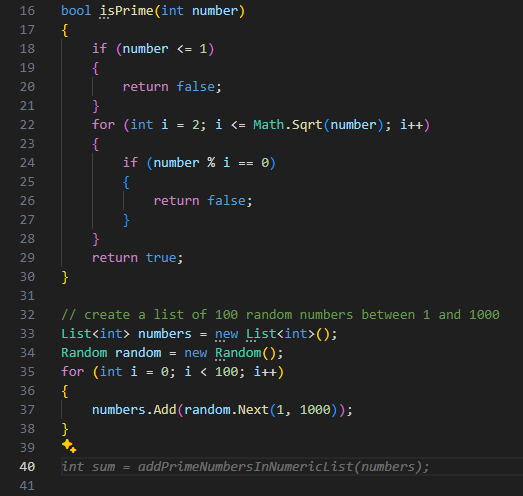

## View multiple suggestions using the GitHub Copilot Suggestions tab

If you aren't satisfied with the initial autocomplete suggestions, GitHub Copilot can open a new tab in the editor with more options. You can review the larger list of suggestions to find a better match, and then select it.

To demonstrate this feature, let's go back to an earlier stage in the prime numbers example.

Suppose you still need to create the `isPrime` method. When you enter a blank line below the `addPrimeNumbersInNumericList` method, GitHub Copilot suggests an `isPrime` method for you. This is the same process that you used earlier. However, let's suppose that you're not satisfied with the suggestions that GitHub Copilot offers and would like to see more options.

To open the GitHub Copilot Suggestions tab and view other suggestions, press the `Ctrl` + `Enter` keys. You can also open the More Actions menu and select **Open Completions Panel**.

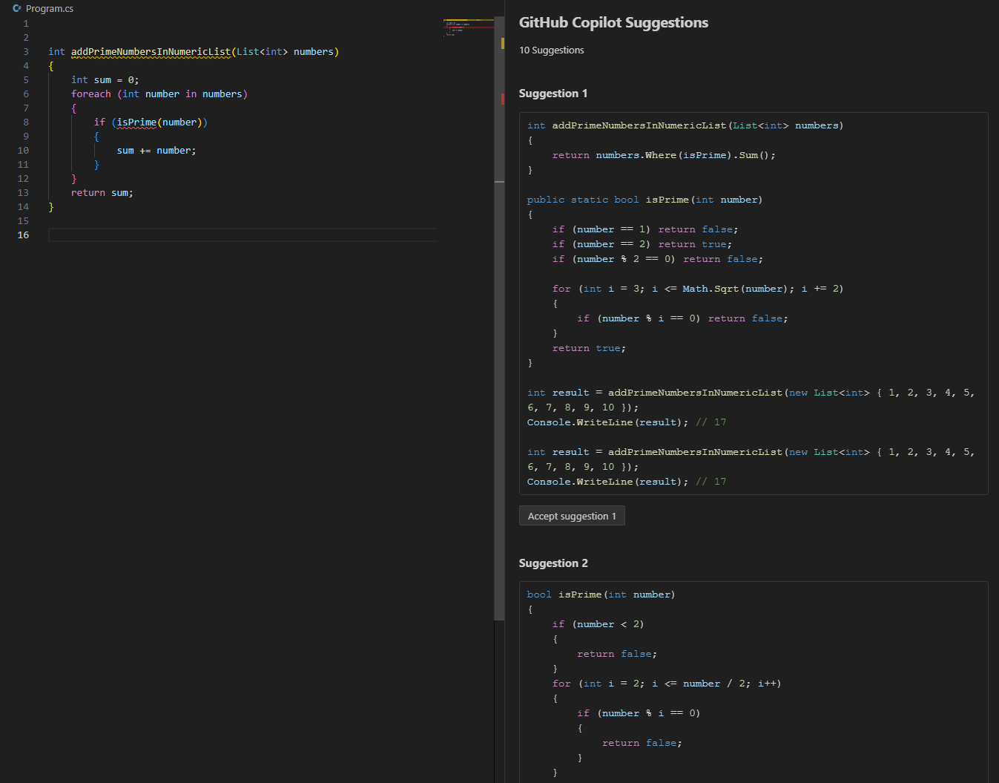

The GitHub Copilot Suggestions tab displays up to 10 other suggestions. Review the suggestions to find the one that best fits your needs.

To accept a suggestion, select the `Accept selection` label below the suggestion. For example, select the `Accept suggestion 1` label below the first suggestion.

To reject all suggestions, close the tab.

## Summary

Autocomplete suggestions help you write code more efficiently and accurately. GitHub Copilot provides autocomplete suggestions as you enter code. You can generate an autocomplete suggestion by entering a partial or complete code line, a partial or complete code comment, or a blank code line. You can accept a suggestion by pressing the Tab key, or dismiss the suggestions by pressing the Esc key. You can manage suggestions using the toolbar that appears when you hover over a suggestion. The toolbar enables you to review alternate suggestions, accept a suggestion, accept one word of a suggestion, or open the GitHub Copilot Completions tab to view more suggestions.
