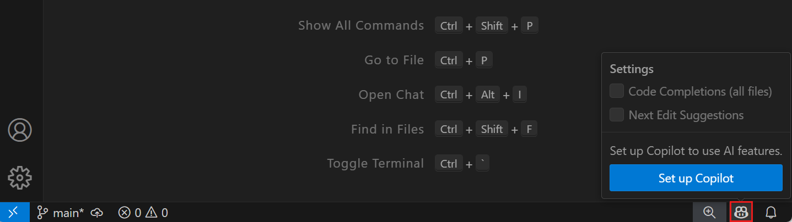
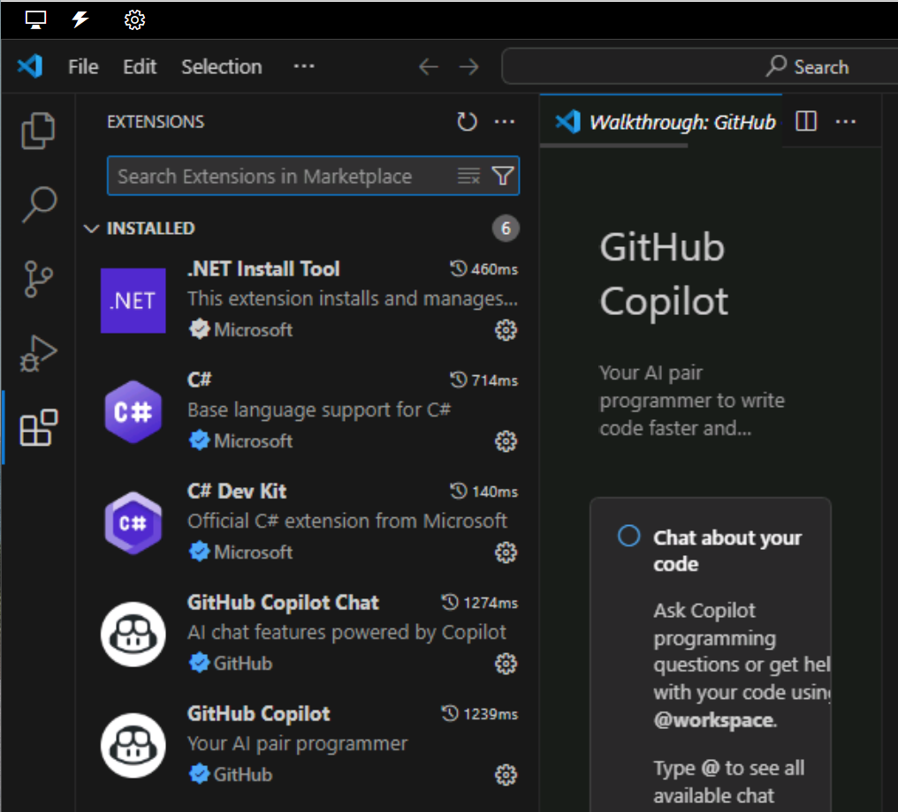
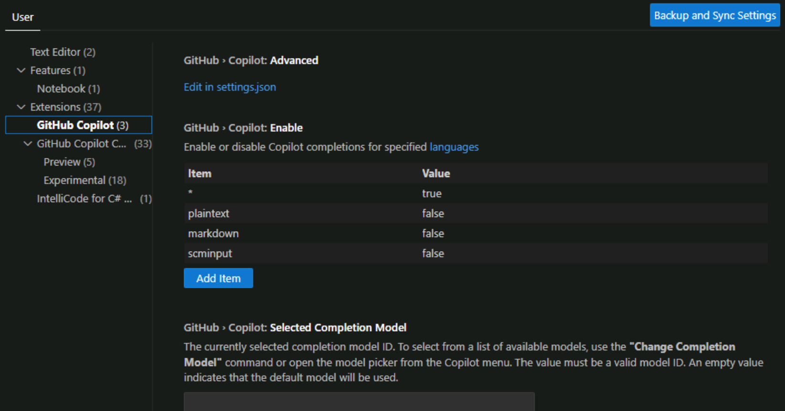
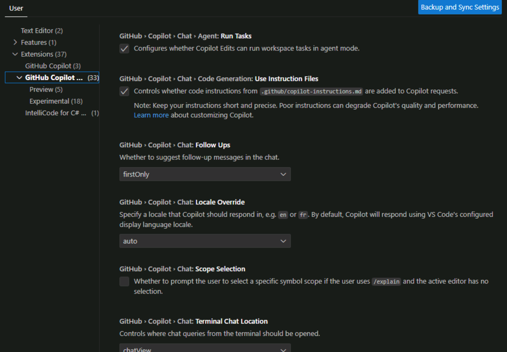

GitHub Copilot natively integrates with Visual Studio Code, Visual Studio, and other developer environments.

GitHub Copilot uses two extensions for Visual Studio Code:

- GitHub Copilot: The GitHub Copilot extension supports code completions, including code suggestions generated using code comments.

- GitHub Copilot Chat: The GitHub Copilot Chat extension supports the AI peer programming tools, including chat conversations between the user and AI models.

## Configure GitHub Copilot extensions in Visual Studio Code

When you use Visual Studio Code to set up GitHub Copilot, the two extensions are automatically installed with default settings. You don't need to download or install the extensions manually.

### Install the GitHub Copilot extensions in Visual Studio Code

Installing the GitHub Copilot extensions in Visual Studio Code is a straightforward process.

1. Open Visual Studio Code and ensure that you have the latest version installed.

1. Hover the mouse pointer over the GitHub Copilot icon on the Status Bar and then select **Set up Copilot**.

    

1. On the **Sign in to use Copilot** dialog, use the **Sign in** button to open the GitHub login page.

    If you've already authenticated your GitHub account in Visual Studio Code, you may see **Use Copilot** rather than **Sign in**.

1. Follow the online instructions to authenticate your account and authorize access in Visual Studio Code.

> [!NOTE]
> If you don't already have a GitHub Copilot subscription, you'll be signed up for the GitHub Copilot Free plan.

The setup process uses a background operation to install the GitHub Copilot and GitHub Copilot Chat extensions in Visual Studio Code.

You can access the GitHub Copilot extensions from the Extensions view in Visual Studio Code.

### Configure GitHub Copilot settings in Visual Studio Code

You can configure GitHub Copilot settings in Visual Studio Code to customize the behavior of the GitHub Copilot extensions. Each extension has its own settings.

You can access the Visual Studio Code settings by selecting **Manage** (the gear icon) in the lower left corner of the Visual Studio Code window, and then selecting **Settings**.

The GitHub Copilot extension settings are used to manage primary features, such as the supported programming languages and AI models.

The GitHub Copilot Chat extension settings are used to manage chat interactions.

## Summary

GitHub Copilot integrates with Visual Studio Code using two extensions: GitHub Copilot and GitHub Copilot Chat. You can configure the settings for each extension to customize the behavior of GitHub Copilot in Visual Studio Code.
