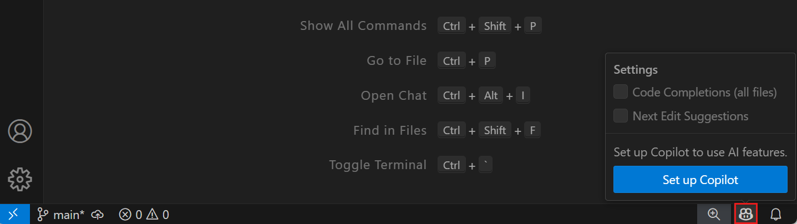
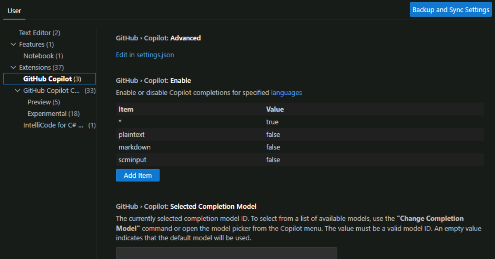

GitHub Copilot natively integrates with Visual Studio Code, Visual Studio, and other developer environments.

GitHub Copilot is built into Visual Studio Code. The GitHub Copilot features, including code completions, chat conversations, inline chat, and agent mode, are all available without needing to install separate extensions.

## Configure GitHub Copilot in Visual Studio Code

When you use Visual Studio Code to set up GitHub Copilot, GitHub Copilot is enabled with default settings. You don't need to download or install extensions manually.

### Set up GitHub Copilot in Visual Studio Code

Setting up GitHub Copilot in Visual Studio Code is a straightforward process.

1. Open Visual Studio Code and ensure that you have the latest version installed.

1. Hover the mouse pointer over the GitHub Copilot icon on the Status Bar and then select **Use AI Features**.

    

1. Choose a sign-in method and follow the prompts to authenticate your GitHub account.

    If you've already authenticated your GitHub account in Visual Studio Code, you may see **Set up Copilot** rather than **Use AI Features**.

1. Follow the online instructions to authenticate your account and authorize access in Visual Studio Code.

> [!NOTE]
> If you don't already have a GitHub Copilot subscription, you'll be signed up for the GitHub Copilot Free plan.

Once setup is complete, GitHub Copilot features are ready to use in Visual Studio Code.

### Configure GitHub Copilot settings in Visual Studio Code

You can configure GitHub Copilot settings in Visual Studio Code to customize the behavior of GitHub Copilot features.

You can access the Visual Studio Code settings by selecting **Manage** (the gear icon) in the lower left corner of the Visual Studio Code window, and then selecting **Settings**.

The GitHub Copilot settings are organized into several categories. Key settings include:

- **Code editing settings**: Configure inline suggestions, next edit suggestions, and language-specific settings.
- **Chat settings**: Configure chat behavior, terminal chat location, and other chat-related options.
- **Agent settings**: Configure agent mode, maximum requests, and tool approval.
- **Inline chat settings**: Configure inline chat display mode and behavior.

## Summary

GitHub Copilot integrates natively with Visual Studio Code, providing code completions, chat, and agent features. You can configure GitHub Copilot settings to customize the behavior of GitHub Copilot features in Visual Studio Code.
