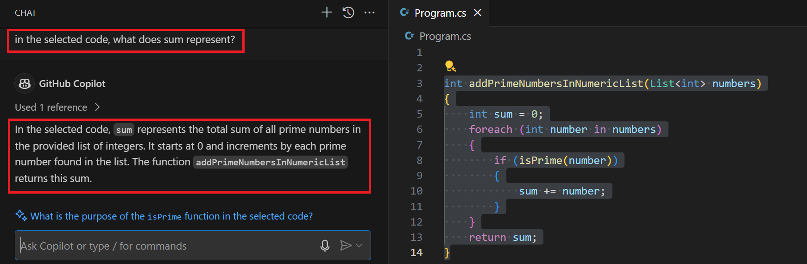
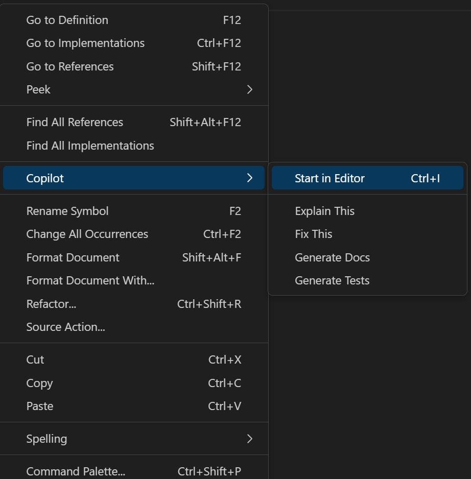
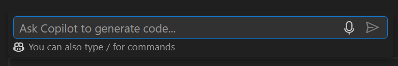
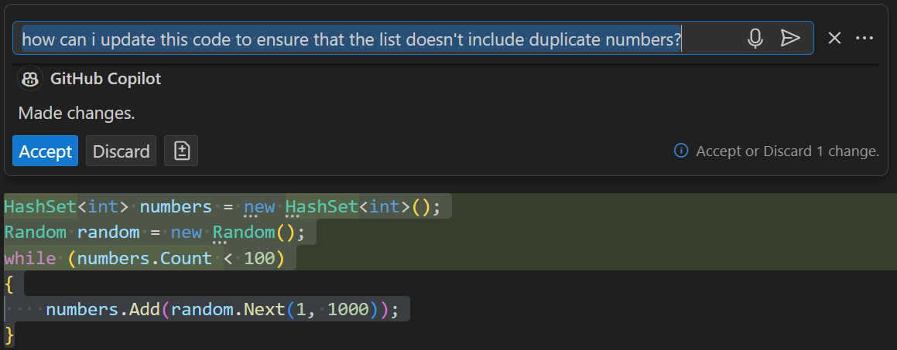
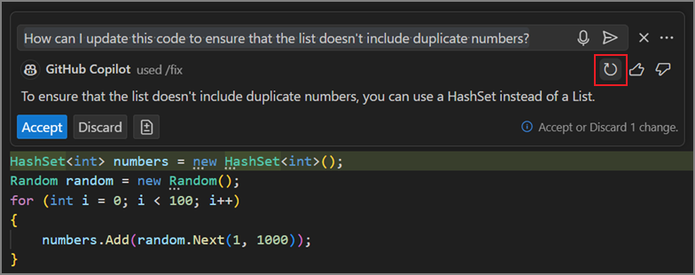
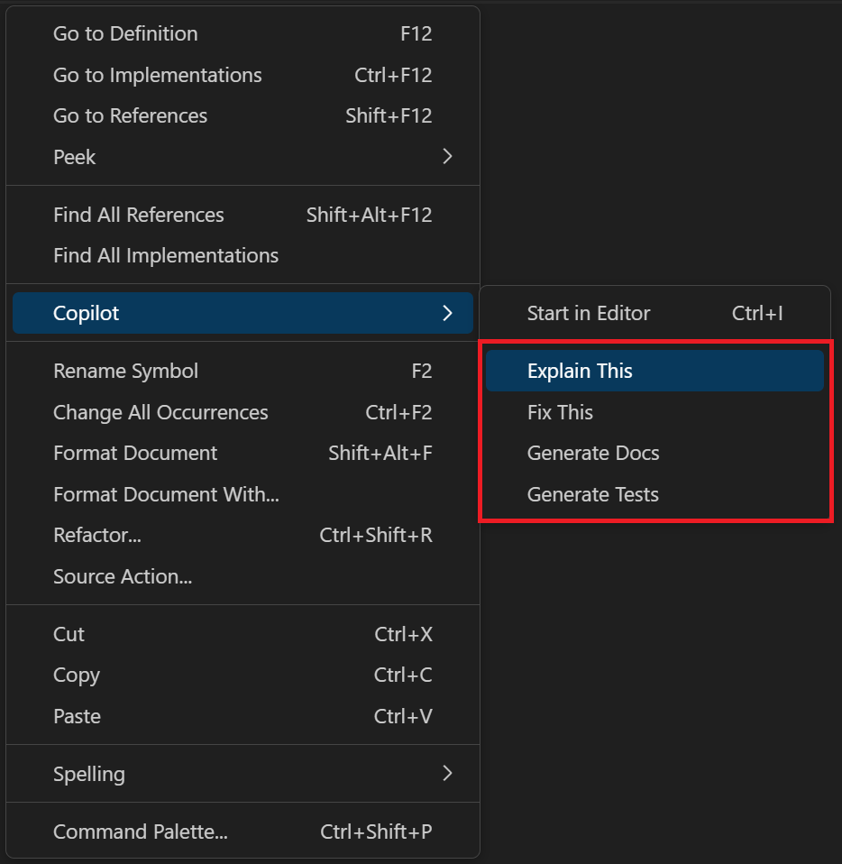
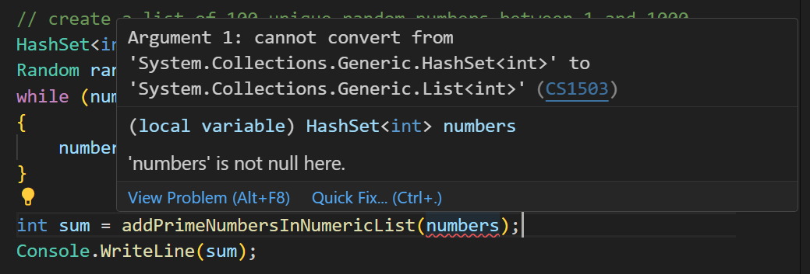
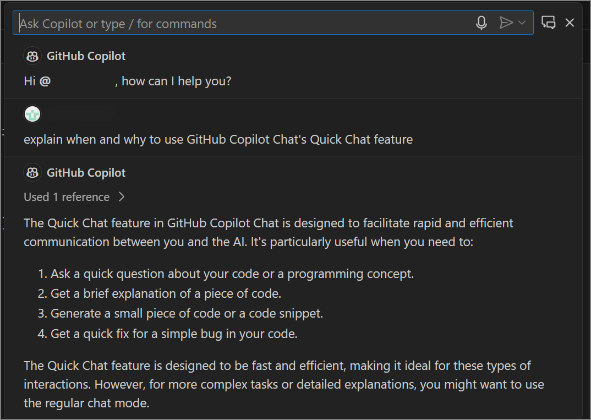
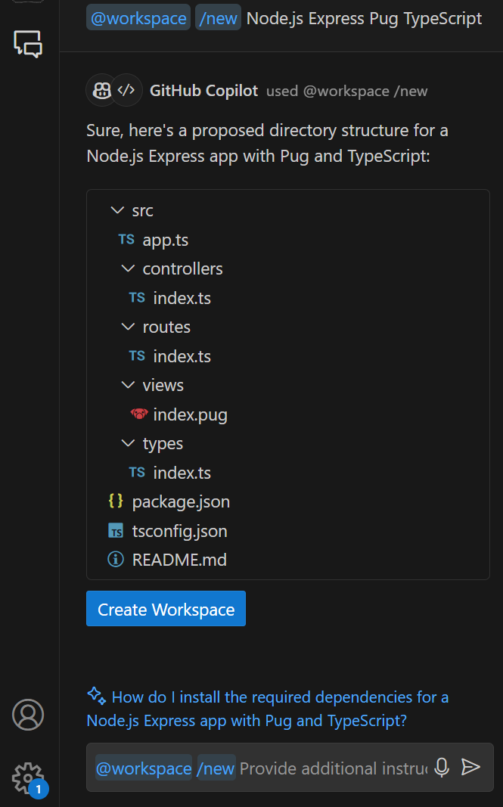

GitHub Copilot Chat is a companion extension to GitHub Copilot that blends conversational AI assistance into the Visual Studio Code user interface.

The GitHub Copilot Chat extension provides a chat interface that lets you interact with GitHub Copilot and receive answers to coding-related questions directly within Visual Studio Code, without requiring you to navigate through documentation or search online forums.

## How it works

GitHub Copilot Chat uses a combination of natural language processing and machine learning to understand your question and provide you with an answer. This process can be broken down into the following steps.

### Input processing

The input prompt from the user is preprocessed by the Copilot Chat system and sent to a large language model to get a response based on the context and prompt. User input can take the form of code snippets or plain language. The system is only intended to respond to coding-related questions.

### Language model analysis

The preprocessed prompt is then passed through the Copilot Chat language model, which is a neural network that has been trained on a large body of text data. The language model analyzes the input prompt.

### Response generation

The language model generates a response based on its analysis of the input prompt and the context provided to it. This response can take the form of generated code, code suggestions, or explanations of existing code.

### Output formatting

The response generated by Copilot Chat is formatted and presented to the user. Copilot Chat may use syntax highlighting, indentation, and other formatting features to add clarity to the generated response. Depending upon the type of question from the user, links to context that the model used when generating a response, such as source code files or documentation, may also be provided.

GitHub Copilot Chat is intended to provide you with the most relevant answer to your question. However, it may not always provide the answer you're looking for. Users of Copilot Chat are responsible for reviewing and validating responses generated by the system to ensure they're accurate and appropriate.

## Use cases for GitHub Copilot Chat

GitHub Copilot Chat offers coding assistance in a variety of scenarios. The following sections describe some of these scenarios.

### Explaining and documenting code

Copilot Chat can help explain selected code by generating natural language descriptions of the code's functionality and purpose. This can be useful if you want to understand the code's behavior or for nontechnical stakeholders who need to understand how the code works. For example, if you select a function or code block in the code editor, Copilot Chat can generate a natural language description of what the code does and how it fits into the overall system. This can include information such as the function's input and output parameters, its dependencies, and its purpose in the larger application.

By generating explanations and documentation, Copilot Chat may help you to understand the selected code, leading to improved collaboration and more effective software development.

### Answering coding questions

You can ask Copilot Chat for help or clarification on specific coding problems and receive responses in natural language format or in code snippet format. This is a useful tool for programmers because it provides guidance and support for common coding tasks and challenges.

### Proposing bug fixes

Copilot Chat can propose a fix for bugs in your code by suggesting code snippets and solutions based on the context of the error or issue. This is useful if you're struggling to identify the root cause of a bug or you need guidance on the best way to fix it. For example, if your code produces an error message or warning, Copilot Chat can suggest possible fixes based on the error message, the code's syntax, and the surrounding code.

Copilot Chat can suggest changes to variables, control structures, or function calls that might resolve the issue and generate code snippets that can be incorporated into the codebase. However, it's important to note that the suggested fixes may not always be optimal or complete, so you'll need to review and test the suggestions.

### Generating unit test cases

Copilot Chat can help you write unit test cases by generating code snippets based on the code open in the editor or the code snippet you highlight in the editor. This helps you write test cases without spending as much time on repetitive tasks. For example, if you're writing a test case for a specific function, you can use Copilot Chat to suggest possible input parameters and expected output values based on the function's signature and body. Copilot Chat can also suggest assertions that ensure the function is working correctly, based on the code's context and semantics.

Copilot Chat can also help you write test cases for edge cases and boundary conditions that might be difficult to identify manually. For instance, Copilot Chat can suggest test cases for error handling, null values, or unexpected input types, helping you ensure your code is robust and resilient. However, it's important to note that generated test cases may not cover all possible scenarios, and manual testing and code review are still necessary to ensure the quality of the code.

### Suggesting improvements to an existing codebase

Copilot Chat can also suggest potential improvements to selected code. For example, Copilot Chat can suggest improvements in the following categories:

- **Code quality**: Copilot Chat can suggest ways to improve the readability, maintainability, and performance of your code. This can include suggestions for refactoring, code simplification, and modularity.
- **Code reliability**: Copilot Chat can suggest ways to make your code more robust and reliable. This can include suggestions for error handling, input validation, and defensive programming.
- **Code performance**: Copilot Chat can suggest ways to optimize the performance of your code. This can include suggestions for algorithmic improvements, data structure optimizations, and parallelization.
- **Code security**: Copilot Chat can suggest ways to make your code more secure. This can include suggestions for input sanitization, access control, and encryption.

By suggesting improvements, Copilot Chat may help you to write better code that is more readable, reliable, performant, and secure.

## GitHub Copilot Chat in Visual Studio Code

Copilot Chat integrates with the Visual Studio Code UI to provide assistance where you need it.

Here are some ways that you can access GitHub Copilot Chat features within Visual Studio Code:

- Open the Chat view for an AI assistant that can help you at any time.
- Start an inline chat conversation directly from the editor for help while you're coding.
- Run smart actions to complete certain tasks without even having to write a prompt.
- Open the Quick Chat window for a quick, interactive conversation with the AI.

### Chat view

The Chat view is a panel that displays the chat messages between you and the AI pair programmer. The Chat view interface is a text input field that allows you to interact with the AI pair programmer by typing messages and receiving responses.

You can open the Chat view in two ways:

- Select the **Chat** icon in the Visual Studio Code activity bar.
- Open the GitHub Copilot status menu, and then select **GitHub Copilot Chat**. To open the GitHub Copilot status menu, select the GitHub Copilot icon on the Visual Studio Code status bar.

Either way, the Chat view opens in the Visual Studio Code interface, allowing you to interact with the AI pair programmer.


The Chat view allows you to interact with the AI pair programmer by typing messages and receiving responses. You can use the Chat view to ask questions, request explanations, propose fixes, generate documentation, and more. The AI pair programmer responds with natural language descriptions, code snippets, and other relevant information to help you with your coding tasks.

Consider the prime number sample app built using GitHub Copilot line completions in the previous unit.

```csharp
int addPrimeNumbersInNumericList(List<int> numbers)
{
    int sum = 0;
    foreach (int number in numbers)
    {
        if (isPrime(number))
        {
            sum += number;
        }
    }
    return sum;
}

bool isPrime(int number)
{
    if (number <= 1)
    {
        return false;
    }
    for (int i = 2; i <= Math.Sqrt(number); i++)
    {
        if (number % i == 0)
        {
            return false;
        }
    }
    return true;
}

// create a list of 100 random number between 1 and 1000
List<int> numbers = new List<int>();
Random random = new Random();
for (int i = 0; i < 100; i++)
{
    numbers.Add(random.Next(1, 1000));
}

int sum = addPrimeNumbersInNumericList(numbers);
Console.WriteLine(sum);
```

What if you've never seen this code before and you have questions about how it works? You can ask Copilot Chat to explain the app, a specific function, or even a specific variable within the code. The AI pair programmer generates a natural language description in response to your question, helping you understand the code much quicker than working it out yourself.

For example, you can ask Copilot Chat to explain the purpose of a specific variable within the code.



> [!NOTE]
> Copilot Chat can generate rich and interactive output. Copilot Chat might use syntax highlighting, indentation, and other formatting features to add clarity to the generated response. Depending upon the type of question from the user, links to context that Copilot used for generating a response, such as source code files or documentation, or buttons for accessing Visual Studio Code functionality might also be provided.

### Inline chat

One of GitHub Copilot Chat's key features is answering questions inline as you're coding. This allows you to harness the power of AI directly within your code editor, with minimal interruption to your development workflow.

You can open an inline chat in two ways:

- With an active file open in the code editor, press the `Ctrl` + `I` keys on your keyboard.
- Right-click inside the code editor and select **Start in Editor** from the context menu.



You can use an inline chat session to ask Copilot any questions that come up as you write or iterate your code.

When you open an inline chat session, the following interface is presented in the Editor.



Let's return to the prime number app and work through an example. The app uses the following code to generate a list of numbers that's passed to the `addPrimeNumbersInNumericList` function.

```csharp
// create a list of 100 random number between 1 and 1000
List<int> numbers = new List<int>();
Random random = new Random();
for (int i = 0; i < 100; i++)
{
    numbers.Add(random.Next(1, 1000));
}
```

As intended, this code generates a list of 100 random integers. However, what if the requirements change? What if you need to ensure that the list doesn't include any duplicate numbers?

To update your code using GitHub Copilot auto completions, you would need to:

1. Delete the existing code.
1. Create a new comment that reflects your updated requirement.
1. Use GitHub Copilot to generate a new code snippet from the updated comment.
1. Review the suggestions and select the best option.

Luckily that isn't necessary. A better solution is to use GitHub Copilot Chat to suggest the required code updates.

You can use an inline chat session to suggest a code update as follows:

1. Highlight the code snippet that you want to update.
1. Press `Ctrl` + `I` to open the inline chat.
1. Ask GitHub Copilot Chat how to complete the update.
1. Review the suggestions and select the best option.

In this case, you could ask: `how can I update this code to ensure that the list doesn't include duplicate numbers?`



If you like the proposed code updates, you can select **Accept** and continue coding. If you don't like the proposed updates, you can ask Copilot Chat to generate another suggestion by selecting the **Rerun...** icon. The Rerun icon is displayed as a circular arrow that and appears below and to the right of the prompt textbox. Hover the mouse pointer in the area below the prompt textbox to display the Rerun icon:



If you rerun the prompt and still don't get the results you need, try updating your prompt with additional context. Copilot Chat generates better suggestions when the prompt is clear, succinct, and accurate.

### Smart actions

Some tasks are so common that they can be automated. GitHub Copilot Chat includes smart actions that allow you to complete certain tasks without having to write a prompt. Smart actions are predefined actions that you can run directly from the Visual Studio Code editor to perform common coding tasks quickly and easily.

The following smart actions are available:

- **Explain This**: The `Explain This` action generates a natural language description of the selected code. This can be useful for understanding the purpose and functionality of a code snippet. The `Explain This` action is especially useful if you're working with unfamiliar code or need to explain the code to others.
- **Fix This**: The `Fix This` action suggests a fix for the selected code. This can be helpful if you encounter an error or issue in your code and need guidance on how to resolve it. Copilot Chat can suggest changes to variables, control structures, or function calls that might resolve the issue.
- **Generate Docs**: The `Generate Docs` action creates documentation for the selected code. This can be useful for documenting your codebase, especially if you're working on a project with multiple contributors or need to share your code with others.
- **Generate Tests**: The `Generate Tests` action creates unit tests for the selected code. This can be helpful for ensuring the correctness and reliability of your code, especially if you're working on a project with complex logic or critical functionality.

To access the smart actions, right-click on a code snippet in the editor and select the desired action from the Copilot context menu.



Once again, let's consider the prime number app.

In the previous section, the inline chat suggested the following code to ensure that `numbers` doesn't include any duplicates:

```csharp
// create a list of 100 unique random numbers between 1 and 1000
HashSet<int> numbers = new HashSet<int>();
Random random = new Random();
while (numbers.Count < 100)
{
    numbers.Add(random.Next(1, 1000));
}
```

Although using a `HashSet` ensures a collection of unique elements, the update creates a new problem. The `addPrimeNumbersInNumericList` function expects a `List<int>` as input, but the updated code creates a `HashSet<int>`. This results in the following compilation error:



Fortunately, you can use the **Fix This** smart action to resolve the issue. To use the **Fix This** smart action:

1. Right-click on the code snippet that needs to be fixed. In this case, the code underlined in red.

1. Select **Fix This** from the Copilot context menu.

1. Review the suggested fix and select **Accept** to apply the changes.

The **Fix This** smart action generates a code snippet that fixes the error by using the `numbers` collection to create a new `List<int>` named `numberList`.

```csharp
List<int> numberList = new List<int>(numbers);
int sum = addPrimeNumbersInNumericList(numberList);
Console.WriteLine(sum);
```

As always, review the suggestion provided by Copilot Chat. There may better solutions. You can select **Accept** to update your code with the proposed fix.

### Quick Chat

The third option that GitHub Copilot Chat provides for chat interactions is Quick Chat.

You can use the Quick Chat feature of GitHub Copilot Chat when you want to have a quick, interactive conversation with the AI. This can be useful when you're trying to solve a problem, need help with understanding a piece of code, or want to brainstorm ideas. It's designed to feel like you're chatting with a fellow developer, making it a great tool for collaborative problem-solving.

To open a Quick Chat window, you can press `Ctrl`+`Shift`+`I` in the Visual Studio Code editor, or you can open Quick Chat from the Visual Studio Code command palette.



## Prompt construction in GitHub Copilot Chat

When you interact with GitHub Copilot Chat, you can use a combination of chat participants, slash commands, and chat variables to provide context and intent for your questions. This helps Copilot generate more relevant responses and suggestions.

### Chat participants

GitHub Copilot Chat provides better responses when you indicate the scope and intent of your question. You can do this by mentioning chat participants in your chat messages using the `@` symbol. Chat participants are like experts with a specific specialty that can help you with your questions.

Currently, Copilot Chat supports the following built-in chat participants:

- `@workspace`: The `@workspace` participant has context about the code in your workspace and can help you navigate it, finding relevant files or classes.
- `@vscode`: The `@vscode` participant knows about commands and features in the Visual Studio Code editor itself, and can help you use them.
- `@terminal`: The `@terminal` participant has context about the integrated terminal shell and its contents.

You can prefix your chat question or prompt with a specific participant to help Copilot generate a more relevant response.

### Slash commands

Chat participants can also contribute slash commands, which are shortcuts to specific functionality provided by the chat participant. One of Copilot Chat's tasks when answering questions is to determine the intent, understanding what you want to do. Slash commands can help clarify your intent.

For example, we can infer that "Create a new workspace with Node.js Express Pug TypeScript" means that you want a new project, but "`@workspace /new Node.js Express Pug TypeScript`" is explicit, concise, and saves you time typing.

Once the intent is clear, `@workspace` has a better chance of addressing your needs, despite the inherent ambiguity of natural language. The @workspace chat participant can propose a directory structure and users can select the proposed files to preview them. There's a Create Workspace button that generates these files in a new folder.



Examples of built-in commands:

- `/help`: Get help about using GitHub Copilot.
- `/doc`: Generate code documentation.
- `/clear`: Start a new chat session.
- `/explain`: Explain how the selected code works.
- `/tests`: Generate unit tests for the selected code.
- `/fix`: Propose a fix for the selected code.
- `/new`: Scaffold code for a new workspace. Only the chat prompt is used as context.
- `/newNotebook`: Create a new Jupyter Notebook. Only the chat prompt is used as context.

Examples using Chat participants combined with slash commands:

- `@workspace /explain`: Generate an explanation of the full workspace.
- `@workspace /fix` (or `/fix`): Propose a fix for the problems in the selected code.
- `@workspace /tests` (or `/tests`): Generate unit tests for the selected code.
- `@vscode /api` (or `/api`): Ask about Visual Studio Code extension development.
- `@workspace /new` (or `/new`): Scaffold code for a new workspace.
- `@workspace /newNotebook` (or `/newNotebook`): Create a new Jupyter Notebook.

### Chat variables

Chat participants, such as @workspace or @vscode, can contribute chat variables that provide domain-specific context. You can reference a chat variable in your chat prompt by using the `#` symbol. For example, the `#selection` variable contains the text selection in the active editor.

By using a chat variable, you can be more specific about the context that you include in your chat prompt. For example, the prompt "which sorting algorithm is used in `#selection`" focuses the chat request on the selected code snippet.

Examples of built-in chat variables are:

- `#selection`: the visible source code in the active editor.
- `#editor`: the current selection in the active editor. The editor content is implicitly included in the Chat view context.
- `#file`: include a specified file in your workspace as context with your chat prompt.
- `#terminalSelection`: the active terminal's selection.
- `#terminalLastCommand`: the active terminal's last run command.

> [!NOTE]
> If possible, the full contents of the file is included when you use `#file`. If the file is too large to fit into the context window, an outline of the file is included that includes functions and their descriptions without implementations. If the outline is also too large, then the file won't be part of the prompt.
