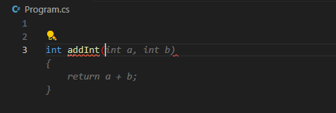
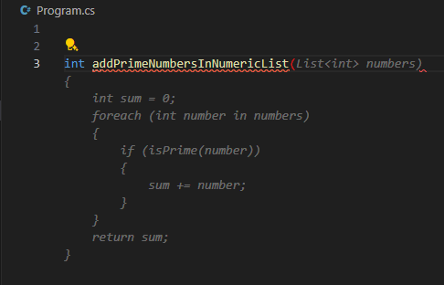
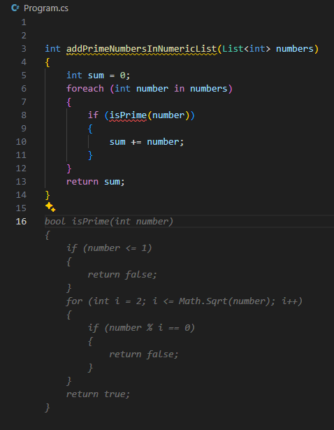
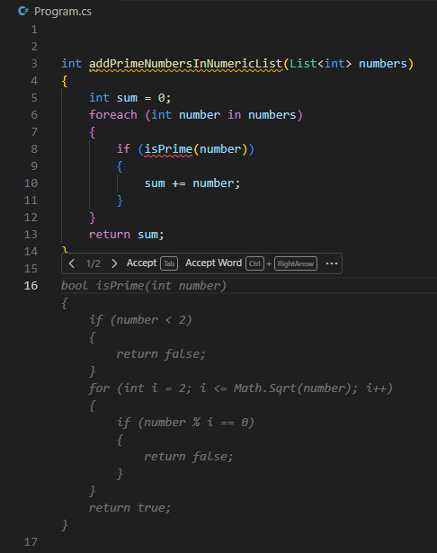
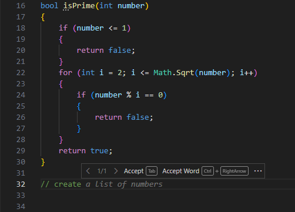
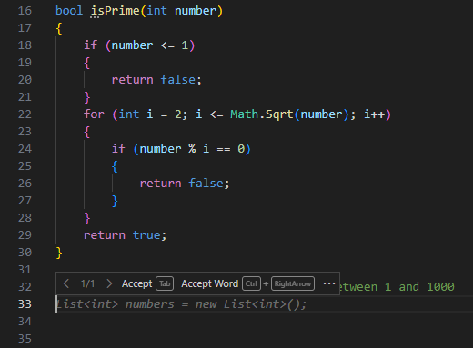

GitHub Copilot provides two types of inline suggestions. **Ghost text suggestions** appear as dimmed text at your current cursor location as you type. **Next edit suggestions (NES)** predict both the location and content of your next code edit based on recent changes you've made.

You receive ghost text suggestions when you perform the following actions:

- Enter a partial or complete code line in the editor.
- Enter a partial or complete code comment in the editor.
- Enter a blank code line in the editor.

Next edit suggestions appear automatically as you edit code. They predict what change you're likely to make next based on your recent edits and are displayed with a special indicator showing the suggested edit location.

### Common next edit suggestion scenarios

Next edit suggestions are especially useful in three coding scenarios:

- **Catching mistakes**: NES detects issues like typos (`conts x = 5` → `const x = 5`), inverted ternary expressions, and incorrect comparison operators, then suggests the correct fix.
- **Cascading intent changes**: When you rename a type or variable, NES suggests propagating that change through all dependent code. For example, renaming a class from `Point` to `Point3D` triggers suggestions to add a `z` coordinate wherever the code needs it.
- **Refactoring**: After you rename a variable once, NES suggests updating every other occurrence. After pasting code, NES suggests adapting it to match the style of the surrounding code.

## Generate a ghost text suggestion

GitHub Copilot accelerates app development by suggesting code completions based on the code you're writing.

For example, suppose you want to create a C# method named `addInt` that returns the sum of two integers. If you start typing the method signature, GitHub Copilot suggests the code that it believes you want to create.



The ghost text suggestion is displayed without colored syntax highlighting. This helps differentiate the suggestion from your existing code. You can accept the suggested code by pressing the Tab key.

You can press the Esc key to dismiss a suggestion.

The `addInt` example is a bit simplistic, so you may be wondering how GitHub Copilot does with something more complex.

Suppose you want to create a method that accepts a list of numbers and returns the sum of the prime numbers contained in the list. You could name the method `addPrimeNumbersInNumericList`. When you start typing the method signature, GitHub Copilot generates a suggestion for you. For example:



It's important to review suggestions before accepting them. This ghost text suggestion looks good, so you could accept the suggestion by pressing the Tab key.

Let's continue the scenario a bit further.

Once the suggestion is merged into your code, you notice that the `isPrime` method is underlined in red. This is because the `isPrime` method doesn't exist in the code yet.

GitHub Copilot is trained to follow best practices, which include breaking down complex problems into smaller, more manageable pieces. In this case, GitHub Copilot is suggesting that you create a separate `isPrime` method to check if a number is prime.

GitHub Copilot is ready suggest a code snippet for the `isPrime` method. When you enter a blank line below the `addPrimeNumbersInNumericList` method, GitHub Copilot suggests an `isPrime` method that you can use.



Ghost text suggestions accelerate the development process by providing code snippets. But what if the suggestions aren't quite what you need? GitHub Copilot provides an interface for managing ghost text suggestions.

## Manage ghost text suggestions

When GitHub Copilot suggests a ghost text completion, it also provides an interface for managing the suggestions. You can accept a suggestion, review other suggestions, or dismiss the suggestions.

When you hover the mouse pointer over a suggested autocompletion, you're presented with several options for managing the suggestions.



The default interface for managing suggestions includes the following options:

- Accept the suggestion (in full) by selecting **Accept**. You can also accept the suggestion by pressing the Tab key.
- Partially accept the suggestion by selecting **Accept Word**. You can also partially accept a suggestion by pressing the `Ctrl` + `→` (right arrow) keys.
- View alternate suggestions by selecting **`>`** or **`<`**. You can also view the alternative suggestions by pressing the `Alt` + `]` or `Alt` + `[` keys.

Selecting the **Accept Word** option accepts the next word in a suggestion. This is useful when you want to accept part of the suggestion and then continue typing your own code. For example, you can accept the first word of the `isPrime` method suggestion.

Continue selecting **Accept Word** until you've accepted as much of the suggestion as you want.

Selecting the ellipsis (...) icon to the right of the Accept Word button provides additional options, such as **Accept Line** and **Always Show Toolbar**.

Selecting the **Always Show Toolbar** option ensures that the toolbar remains visible when using keyboard shortcuts to manage ghost text suggestions. Selecting the **Open Completions Panel** option opens the GitHub Copilot Completions Panel.

> [!NOTE]
> To accept an entire line of a suggestion, you need to configure a custom keyboard shortcut for the `editor.action.inlineSuggest.acceptNextLine` command. This option is not available by default in the toolbar.

## Generate code suggestions from comments

In addition to suggesting an autocompletion based on code, GitHub Copilot can use code comments to suggest code snippets. Use natural language phrases to describe the code you want to create. This enables GitHub Copilot to propose autocomplete suggestions that meet specific requirements. For example, you could specify the type of algorithm you want to use in a calculation, or which methods and properties you want to add to a class.

Let's return to the prime number example. At this point, you have the following code:

```csharp
int addPrimeNumbersInNumericList(List<int> numbers)
{
    int sum = 0;
    foreach (int number in numbers)
    {
        if (IsPrime(number))
        {
            sum += number;
        }
    }
    return sum;
}

private bool IsPrime(int number)
{
    if (number <= 1)
    {
        return false;
    }
    for (int i = 2; i <= Math.Sqrt(number); i++)
    {
        if (number % i == 0) return false;
    }
    return true;
}
```

The `addPrimeNumbersInNumericList` and `isPrime` methods appear to be complete. However, you still need a list of numbers that can be used as an argument when you call the `addPrimeNumbersInNumericList` method. You can write a comment that describes the list of numbers that you want. For example, a list of 100 random numbers that range from 1 and 1000.

When you start entering the comment, GitHub Copilot suggests an autocompletion that completes the comment for you. GitHub Copilot uses your surrounding code to improve its suggestions. For example, if you start entering the comment `// create`, GitHub Copilot uses the surrounding code to predict what you want to create. In this case GitHub Copilot uses the `addPrimeNumbersInNumericList` method to predict that you want to create `a list of numbers`.



As you continue to write your comment, GitHub Copilot updates its autocomplete suggestion. When you're ready to accept the suggestion, select **Accept** or press the Tab key.

When you create a new code line after the comment, GitHub Copilot begins generating a code snippet based on the comment and your existing code.



Accept each of the suggestions as they appear. If GitHub Copilot isn't done, it generates another suggestion for you to accept.

If you enter a new code line after the code snippet is complete, GitHub Copilot generates another autocomplete suggestions based on the requirements of your code project.

## Summary

Ghost text suggestions and next edit suggestions help you write code more efficiently and accurately. Ghost text suggestions appear as dimmed text at the cursor location as you type; next edit suggestions predict the location and content of your next edit based on your recent changes. You can generate a ghost text suggestion by entering a partial or complete code line, a partial or complete code comment, or a blank code line. You can accept a suggestion by pressing the Tab key, or dismiss it by pressing the Esc key. You can manage suggestions using the toolbar that appears when you hover over a suggestion. The toolbar enables you to review alternate suggestions, accept a suggestion, accept one word of a suggestion, or open the GitHub Copilot Completions Panel to view more suggestions.
