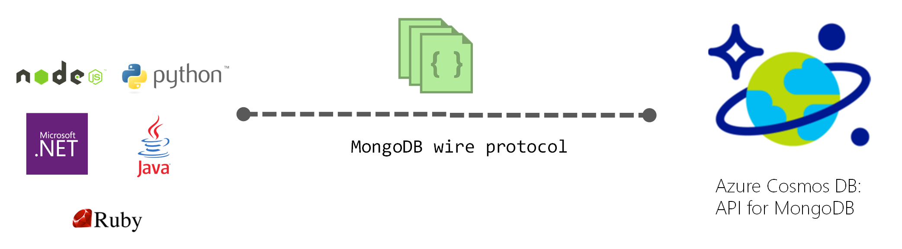

Current MongoDB developers will feel right at home using the Azure Cosmos DB API for MongoDB. The API will allow them to use Azure Cosmos DB transparently as if they were using a MongoDB database. The developers can keep on using MongoDB drivers, SDKs and tools they're familiar with to create apps and connect to Azure Cosmos DB. 

## Advantages of choosing the API for MongoDB

Let's take a look at some advantages of using the Azure Cosmos DB API for MongoDB over other offerings like MongoDB Atlas.

- **Instantaneous scalability** - [Autoscale][/azure/cosmos-db/provision-throughput-autoscale] allows your database or containers to scale throughput up/down automatically and instantly.
- Automatic and transparent sharding - While offerings like MongoDB Atlas require you to specify and manage scaling to a horizontal scaling, the Azure Cosmos DB API for MongoDB automatically manages all sharding and its infrastructure behinds the scenes for you.
- **99.999% availability** - Azure Cosmos DB offers [99.999%][/azure/cosmos-db/high-availability] read and write availability for multi-region databases.  (For information about the SLA, see the [Azure Cosmos DB service-level agreements page](/support/legal/sla/cosmos-db/v1_4/).)
- **Cost efficient, granular, unlimited scalability** - While many MongoDB offerings might limit the size of the database, Azure Cosmos DB sharded collections can scale to any size. The Azure Cosmos DB infrastructure can scale in increments as small as 1/100th of the VMs hence giving you growth granularity and reducing cost.
- **Serverless deployments** - Unlike MongoDB Atlas, the API for MongoDB is a cloud native database that offers a [serverless capacity mode][/azure/cosmos-db/serverless]. With Serverless, you're only charged per operation, and don't pay for the database when you don't use it.
- **Free Tier** - Azure Cosmos DB offers a free tier that is applied at the account level. This tier gives you the first 1000 RU/s and 25 GB of storage in your account for free.
- **Upgrades between MongoDB versions take seconds** - All API versions are contained within one codebase, making version changes as simple as [flipping a switch][azure/cosmos-db/mongodb/upgrade-mongodb-version] for the different features, with zero downtime.
- **Real time analytics (HTAP) at any scale** - The API for MongoDB offers the ability to run complex analytical queries for use cases such as business intelligence against your database data in real time with no impact to your database. This is fast and cheap, due to the cloud native analytical columnar store being utilized, with no ETL pipelines. Learn more about the [Azure Synapse Link][/azure/cosmos-db/synapse-link].

## Compatibility with multiple MongoDB server versions

Azure Cosmos DB API for MongoDB is compatible with multiple MongoDB Server versions: versions 4.2, 4.0, 3.6 and 3.2.  Azure Cosmos DB doesn't have a MongoDB database engine, it implements the wire protocol for MongoDB.  This allows for transparent compatibility with native MongoDB client SDKs, drivers and tools. Since all APIs for the different MongoDB versions use the same codebase, making upgrades is as simple as flipping a few feature flags to go from one server version to another. You can choose the MongoDB version that is best for you because unlike other MongoDB service providers, our architecture [doesn't force us to deprecate versions/features][/cosmosdb/mongodb-3-6-lives-on-in-azure-cosmos-db/].

## Get started with Azure Cosmos DB API for MongoDB

After completing this module, you’ll be able to:

- Estimate RU/s using the Azure Cosmos DB capacity planner for the Azure Cosmos DB API for MongoDB.
- Learn about support for different MongoDB features.
- Learn how to create accounts, databases and collections using the Azure Cosmos DB API for MongoDB.
- Learn how to connect and query using the Azure Cosmos DB API for MongoDB.

[/cosmosdb/mongodb-3-6-lives-on-in-azure-cosmos-db/]: https://devblogs.microsoft.com/cosmosdb/mongodb-3-6-lives-on-in-azure-cosmos-db/
[/azure/cosmos-db/provision-throughput-autoscale]: https://docs.microsoft.com/azure/cosmos-db/provision-throughput-autoscale
[/azure/cosmos-db/high-availability]: https://docs.microsoft.com/azure/cosmos-db/high-availability
[/azure/cosmos-db/serverless]: https://docs.microsoft.com/azure/cosmos-db/serverless
[azure/cosmos-db/mongodb/upgrade-mongodb-version]: https://docs.microsoft.com/azure/cosmos-db/mongodb/upgrade-mongodb-version
[/azure/cosmos-db/synapse-link]: https://docs.microsoft.com/azure/cosmos-db/synapse-link
[/support/legal/sla/cosmos-db/v1_4/]: https://azure.microsoft.com/support/legal/sla/cosmos-db/v1_4/