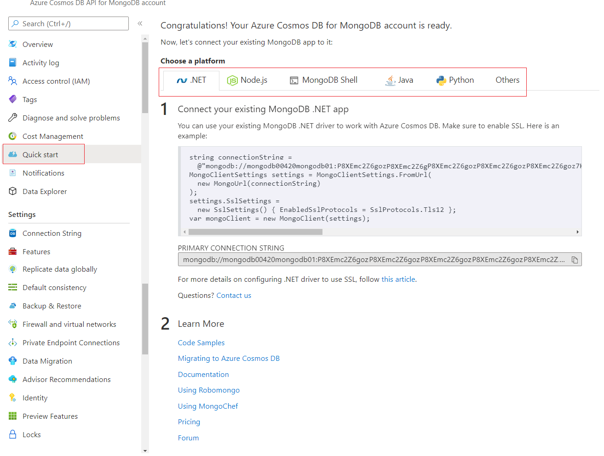

Once you create an Azure Cosmos DB for MongoDB account, connecting to that account is easy. Regardless if you're connecting from .NET, Node.js, MongoDB Shell, Java, Python, or other sources, you can find easy to follow connection instructions or scripts on the Azure portal itself. These code snippets reduce the guesswork of how to create your own connection strings or use the MongoDB Shell to connect to your account. Let's take a quick look on where we can find this information.

1. In the Azure portal, navigate to your Azure Cosmos DB for MongoDB account.

1. On the left-hand Azure Cosmos DB for MongoDB account menu, select **Quick start**.

    > [!div class="mx-imgBorder"]
    > 

There are tabs for different programming languages. Each of these tabs contains an already prepared code snippet that you use to connect to the Azure Cosmos DB for MongoDB account. All you need to do is copy and paste the code  with no changes into your application code or tool. If your programming language or tool isn't listed, the last tab list most common parameters like host, port, username, and password so you can create your own connection string on that language or tool.

That said, using connection strings isn't the best practice for production applications. Instead, you should use managed identity or other secure methods to connect to your Azure Cosmos DB for MongoDB account. The previous unit has several code snippets that show how to connect to an Azure Cosmos DB for MongoDB account using managed identity.

While it's simple to connect to an Azure Cosmos DB for MongoDB account, we should still take care of choosing the right partitioning and indexing strategy when designing our Azure Cosmos DB for MongoDB databases. It should be more than just connecting and loading/reading data. We discuss these topics in more detail in the *Partitioning and Indexing* Module.
