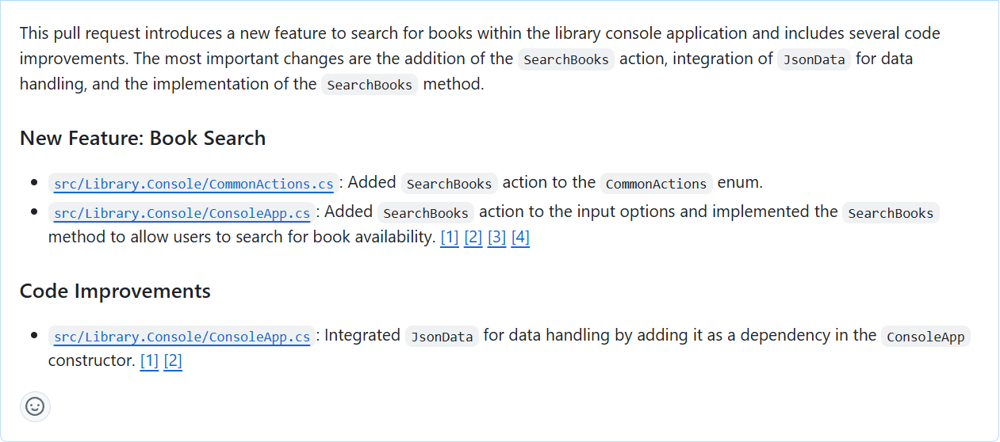

You and your coworker meet to discuss your goals for the library application. You want to improve the user experience for the librarians and patrons. You discuss several new features that could be added to the application.

You agree to work on the following features:

- Book availability: Enable a librarian to determine the availability status of a book. This feature should display a message indicating if a book is available for loan or the return due date if the book is currently on loan to another patron.

- Book loans: Enable a librarian to loan a book to a patron (if the book is available). This feature should display the option for a patron to receive a book on loan, update Loans.json with the new loan, and display updated the loan details for the patron.

- Book reservations: Enable a librarian to reserve a book for a patron (unless the book is already reserved). This feature should implement a new book reservation process. This feature may require creating a new Reservations.json file along with the new classes and interfaces required to support the reservation process.

Each of you will work on one of the new features and then regroup. You'll work on the feature to determine the availability status of a book. Your coworker will work on the feature to loan a book to a patron. The final feature, to reserve a book for a patron, will be developed after the other two features are completed.

During this exercise, you complete the following tasks:

1. Create a "book availability" branch in the code repository.

1. Develop a new "book availability" feature.

    - Use GitHub Copilot suggestions to help implement the code more quickly and accurately.
    - Sync your code updates to the "book availability" branch of your remote repository.

1. Create a pull request to merge your changes into the main branch of the repository.

## Create a new branch in the repository

Before you start developing the new "book availability" feature, you need to create a new branch in the repository. This enables you to work on the new feature without affecting the main branch of the repository. You can merge the new feature into the main branch when it's ready.

Use the following steps to complete this section of the exercise:

1. Ensure that you have the AccelerateDevGitHubCopilot solution open in Visual Studio Code.

1. Select the Source Control view and ensure that the local repository is synchronized with the remote repository (Pull or Sync).

1. In the bottom-left corner of the window, select **main**.

1. To create a new branch, type **book availability** and then select **+ Create new branch**.

1. To push the new branch to the remote repository, select **Publish Branch**.

## Develop a feature that enables a librarian to determine the availability status of a book

In this section of the exercise, you use GitHub Copilot to help you implement a new feature for the library application. Your new feature enables a librarian to determine the availability status of a book.

The book availability feature should include the following code updates:

- Add a new `SearchBooks` action to `CommonActions`.
- Update the `WriteInputOptions` method in ConsoleApp.cs. Add support for the new `CommonActions.SearchBooks` option. Display the option to check if a book is available for loan.
- Update the `ReadInputOptions` method in ConsoleApp.cs. Add support for the new `CommonActions.SearchBooks` option.
- Update the `PatronDetails` method in ConsoleApp.cs. Add `CommonActions.SearchBooks` to `options` before calling `ReadInputOptions`. Add an `else if` to handle the `SearchBooks` action. The `else if` block should call a new method named `SearchBooks`.
- Create a new `SearchBooks` method in ConsoleApp.cs. The `SearchBooks` method should read a user provided book title. Check if a book is available for loan, and display a message stating either "`book.title` is available for loan" or "`book.title` is on loan to another patron. The return due date is `loan.DueDate`.

Use the following steps to complete this section of the exercise:

1. Open the SOLUTION EXPLORER view.

1. Open the CommonActions.cs file, and then select the `CommonActions` enum.

    You need to add a new `SearchBooks` action to `CommonActions`.

1. Open the inline chat and then enter the following prompt:

    ```plaintext
    Update selection to include a new `SearchBooks` action.
    ```

    GitHub Copilot should suggest a code update that adds the new `SearchBooks` action to the `CommonActions` enum.

1. Review the suggested update and then select **Accept**.

    ```csharp
    public enum CommonActions
    {
        Repeat = 0,
        Select = 1,
        Quit = 2,
        SearchPatrons = 4,
        RenewPatronMembership = 8,
        ReturnLoanedBook = 16,
        ExtendLoanedBook = 32,
        SearchBooks = 64
    }
    ```

1. Open the ConsoleApp.cs file.

1. Find and then select the `WriteInputOptions` method.

    You need to add support for the new `CommonActions.SearchBooks` option. Display the option to check if a book is available for loan.

1. Open the inline chat and then enter the following prompt:

    ```plaintext
    Update selection to include an option for the `CommonActions.SearchBooks` action. Use the letter "b" and the message "to check for book availability".
    ```

    GitHub Copilot should suggest a code update that adds a new `if` block for the `SearchBooks` action.

1. Review the suggested update and then select **Accept**.

    The suggested update should be similar to the following code snippet:

    ```csharp
    static void WriteInputOptions(CommonActions options)
    {
        Console.WriteLine("Input Options:");
        if (options.HasFlag(CommonActions.ReturnLoanedBook))
        {
            Console.WriteLine(" - \"r\" to mark as returned");
        }
        if (options.HasFlag(CommonActions.ExtendLoanedBook))
        {
            Console.WriteLine(" - \"e\" to extend the book loan");
        }
        if (options.HasFlag(CommonActions.RenewPatronMembership))
        {
            Console.WriteLine(" - \"m\" to extend patron's membership");
        }
        if (options.HasFlag(CommonActions.SearchPatrons))
        {
            Console.WriteLine(" - \"s\" for new search");
        }
        if (options.HasFlag(CommonActions.SearchBooks))
        {
            Console.WriteLine(" - \"b\" to check for book availability");
        }
        if (options.HasFlag(CommonActions.Quit))
        {
            Console.WriteLine(" - \"q\" to quit");
        }
        if (options.HasFlag(CommonActions.Select))
        {
            Console.WriteLine("Or type a number to select a list item.");
        }
    }
    ```

1. Scroll up slightly to find and then select the `ReadInputOptions` method.

    You need to add support for the new `CommonActions.SearchBooks` option. Include a case that handles the user selecting the `SearchBooks` action.

1. Open the inline chat and then enter the following prompt:

    ```plaintext
    Update selection to include an option for the `CommonActions.SearchBooks` action.
    ```

    GitHub Copilot should suggest a code update that adds a new `case` that handles the user selecting the `SearchBooks` action.

1. Review the suggested update and then select **Accept**.

    The suggested update should be similar to the following code snippet:

    ```csharp
    static CommonActions ReadInputOptions(CommonActions options, out int optionNumber)
    {
        CommonActions action;
        optionNumber = 0;
        do
        {
            Console.WriteLine();
            WriteInputOptions(options);
            string? userInput = Console.ReadLine();

            action = userInput switch
            {
                "q" when options.HasFlag(CommonActions.Quit) => CommonActions.Quit,
                "s" when options.HasFlag(CommonActions.SearchPatrons) => CommonActions.SearchPatrons,
                "m" when options.HasFlag(CommonActions.RenewPatronMembership) => CommonActions.RenewPatronMembership,
                "e" when options.HasFlag(CommonActions.ExtendLoanedBook) => CommonActions.ExtendLoanedBook,
                "r" when options.HasFlag(CommonActions.ReturnLoanedBook) => CommonActions.ReturnLoanedBook,
                "b" when options.HasFlag(CommonActions.SearchBooks) => CommonActions.SearchBooks,
                _ when int.TryParse(userInput, out optionNumber) => CommonActions.Select,
                _ => CommonActions.Repeat
            };

            if (action == CommonActions.Repeat)
            {
                Console.WriteLine("Invalid input. Please try again.");
            }
        } while (action == CommonActions.Repeat);
        return action;
    }
    ```

1. Scroll down to find and then select the `PatronDetails` method.

    There are two things that you need to accomplish:

    - You need to add `CommonActions.SearchBooks` to `options` before calling `ReadInputOptions`.
    - You also need to add an `else if` to handle the `SearchBooks` action. The `else if` block should call a new method named `SearchBooks`.

    You can address both of these together.

1. Open the inline chat and then enter the following prompt:

    ```plaintext
    Update selection to add `CommonActions.SearchBooks` to `options` before calling `ReadInputOptions`. Add an `else if` block to handle the `SearchBooks` action. The `else if` block should call a new method named `SearchBooks`.
    ```

    GitHub Copilot should suggest a code update that adds `CommonActions.SearchBooks` to `options` before calling `ReadInputOptions`.

1. Review the suggested update and then select **Accept**.

    ```csharp
    async Task<ConsoleState> PatronDetails()
    {
        Console.WriteLine($"Name: {selectedPatronDetails.Name}");
        Console.WriteLine($"Membership Expiration: {selectedPatronDetails.MembershipEnd}");
        Console.WriteLine();
        Console.WriteLine("Book Loans:");
        int loanNumber = 1;
        foreach (Loan loan in selectedPatronDetails.Loans)
        {
            Console.WriteLine($"{loanNumber}) {loan.BookItem!.Book!.Title} - Due: {loan.DueDate} - Returned: {(loan.ReturnDate != null).ToString()}");
            loanNumber++;
        }

        CommonActions options = CommonActions.SearchPatrons | CommonActions.Quit | CommonActions.Select | CommonActions.RenewPatronMembership | CommonActions.SearchBooks;
        CommonActions action = ReadInputOptions(options, out int selectedLoanNumber);
        if (action == CommonActions.Select)
        {
            if (selectedLoanNumber >= 1 && selectedLoanNumber <= selectedPatronDetails.Loans.Count())
            {
                var selectedLoan = selectedPatronDetails.Loans.ElementAt(selectedLoanNumber - 1);
                selectedLoanDetails = selectedPatronDetails.Loans.Where(l => l.Id == selectedLoan.Id).Single();
                return ConsoleState.LoanDetails;
            }
            else
            {
                Console.WriteLine("Invalid book loan number. Please try again.");
                return ConsoleState.PatronDetails;
            }
        }
        else if (action == CommonActions.Quit)
        {
            return ConsoleState.Quit;
        }
        else if (action == CommonActions.SearchPatrons)
        {
            return ConsoleState.PatronSearch;
        }
        else if (action == CommonActions.RenewPatronMembership)
        {
            var status = await _patronService.RenewMembership(selectedPatronDetails.Id);
            Console.WriteLine(EnumHelper.GetDescription(status));
            // reloading after renewing membership
            selectedPatronDetails = (await _patronRepository.GetPatron(selectedPatronDetails.Id))!;
            return ConsoleState.PatronDetails;
        }
        else if (action == CommonActions.SearchBooks)
        {
            return await SearchBooks();
        }

        throw new InvalidOperationException("An input option is not handled.");
    }
    ```

    > [!NOTE]
    > Inline chat suggestions may also create stub code for the `SearchBooks` method.

1. Take a minute to consider the process requirements for the `SearchBooks` method.

    What does the method need to do? What should it return? Does it require parameters?

    The `SearchBooks` method should implement the following process:

    1. Prompt the user for a book title.
    1. Read the user provided book title.
    1. Check if a book is available for loan
    1. Display a message stating one of the following options:

        - "`book.title` is available for loan"
        - "`book.title` is on loan to another patron. The return due date is `loan.DueDate`.

    To build the message options, your code will need to access the following JSON files:

    - `Books.json` is needed to find the matching `Title` and `BookId`.
    - `Loans.json` is needed to find the `ReturnDate` and `DueDate` for the matching `BookItemId`. The `BookItemId` is the same as the `BookId` in `Books.json`.

1. Ensure that you have the following `SearchBooks` method created in the ConsoleApp.cs file:

    ```csharp
    async Task<ConsoleState> SearchBooks()
    {

        return ConsoleState.PatronDetails;
    }
    ```

    > [!NOTE]
    > Be sure to remove any code comments created by GitHub Copilot. Unnecessary and inaccurate comments can negatively influence GitHub Copilot's suggestions.

1. Select the `SearchBooks` method.

1. Open the inline chat and then enter the following prompt:

    ```plaintext
    Update selection to obtain a book title. Prompt the user to "Enter a book title to search for". Read the user input and ensure the book title isn't null.
    ```

    GitHub Copilot should suggest a code update that captures the user supplied book title.

1. Review the suggested update and then select **Accept**.

    ```csharp
    async Task<ConsoleState> SearchBooks()
    {
        string? bookTitle = null;
        while (String.IsNullOrWhiteSpace(bookTitle))
        {
            Console.Write("Enter a book title to search for: ");
            bookTitle = Console.ReadLine();
        }

        // Perform book search logic here

        return ConsoleState.PatronDetails;
    }
    ```

1. Select the `SearchBooks` method.

    > [!NOTE]
    > GitHub Copilot may create a separate method to handle user input of a book title. You can continue to develop the primary logic in the `SearchBooks` method.

1. Open the Chat view.

1. Add the following files to the Chat context: ConsoleApp.cs, JsonData.cs, JsonLoanRepository.cs, Books.json, Loans.json, BookItems.json, .

1. Enter the following prompt:

    ```plaintext
    @workspace  Explain how to update the `SearchBooks` method and ConsoleApps class to find a matching book title in the `Books.json` file. Use the user supplied book title to find a matching book. If a book is found, use Loans.json to check if the book is available for loan. If the book has been returned, display a message stating "`book.title` is available for loan". If the book is on loan, display a message stating "`book.title` is on loan to another patron. The return due date is `loan.DueDate`".
    ```

1. Take a minute to review the suggested updates.

    GitHub Copilot should propose updates similar to the following suggestions:

    To update the `SearchBooks` method and `ConsoleApp` class to find a matching book title in the `Books.json` file and check if the book is available for loan, follow these steps:

    a. Add a method to search for books by title in the `JsonData` class.
    b. Update the `SearchBooks` method in the `ConsoleApp` class to use this new method.
    c. Check the loan status of the book and display the appropriate message.

    Here is the updated code:

    Step 1: Add a method to search for books by title in the JsonData class

    ```csharp
    public class JsonData
    {
        // Existing code...
    
        public Book? SearchBookByTitle(string title)
        {
            return Books?.FirstOrDefault(b => b.Title.Equals(title, StringComparison.OrdinalIgnoreCase));
        }
    }
    ```

    Step 2: Update the SearchBooks method in the ConsoleApp class

    ```csharp
    public class ConsoleApp
    {
        // Existing fields...
    
        JsonData _jsonData;
    
        public ConsoleApp(ILoanService loanService, IPatronService patronService, IPatronRepository patronRepository, ILoanRepository loanRepository, JsonData jsonData)
        {
            _patronRepository = patronRepository;
            _loanRepository = loanRepository;
            _loanService = loanService;
            _patronService = patronService;
            _jsonData = jsonData;
        }
    
        // Existing methods...
    
        async Task<ConsoleState> SearchBooks()
        {
            string bookTitle = ReadBookTitle();
    
            Book? book = _jsonData.SearchBookByTitle(bookTitle);
    
            if (book == null)
            {
                Console.WriteLine($"No book found with title: {bookTitle}");
                return ConsoleState.PatronDetails;
            }
    
            Loan? loan = _jsonData.Loans?.FirstOrDefault(l => l.BookItemId == book.Id && l.ReturnDate == null);
    
            if (loan == null)
            {
                Console.WriteLine($"{book.Title} is available for loan.");
            }
            else
            {
                Console.WriteLine($"{book.Title} is on loan to another patron. The return due date is {loan.DueDate}.");
            }
    
            return ConsoleState.PatronDetails;
        }
    
        // Existing methods...
    }
    ```

    Step 3: Update the Program.cs to pass JsonData to ConsoleApp

    ```csharp
    using Microsoft.Extensions.DependencyInjection;
    using Library.Infrastructure.Data;
    using Library.ApplicationCore;
    using Microsoft.Extensions.Configuration;
    
    var services = new ServiceCollection();
    
    var configuration = new ConfigurationBuilder()
    .SetBasePath(Directory.GetCurrentDirectory())
    .AddJsonFile("appSettings.json")
    .Build();
    
    services.AddSingleton<IConfiguration>(configuration);
    
    services.AddScoped<IPatronRepository, JsonPatronRepository>();
    services.AddScoped<ILoanRepository, JsonLoanRepository>();
    services.AddScoped<ILoanService, LoanService>();
    services.AddScoped<IPatronService, PatronService>();
    
    services.AddSingleton<JsonData>();
    services.AddSingleton<ConsoleApp>();
    
    var servicesProvider = services.BuildServiceProvider();
    
    var consoleApp = servicesProvider.GetRequiredService<ConsoleApp>();
    consoleApp.Run().Wait();
    ```

    With these changes, the `SearchBooks` method in the `ConsoleApp` class will now search for a book by title in the `Books.json` file and check its loan status in the `Loans.json` file. If the book is available for loan, it will display a message stating that the book is available. If the book is on loan, it will display a message stating that the book is on loan and provide the return due date.

1. Add the suggested method to the end of the `JsonData` class.

    ```csharp
    public Book? SearchBookByTitle(string title)
    {
        return Books?.FirstOrDefault(b => b.Title.Equals(title, StringComparison.OrdinalIgnoreCase));
    }
    ```

1. Update the Program.cs file using the suggested updates.

    ```csharp
    using Microsoft.Extensions.DependencyInjection;
    using Library.Infrastructure.Data;
    using Library.ApplicationCore;
    using Microsoft.Extensions.Configuration;
    
    var services = new ServiceCollection();
    
    var configuration = new ConfigurationBuilder()
    .SetBasePath(Directory.GetCurrentDirectory())
    .AddJsonFile("appSettings.json")
    .Build();
    
    services.AddSingleton<IConfiguration>(configuration);
    
    services.AddScoped<IPatronRepository, JsonPatronRepository>();
    services.AddScoped<ILoanRepository, JsonLoanRepository>();
    services.AddScoped<ILoanService, LoanService>();
    services.AddScoped<IPatronService, PatronService>();
    
    services.AddSingleton<JsonData>();
    services.AddSingleton<ConsoleApp>();
    
    var servicesProvider = services.BuildServiceProvider();
    
    var consoleApp = servicesProvider.GetRequiredService<ConsoleApp>();
    consoleApp.Run().Wait();
    ```

1. Add the `JsonData _jsonData;` field declaration to the `ConsoleApp` class before the class constructor.

1. Add a `JsonData jsonData` parameter to the `ConsoleApp` class constructor and use it to initialize the `_jsonData` field inside the constructor.

    The updated class constructor should look like the following code snippet:

    ```csharp
    public ConsoleApp(ILoanService loanService, IPatronService patronService, IPatronRepository patronRepository, ILoanRepository loanRepository, JsonData jsonData)
    {
        _patronRepository = patronRepository;
        _loanRepository = loanRepository;
        _loanService = loanService;
        _patronService = patronService;
        _jsonData = jsonData;
    }
    ```

1. Notice that JsonData isn't recognized in the `ConsoleApp` class.

    You need to add `using Library.Infrastructure.Data;` to the top of the `ConsoleApp.cs` file.

1. Ensure that the `using Library.Infrastructure.Data;` statement is added to the top of the `ConsoleApp.cs` file.

1. Use the code suggestions to update the `SearchBooks` method:

    The suggested code should use a LINQ query to search for the book by title. If the book is found, another LINQ query is used to determine if the book is on loan. The code also includes logic to display the availability status of the book based on the search results. The logic used to display response messages can be implemented in several ways. An example is provided in the code snippet below.

    The following code snippet shows one possible implementation of the `SearchBooks` method:

    ```csharp
    async Task<ConsoleState> SearchBooks()
    {
        string bookTitle = ReadBookTitle();

        Book? book = _jsonData.SearchBookByTitle(bookTitle);

        if (book == null)
        {
            Console.WriteLine($"No book found with title: {bookTitle}");
            return ConsoleState.PatronDetails;
        }

        Loan? loan = _jsonData.Loans?.FirstOrDefault(l => l.BookItemId == book.Id && l.ReturnDate == null);

        if (loan == null)
        {
            Console.WriteLine($"{book.Title} is available for loan.");
        }
        else
        {
            Console.WriteLine($"{book.Title} is on loan to another patron. The return due date is {loan.DueDate}.");
        }

        return ConsoleState.PatronDetails;
    }
    ```

1. Select the `SearchBooks` method.

1. Open the Chat view, and then enter the following prompt:

    ```plaintext
    Explain the LINQ queries and the evaluation of the book's availability status.
    ```

1. Take a minute to review the explanation provided by GitHub Copilot.

    For the query that checks whether the book is on loan, you should see a description that's similar to the following explanation:

    ```markdown
    **Search for the Loan Status of the Book**
    ```

    ```csharp
    Loan? loan = _jsonData.Loans?.FirstOrDefault(l => l.BookItemId == book.Id && l.ReturnDate == null);
    ```

    ```markdown
    - _jsonData.Loans: Accesses the list of loans from the JsonData class.

    - ?.: The null-conditional operator ensures that if _jsonData.Loans is null, the entire expression will return null without throwing a NullReferenceException.

    - FirstOrDefault: A LINQ method that returns the first element in the collection that matches the specified condition, or null if no such element is found.

    - Lambda Expression: l => l.BookItemId == book.Id && l.ReturnDate == null

        - l.BookItemId == book.Id: Checks if the BookItemId of the loan matches the Id of the book being searched.

        - l.ReturnDate == null: Checks if the loan's ReturnDate is null, indicating that the book is currently on loan and has not been returned.

    - Result: If a matching loan is found, it is assigned to the loan variable. If no matching loan is found, loan is null.

    **Evaluation of the Book's Availability Status**

    After executing the LINQ queries, the method evaluates the availability status of the book:

      - If `loan` is `null`, the book has been returned. The method prints that the book is available for loan.
      - If `loan` is not `null`, the book is currently on loan (no return date). The method prints that the book is on loan and provides the date when the book should be returned.

    ```

1. Verify the logic implemented by the **Check if the Book is on Loan** query.

    Null-Conditional Operator: The `?.` operator is a null-conditional operator. It ensures that if `_jsonData.Loans` is `null`, the entire expression will evaluate to `null` without throwing a `NullReferenceException`.

    Lambda Expression: The lambda expression `l => l.BookItemId == book.Id && l.ReturnDate == null` defines the condition for the `FirstOrDefault` method. It checks each `loan` object `l` to see if its `BookItemId` matches the `Id` of the `book` object and if its `ReturnDate` is `null`.

    This code attempts to find the first `loan` in the `_jsonData.Loans` collection where the `BookItemId` matches the `Id` of the given `book` and the `ReturnDate` is `null`. If no such `loan` is found or if `_jsonData.Loans` is `null`, `loan` will be set to `null`.

    > [!NOTE]
    > Most modern libraries have multiple copies of the same book. This code assumes that there is only one copy of each book. If the library has multiple copies of the same book, the code will need to be updated to handle multiple loans for the same book. For the purposes of this training, we are assuming that there is only one copy of each book and that the logic provided is sufficient.

1. Build the solution to ensure that there are no errors.

    You'll see Warning messages, but there shouldn't be any errors.

    To build the solution in the Solution Explorer view, right-click **AccelerateDevGitHubCopilot** and then select **Build**.

## Sync your changes with the remote repository

1. Select the Source Control view.

1. Ensure that the files you updated are listed under **Changes**.

1. Use GitHub Copilot to generate a message for the **Commit**.

1. To stage and commit your changes, select **Commit** and then select **Yes**.

1. Sync (or Push) changes to the remote repository.

## Check your work

In this section of the exercise, you complete the following tasks:

1. Verify that the new feature correctly determines the availability status of a book.
1. Create a pull request to merge your changes into the main branch of the repository.

### Verify that your new feature works as expected

Since you don't have automated tests, manual testing can be used to verify that the new feature works as expected. Using a data source that can be verified is important. In this case, you use the `Books.json` and `Loans.json` files to verify that the new feature reports the availability status of a book correctly.

Use the following steps to complete this section of the exercise:

1. Open the Solution Explorer view.

1. To run the application, right-click **Library.Console**, select **Debug**, and then select **Start New Instance**.

1. When prompted for a patron name, type **One** and then press Enter.

    You should see a list of patrons that match the search query.

1. At the "Input Options" prompt, type **2** and then press Enter.

    Entering **2** selects the second patron in the list.

    You should see the patron's name and membership status followed by book loan details.

1. At the "Input Options" prompt, type **b** and then press Enter.

    Entering **b** selects the option to search for a book's availability status.

    You should see a prompt to enter a book title.

1. Type **Book One** and then press Enter.

    In the original data that you downloaded, **Book One** is currently on loan to **Patron Forty-Nine**, so it shouldn't be available.

1. Verify that the application displays a message indicating that the book is on loan to another patron.

1. Verify that **Book Nine** has been returned by **Patron One**.

    In the previous exercise, during a test of the Library application, you had **Patron One** return **Book Nine**. If the application shows that **Book Nine** hasn't been returned by **Patron One**, use the input options to select and return **Book Nine** before continuing.

    > [!NOTE]
    > The `Library.Console.csproj` file ensures that the JSON data files are copied to the output directory when the application is built. However, performing Clean or Rebuild operations will essentially reset the data. Repeated Build operations do not reset the data in the output directory (`/bin/Debug/net8.0/`).

1. At the "Input Options" prompt, type **b** and then press Enter.

1. Type **Book Nine** and then press Enter.

1. Verify that the application displays a message indicating that the book is available for loan.

1. At the "Input Options" prompt, type **q** and then press Enter.

1. Stop the debug session.

1. Open the `Loans.json` file.

    The `Loans.json` file is used to track the loan status of each book. You can use the `Loans.json` file to verify that the availability status of Book One and Book Nine is correct.

    The updated `Loans.json` file should be located in either the `Library.Console\bin\Debug\net8.0\Json` folder or `Library.Console\Json` folder.

    - If you're using the Visual Studio Code debugger to run the app, the updated `Loans.json` file should be located in the `Library.Console\bin\Debug\net8.0\Json` folder.

    - If you're using a `dotnet run` command from the `AccelerateDevGitHubCopilot\src\Library.Console>` folder to run the app, the updated `Loans.json` file should be located in the `Library.Console\Json` folder.

1. Verify that loan ID 37 and loan ID 46 are both for Book One (`"BookItemId": 1`).

    - Loan ID 37 should have a `ReturnDate` value (2024-01-17)
    - Loan ID 46 shouldn't have a `ReturnDate` value. The `ReturnDate` value should be `null`.

    The `ReturnDate` value is used to determine whether the book is currently on loan. If the `ReturnDate` value is `null`, the book is considered to be on loan.

1. Verify that loan ID 22 is for Book Nine (`"BookItemId": 9`) and that the `ReturnDate` value is set to today's date.

    If you're running in the debugger and you cleaned the solution after making changes to the `Loans.json` file, those changes are lost. After you clean the solution, the `Loans.json` file is reset to the original data the next time you run the application. You can manually update the `Loans.json` file to test the availability status of Book One and Book Nine.

### Create a pull request to merge your changes into the main branch

You completed the new feature that enables a librarian to determine the availability status of a book. Now you need to merge your changes into the main branch of the repository. You can create a pull request to merge your changes into the main branch.

Use the following steps to complete this section of the exercise:

1. Open your GitHub repository in a web browser.

1. Open the **Pull requests** tab.

1. Select **New pull request**.

1. Under **Compare changes**, ensure that **base** is configured for the **main** branch.

1. Ensure that **compare** is configured for the **book-availability** branch.

    After you configure the branches, a comparison of the changes between **main** and **book-availability** is displayed. You should see the changes for each of the files you updated.

1. Select **Create pull request**.

1. Enter a title and description for the pull request.

    You can use the following title and description:

    - **Title**: feat: Add search functionality for books in ConsoleApp
    - **Description**: This pull request adds a new feature that enables a librarian to determine the availability status of a book. The feature includes a new `SearchBooks` action in `CommonActions`, updates to the `WriteInputOptions`, `ReadInputOptions`, and `PatronDetails` methods in `ConsoleApp`, and adds a new `SearchBooks` method in `ConsoleApp`.

    > [!NOTE]
    > Members of an enterprise with a subscription to GitHub Copilot Enterprise, can use GitHub Copilot to generate a summary of a pull request on GitHub.com. You can use the summary to help reviewers understand your changes, or to quickly understand the changes in a pull request you're reviewing. Select **GitHub Actions** and then select **Summary** to generate a summary of the pull request.

    Here's an example of a pull request summary that was generated using a GitHub Copilot Enterprise account:

    

1. Ensure that the title and description reflect your code updates, and then select **Create pull request**.

1. Wait for the checks to complete, and then verify that all checks passed and that there are no conflicts with the base branch.

    It can take a minute for the checks to complete. You need to address any issues that are identified before you can merge the changes into the main branch.

1. To merge your changes into the main branch, select **Merge pull request**, and then select **Confirm merge**.

    Notice that you can delete the `book-availability` branch after merging the changes.

1. Open Visual Studio Code.

1. Switch to the **main** branch of the repository.

1. **Pull** the changes from the remote repository.

1. Verify that the changes you made in the **book-availability** branch are now in the **main** branch.
