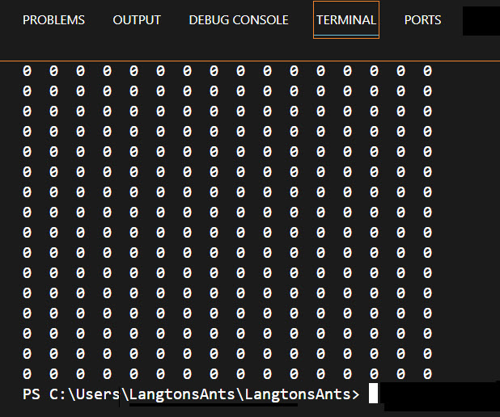

In this exercise, you get started with the project. you'll create the Langton's Ant console application and start working on the Program.cs file code. In the Program.cs file, you create a two-dimensional byte array that is the grid (also referred to as the playing field) and then check your progress.

## Create a new console application

Let's begin by creating a new VS Code console application project.

1. Create a directory for your project.
    1. Open File Explorer.
    1. Create a project directory on your Desktop by right-clicking your Desktop folder and selecting 'Show more options'.
    1. Select New --> Folder
    1. Name your folder `Langtons Ant Project` and press Enter.

1. Create a console app in VS Code.
    1. Right-click the LangtonsAnt folder and select 'Show more options'.
    1. Right-click the LangtonsAnt folder and select 'Open with Code'.
    1. Select View --> Terminal to open a console window.
    1. Verify that you're using the .NET 6.0 or above by entering `dotnet --version` and pressing Enter.
    1. Create your project by entering the type of application you want to create, its directory, and name for your application: `dotnet new console -o LangtonsAnt` and press Enter.
    1. Enter `cd LangtonsAnt` to change your current directory to your newly created application folder.
    1. Run your starter 'Hello World' application to make sure you created your console application correctly.
    1. Run your application, in the terminal window enter `dotnet run` and press Enter.

    > [!NOTE]
    > You need to be sure you are in the LangtonsAnt directory when you try and build or run your project. This directory is where your project file (LangtonsAnt.proj) is located, which is needed to run your application.

You should see the words 'Hello, world!' in the console window. You can close the default Welcome file that is created for you by VS Code.

Now that you have created a basic console application that runs in the little window called a console, you're ready to add files to it. Let's begin, however, by modifying the Program.cs file that VS Code created for you.

## Create a two-dimensional integer array

You'll create a two dimensional (16x16) byte array that represents the grid for the ants. You then display it by creating a nested looping structure that prints characters to the screen showing the cell locations. The outer loop is creating the horizontal cells (x-axis), while the inner loop is stacking each row as it builds out the vertical axis.

1. Open your Program.cs file and delete the starter code in the file.

1. Next, add the following two dimensional byte array for the grid:

   `int[,] field = new int[16, 16];`

## Create the loops

Now you'll need to be able to loop through each position in your two-dimensional array to create the grid or field.

1. First, create the outer `for` loop.

    ```csharp
    for(int i = 0; i < field.GetLength(0); i++) {
        // You will put stuff here
    }
    ```

1. Then create the inner `for` loop.

    ```csharp
    for(int i = 0; i < field.GetLength(0); i++) {
        for(int j = 0; j < field.GetLength(1); j++){
            // You will put stuff here
        }
    }
    ```

1. Now add grid characters and spacing using Console.Write and Console.WriteLine statements to the inner body of the loop so you can see the grid you created.

    ```csharp
    for(int i = 0; i < field.GetLength(0); i++) {
        for(int j = 0; j < field.GetLength(1); j++){
            Console.Write($"{field[i, j]}  ");
        }
        Console.WriteLine();
    }
    ```

1. Save your work by entering Ctrl-S and press enter.

## Check your work

Build the project and launch the application. 

1. Build your project by entering 'dotnet build' in your terminal window and pressing Enter.

1. Run the project by entering `dotnet run` and pressing Enter.



You should see a representation of the grid printed to the screen using 0s and spaces, as shown. Make sure it outputs the array you created with each “row” printed on a separate line.