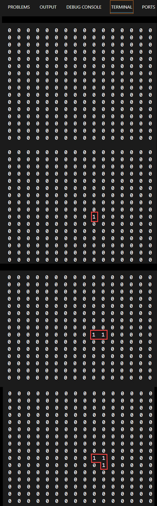

In this exercise, you create the Game folder in the application root and begin implementing LangtonsAnt game concepts in this folder.

## Create a game folder

1. Ensure that you have the VS Code Editor open to your LangtonsAnt project.

1. Select the folder icon in the Explorer pane of the editor.

1. Name your new folder *Game* in the text box and press enter.

## Create AntDirection enum

Now that you have a Game folder, you can begin adding your application files to it. To start, you will create an enum (enumerable) that specifies the 4 directions Langton's Ant can move. Using an enum makes the code more readable and easier to understand.

1. Click the Game folder and select the New File icon.

1. Name your new file AntDirection.cs and press enter.

1. Create a namespace so your project can find the files that belong to it.

    ```csharp
    namespace LangtonsAnt
    {

    }
    ```

 You will later need to reference this namespace in a 'using' statement ('using LangtonsAnt') so that your program can find your code.

>[!NOTE]
>You may notice that your code does not always format correctly in the editor, especially if you are copying and pasting code. To get your code to format correctly, you can right-click anywhere in the text window to bring up the editor menu and select Format Document or type Shift-Alt-F.

1. Now you will add what is called an enum to your code. It allows you to easily know the number that corresponds to each movement.

    ```csharp
    namespace LangtonsAnt
    {
        public enum AntDirection
        {
            Up = 0,
            Right = 1,
            Down = 2,
            Left = 3
        }
    }
    ```

## Create an Ant class and add Ant properties and a constructor

Add an Ant class in your new namespace in a file called Ant.cs.

1. Select the Game folder and click the New File icon.

1. Name the new file you're creating Ant.cs and press enter.

1. Add your namespace to the new file.

    ```csharp
    namespace LangtonsAnt
    {

    }
    ```

1. Inside the namespace create the Ant class.

    ```csharp
    namespace LangtonsAnt
    {
        public class Ant
        {
        
        }
    }
    ```

1. You will need a and 'I' integer property for the rows index and a 'J' property for the columns index. You will also need a Direction property to store the information about the ants orientation. Let's start by adding the properties.

    ```csharp
    namespace LangtonsAnt
    {
        public class Ant
        {
            public int I { get; set; }
            public int J { get; set; }
            public AntDirection Direction { get; set; }
        }
    }
    ```

1. Add you Ant contructor and initialize you properties.

    ```csharp
    namespace LangtonsAnt
    {
        public class Ant
        {
            public int I { get; set; }
            public int J { get; set; }
            public AntDirection Direction { get; set; }

            public Ant(int i, int j, AntDirection direction)
            {
                I = i;
                J = j;
                Direction = direction;
            }
        }
    }
    ```

## Add ant Act method and helper methods

As you may notice, your Ant class is used to implement game mechanics and the movement of an ant. Your Act method will get the new field cell color and Ant location and orientation, based on the previous values. It will use helper methods for calculating the new Ant's location and orientation.

1. Add a method called Act that takes a byte variable called *oldValue* and returns a byte.

    ```csharp
    public virtual byte Act(byte oldValue)
    {
        byte ret;
        if (oldValue == 0)
        {
            ret = 1;
            RotateCW();
        }
        else
        {
            ret = 0;
            RotateCCW();
        }
        Move();
        return ret;
    }
    ```

1. Add a Move method.

    ```csharp
    protected void Move()
    {
        if (AntDirection.Up == Direction) I--;
        if (AntDirection.Right == Direction) J++;
        if (AntDirection.Down == Direction) I++;
        if (AntDirection.Left == Direction) J--;
    }
    ```

1. Add a RotateCW (rotate clock-wise) method.

    ```csharp
    public void RotateCW()
    {
        Direction = (AntDirection)(((int)Direction + 1) % 4);
    }
    ```

1. Add a RotateCCW (rotate counter clock-wise) statement.

    ```csharp
    public void RotateCCW()
    {
        Direction = (AntDirection)((int)Direction == 0 ? 3 : (int)Direction - 1);
    }
    ```

## Add Game class

You'll now create your Game class and add a few properties to it. The Game class holds information about the state of the game. The state of the game is described by a generation number, the game field, and an ant instances collection.

1. Select the Game folder, then click the New File icon.

1. Enter the name of the new file, Game.cs, and press enter.

1. Add your namespace.

    ```csharp
    namespace LangtonsAnt
    {

    }
    ```

1. Create your class.

    ```csharp
    namespace LangtonsAnt
    {
        public class Game
        {
        
        }
    }
    ```

## Add a GenerationN property

1. The first item you'll add to your new class is a property called 'GenerationN' used to create a new ant. Type the word `prop` (short for property) and press Tab twice to highlight the name of your new property.
1. Enter your property name `GenerationN`.
1. Tab to the end of the line and add `= 0 ;`.

    ```csharp
    namespace LangtonsAnt
    {
        public class Game
        {
            public int GenerationN { get; set; } = 0;
        }
    }
    ```

## Add Field property

1. Beneath the previous property, type the word `prop` again and press Tab.
1. Enter `byte[,]` for a dimensional byte array.
1. Press Tab again.
1. Enter your property name `Field`.
1. Press Enter.

    ```csharp
    namespace LangtonsAnt
    {
        public class Game
        {
            public int GenerationN { get; set; } = 0;
            public byte[,] Field { get; set; }
        }
    }
    ```

    >[!NOTE]
    >You will get errors saying that your properties contain Non-nullable values. You can ignore these for now. When you create your Ant constructor you will initialize these properties and the errors will go away.

## Add an Ants property

1. Now, beneath your Field property, type the word `prop` and press Tab once.
1. Enter `Ant[]`.
1. Press Tab again.
1. Enter your property name `Ants`.
1. Press Enter.

Your growing class should look like this, so far. Again, don't worry about the 'Non-nullable' error for now. You will fix them shortly.

```csharp
namespace LangtonsAnt
{
    public class Game
    {
        public int GenerationN { get; set; } = 0;
        public byte[,] Field { get; set; }
        public Ant[] Ants { get; set; }
    }
}
```

## Create a "getter" only Size property

As you know, properties 'get' and 'set' values of a particular type (int, string, etc). You can, however, customize them so that they only either 'get' or 'set' a value, but not both. Here you are customizing your Size property so that it only gets the size of the field.

```csharp
namespace LangtonsAnt
{
    public class Game
    {
        public int GenerationN { get; set; } = 0;
        public byte[,] Field { get; set; }
        public Ant[] Ants { get; set; }
        public int Size
        {
            get => Field.GetLength(0);
        }
    }
}
```

## Add a constructor

Add a constructor that sets a default 'size' variable to 64 for the two dimensional byte array that is your playing field. You will also now initialize your 'Field' and and 'Ants' properties. This should make the 'Non-nullable' errors you have been seeing go away.

```csharp
namespace LangtonsAnt
{
    public class Game
    {
       public int GenerationN { get; set; } = 0;
       public byte[,] Field { get; set; }
       public Ant[] Ants { get; set; }
       public int Size
       {
            get => Field.GetLength(0);
       }

       public Game(int size = 64)
       {
            Field = new byte[size, size];
            Ants = new Ant[] {
                new Ant(i: size/2 + 1, j: size / 2 + 1, direction: AntDirection.Up)
            };
       }
    }
}
```

## Implement Game methods

Now that you have created your Game class with a constructor that initializes the size of your byte array for your grid and created your properties, you're ready to begin implementing the methods you will need. You begin by creating a method called *NextGeneration* and then adding the method it calls, *CalcNextGeneration*.

You're separating out your *NextGeneration* methods into two methods for clarity sake. Although it's the *CalcNextGeneration* method that does the real work of the two methods, you begin by creating the *NextGeneration* method that calls into it.

>[!NOTE]
> The 'CalcNextGeneration' method calculates the next presentation of the grid, displaying the new position of the ant in the grid. It is literally calculating a new presentation (or generation) of the grid based on the ants movements.

1. Beneath your constructor, create a public method called `CalcNextGeneration` that looks like this.

    ```csharp
    public void CalcNextGeneration()
    {
    
    }
    ```

Add code to `CalcNextGeneration` method.

1. Create a variable called `newField` from your byte array that you can use for your new cell value.

    ```csharp
    public byte[,] CalcNextGeneration()
    {
        var newField = (byte[,])Field.Clone();
    }
    ```

1. Beneath it, create a `for` loop so you can loop through each ant and set the newField value(s).

    ```csharp
    for (int index = Ants.Length - 1; index >= 0; index--)
    {

    }
    ```

1. Get the current ant and assign it to a variable called `ant`.

    ```csharp
    for (int index = Ants.Length - 1; index >= 0; index--)
    {
        var ant = Ants[index];
    }
    ```

1. Now check if the ant is still within the field with the following 'if' statement, below your 'ant' variable.

This next bit of code checks to see if the ant is still in the grid. The following `if` statement checks to see if an ant has exceeded the bound of the grid. If an ant has exceeded the bounds of the grid, you `continue` and skip processing that ants movements and begin the loop again with our next ant.

```csharp
// Check if the ant is still within the field
if (ant.I < 0 || ant.J < 0 || ant.J >= Size || ant.I >= Size)
{
    // TODO later you can act on ants going out of the field, 
    // for now you just exclude them from processing
    continue;
}
```

The next several lines of code essentially swap out the old grid value (initially a 0) and replace it with the new one (initially a 1), now that the ant has landed on it. The first thing you do is take the newField variable you created which is our entire grid and grab the individual cell the ant is currently on.

1. Add the following line below the `if` statement `byte v = newField[ant.I, ant.J];`.

1. Now put the `i` and `j` integer values into their own variables for clarity sake, in preparation for updating our grid:

    ```csharp
    int i = ant.I;
    int j = ant.J;`
    ```

1. Add the following line `byte newVal = ant.Act(v);`.

1. Add the following line `newField[i, j] = newVal;`.

1. Add a return statement that returns the updated grid `return newField;` (outside of `for` loop). Your code should look like this.

    ```csharp
        private byte[,] CalcNextGeneration()
        {
            var newField = (byte[,])Field.Clone();

            for (int index = Ants.Length - 1; index >= 0; index--)
            {
                var ant = Ants[index];

                // Check if the ant is still within the field
                if (ant.I < 0 || ant.J < 0 || ant.J >= Size || ant.I >= Size)
                {
                    // TODO later you will act on ants going out of the field, 
                    //      now you just exclude them from processing
                    continue;
                }

                byte v = newField[ant.I, ant.J];
                int i = ant.I;
                int j = ant.J;
                byte newVal = ant.Act(v);
                newField[i, j] = newVal;
            }

            return newField;
        }
    ```

1. Create the NextGeneration method that calls the 'CalcNextGeneration()' method.

    ```csharp
    public void NextGeneration()
    {
        Field = CalcNextGeneration();
        GenerationN++;
    }
    ```

## Rewrite Program.cs to print game state

Your final task for this exercise is to rewrite the Program.cs file so that it prints the state of the game. You will do this by creating a Print method that takes a Game object and putting your existing print code inside the new method, changing the 'field' byte array to 'game.Field' so that it is now associated with an instance of the game.

1. Start by deleting the 'field' byte array we created in Program.cs to demo the playing field, 'int[,] field = new int[16, 16];'

1. Now replace it with a 'using' statement so that your code knows where to find the code you have been writing that is in that namespace, 'using LangtonsAnt;'.

1. Create your Print method that takes a Game object and rework your 'for' loops so that they now use the 'Field' property in the Game object you are passing in.

    ```csharp
    using LangtonsAnt;

    void Print(Game game)
    {
        for (int i = 0; i < game.Field.GetLength(0); i++)
        {
            for (int j = 0; j < game.Field.GetLength(1); j++)
                Console.Write($"{game.Field[i, j]}  ");
            Console.WriteLine();
        }
        Console.WriteLine();
    }
    Console.WriteLine();
    ```

>[!NOTE]
>You will get an error saying that your Print method is declared but never used. The error will go away shortly, as you will now be adding code to invoke the method.

## Create a game instance and go through a few generations

Now you should be ready to create an instance of the Game class and call NextGeneration and print it with your Print method.

1. Open your Program.cs file, if it is not already open.

1. Create an instance of the Game class beneath your last 'Console.WriteLine()' statement.

    ```csharp
    void Print(Game game)
    {
        for (int i = 0; i < game.Field.GetLength(0); i++)
        {
            for (int j = 0; j < game.Field.GetLength(1); j++)
                Console.Write($"{game.Field[i, j]}  ");
            Console.WriteLine();
        }
        Console.WriteLine();
    }
     Console.WriteLine();

     Game game = new Game(16);
    ```

1. Now add several calls to your 'Print' method, passing it the 'Game' object ('game') you just created, then call the 'NextGeneration()' property on the game ('game.NextGeneration') to create additional ants.

    ```csharp
    void Print(Game game)
    {
        for (int i = 0; i < game.Field.GetLength(0); i++)
        {
            for (int j = 0; j < game.Field.GetLength(1); j++)
                Console.Write($"{game.Field[i, j]}  ");
            Console.WriteLine();
        }
        Console.WriteLine();
    }
    Console.WriteLine();

    Game game = new Game(16);
    Print(game);
    game.NextGeneration();
    Print(game);
    game.NextGeneration();
    Print(game);
    game.NextGeneration();
    Print(game);
    ```

1. Press Ctrl-s to save your work.

## Check your work

1. Build your code with the following statement, 'dotnet build'.

1. Run your code, 'dotnet run'.

1. Compare your output. It should look similar to the output below, with the game field being output 3 times. Each game field changes with each generation according to the LangtonsAnts rules.


