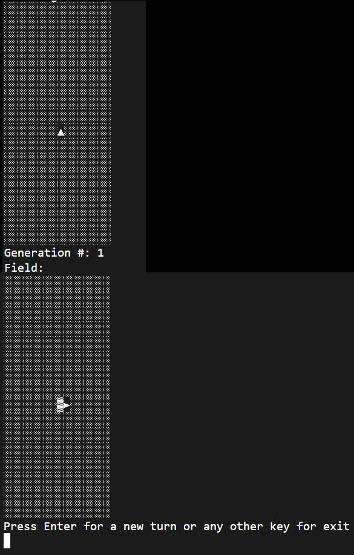

In this last exercise, you make your game field, or grid, look a little nicer. To do that, you edit your Print method in the Program.cs file. Essentially, rather than a “0”, your method now uses this symbol '░' instead. Rather than the number “1”, you use this symbol '▓'. When an ant is present, you print the direction of the ant's current direction, for example, '►'.

## Add Game field pretty-printing

In your Program.cs file, you begin by modifying the 'for' loops you created earlier in the Print method, replacing the zeros with a character. Start by removing that line in your inner 'for' loop.

1. Delete the `Console.Write($"{game.Field[i, j]}  ")` in your inner loop and replace it with the following line 'char fieldChar = '░';'.

1. Now check to see if an ant exists in your collection at the current location by adding the following line, 'Ant? ant = game.Ants.FirstOrDefault(a => (i == a.i) && (j == a.j))'.

    ```csharp
    using LangtonsAnt;

    void Print(Game game)
    {
        for (int i = 0; i < game.Field.GetLength(0); i++)
        {
            for (int j = 0; j < game.Field.GetLength(1); j++)
            {
                char fieldChar = '░'; 

                // Check for an ant in your collection
                Ant? ant = game.Ants.FirstOrDefault(a => (i == a.i) && (j == a.j));
            }     
            Console.WriteLine();
        }
        Console.WriteLine();
    }
    Console.WriteLine();
    ```

    Your Print method should look like what you see pictured.

1. If there's an ant, print the symbol for its direction, as shown in the 'if' and Switch statements.

    ```csharp
    using LangtonsAnt;

    void Print(Game game)
    {
        for (int i = 0; i < game.Field.GetLength(0); i++)
        {
            for (int j = 0; j < game.Field.GetLength(1); j++)
            {
                char fieldChar = '░'; 

                // If ant is at the cell, display ant direction instead of color value
                Ant? ant = game.Ants.FirstOrDefault(a => (i == a.i) && (j == a.j));

                if (ant != null)
                {
                    // Draw one of the ants
                    switch (ant.Direction)
                    {
                        case AntDirection.Up:
                            fieldChar = '▲';
                            break;
                        case AntDirection.Right:
                            fieldChar = '►';
                            break;
                        case AntDirection.Down:
                            fieldChar = '▼';
                            break;
                        case AntDirection.Left:
                            fieldChar = '◄';
                            break;
                    }
                }
            }   
            Console.WriteLine();
        }
        Console.WriteLine();
    }
    Console.WriteLine();
    ```

    If there's no ant at that location, you flip the color of the cell from black to white as shown in the 'else' clause of the 'if' statement.

4. Add an 'else' clause to the 'if' statement as shown.

    ```csharp
    using LangtonsAnt;

    void Print(Game game)
    {
        for (int i = 0; i < game.Field.GetLength(0); i++)
        {
            for (int j = 0; j < game.Field.GetLength(1); j++)
            {
                char fieldChar = '░'; 

                // If ant is at the cell, display ant direction instead of color value
                Ant? ant = game.Ants.FirstOrDefault(a => (i == a.i) && (j == a.j));

                if (ant != null)
                {
                    // Draw one of the ants
                    switch (ant.Direction)
                    {
                        case AntDirection.Up:
                            fieldChar = '▲';
                            break;
                        case AntDirection.Right:
                            fieldChar = '►';
                            break;
                        case AntDirection.Down:
                            fieldChar = '▼';
                            break;
                        case AntDirection.Left:
                            fieldChar = '◄';
                            break;
                    }
                }
                else
                {
                    fieldChar = game.Field[i, j] == 0 ? '░' : '▓';
                }
            }     
            Console.WriteLine();
        }
        Console.WriteLine();
    }
    Console.WriteLine();
    ```

1. Finally, change the 'Console.WriteLine() after the 'else' clause to print the 'fieldChar' variable with the new grid character.

    ```csharp
    using LangtonsAnt;
    
    void Print(Game game)
    {
        for (int i = 0; i < game.Field.GetLength(0); i++)
        {
            for (int j = 0; j < game.Field.GetLength(1); j++)
            {
                char fieldChar = '░'; 
    
                // If the ant is at the cell, display ant direction instead of color value
                Ant? ant = game.Ants.FirstOrDefault(a => (i == a.i) && (j == a.j));
    
                if (ant != null)
                {
                    // Draw one of the ants
                    switch (ant.Direction)
                    {
                        case AntDirection.Up:
                            fieldChar = '▲';
                            break;
                        case AntDirection.Right:
                            fieldChar = '►';
                            break;
                        case AntDirection.Down:
                            fieldChar = '▼';
                            break;
                        case AntDirection.Left:
                            fieldChar = '◄';
                            break;
                    }
                }
                else
                {
                    fieldChar = game.Field[i, j] == 0 ? '░' : '▓';
                }
            }
            Console.Write($"{fieldChar}");
        }
        Console.WriteLine();
    }
    Console.WriteLine();
    ```

## Clean up Console.WriteLine statements

As you have substantially modified this method, you must rearrange the Console.WriteLine statements that you created earlier so they output 'fieldChar' correctly. The 'fieldChar' you just added to the Console.WriteLine statement needs to come just after the 'else' clause. And the next Console.WriteLine is part of the outer 'for' loop. The line, after your Print method, is also a Console.WriteLine. You can delete this line.

Your code should look like this.

```csharp
using LangtonsAnt;

void Print(Game game)
{
    for (int i = 0; i < game.Field.GetLength(0); i++)
    {
        for (int j = 0; j < game.Field.GetLength(1); j++)
        {
            char fieldChar = '░'; 

            // If the ant is at the cell, display ant direction instead of color value
            Ant? ant = game.Ants.FirstOrDefault(a => (i == a.i) && (j == a.j));

            if (ant != null)
            {
                // Draw one of the ants
                switch (ant.Direction)
                {
                    case AntDirection.Up:
                        fieldChar = '▲';
                        break;
                    case AntDirection.Right:
                        fieldChar = '►';
                        break;
                    case AntDirection.Down:
                        fieldChar = '▼';
                        break;
                    case AntDirection.Left:
                        fieldChar = '◄';
                        break;
                }
            }
            else
            {
                fieldChar = game.Field[i, j] == 0 ? '░' : '▓';
            }
            Console.Write($"{fieldChar}");
        }
        Console.WriteLine();
    }
}
```

## Housekeeping tasks

The last thing you need to do is delete the testing code you created. In your testing code, you create a Game object, make calls to the Print method where you pass in the Game object, call the NextGeneration method and, finally, print the state of the game. You can delete this code.

You now need to create an instance of the game below the 'using LangtonsAnt' statement. You can put your call into the Print method just below it.

1. Delete the following lines at the bottom of your Program.cs file.

    ```csharp
    Game game = new Game(16);
    Print(game);
    game.NextGeneration();
    Print(game);
    game.NextGeneration();
        Print(game);
    game.NextGeneration();
    Print(game);
    ```

1. At the top of your Program.cs, create a Game object and pass it to your Print method as shown.

    ```csharp
    using LangtonsAnt;
    
    Game game = new Game(16);
    Print(game);
    
    void Print(Game game)
    {
        // Method content not shown
    }
    ```

To sum up, you have removed your previous testing code and now create a game object at the top of your file. You then pass the __game__ object to your Print method.

## Modify the Game.cs file

Make an adjustment to the creation of your ants array in the Game.cs file. As you're now getting your ants from an Ants array, you no longer need the '+ 1'. You're now using a 'FirstOrDefault' method on the collection, which isn't a `0` based collection, but starts with the number `1`. As such, the creation of an ant doesn't need the help of a '+ 1'. The collection from 'FirstOrDefault' starts with the number `1`.

1. Open the Game.cs file.

1. In the constructor of the Game class, find the line that reads:

    ```csharp
    Ants = new Ant[] {
        new Ant(i: size/2 + 1, j: size / 2 + 1, direction: AntDirection.Up)
    }
    ```

1. Remove the `+ 1`s passed in the constructor.

    ```csharp
    Ants = new Ant[] {
        new Ant(i: size/2, j: size / 2, direction: AntDirection.Up)
    }
    ```

## Read user input

The last thing on the agenda is to create a 'do...While' loop to read user input while playing the game. You'll start by creating a nullable string variable called 'input' in your Program.cs file.

The While clause in your 'do...While' loop will check the input variable to see if the user has entered anything from the keyboard. If they haven't entered anything, the loop will execute, running the 'game.NextGeneration()' and 'Print(game)' methods, and prompting the user with 'Console.WriteLine' messages. Let's get started.

1. Open your Program.cs file.

1. Delete the existing 'Print(game)', which should be the last line in the file.

1. Add a nullable string variable called 'input', as indicated by the question mark after the word string, 'string? input;'.

1. Create your 'do...While' loop.

    ```csharp
    string? input;
    do
    {

    }
    while (String.IsNullOrEmpty(input));
    ```

1. Add a statement to execute the 'game.NextGeneration' method and a 'Console.WriteLine' statement indicating the generation number of the game.

    ```csharp
    string? input;
    do
    {
        game.NextGeneration();
        Console.WriteLine($"Generation #: {game.GenerationN}");
    }
    while (String.IsNullOrEmpty(input));
    ```

1. Now add a 'Console.WrieLine' statement indication that what follows is the game field and execute the 'Print(game)' method.

    ```csharp
    string? input;
    do
    {
        game.NextGeneration();
        Console.WriteLine($"Generation #: {game.GenerationN}");

        Console.WriteLine("Field:");
        Print(game);
    }
    while (String.IsNullOrEmpty(input));
    ```

1. Add a 'Console.WriteLine' method, prompting the user for input.

    ```csharp
    string? input;
    do
    {
        game.NextGeneration();
        Console.WriteLine($"Generation #: {game.GenerationN}");

        Console.WriteLine("Field:");
        Print(game);

        Console.WriteLine("Press Enter for a new turn or any other key for exit");
    }
    while (String.IsNullOrEmpty(input));
    ```

1. Lastly, add a 'Console.ReadLine' statement and capture the user's input in the nullable 'input' variable you created at the top of this section.

    > [!NOTE]
    > The reason you make the 'input' variable nullable, ('string? input') indicated by the question mark, is that this variable will be empty (or null) until the user enters something through the keyboard.

    ```csharp
    string? input;
    do
    {
        game.NextGeneration();
        Console.WriteLine($"Generation #: {game.GenerationN}");
    
        Console.WriteLine("Field:");
        Print(game);
    
        Console.WriteLine("Press Enter for a new turn or any other key for exit");
        input = Console.ReadLine();
    }
    while (String.IsNullOrEmpty(input));
    ```

1. Save your work by entering Ctrl-S.

## Check your work

In this task, you save build and run the code to verify the output is correct.


1. Open a Terminal window by selecting View --> Terminal from the menu.

1. Type __dotnet build__ and press Enter.

1. Type __dotnet run__ and press Enter.

    Your output should look like this.
    

Now that you have added code to read user input, you should be able to press Enter to create and display new instances of the game.