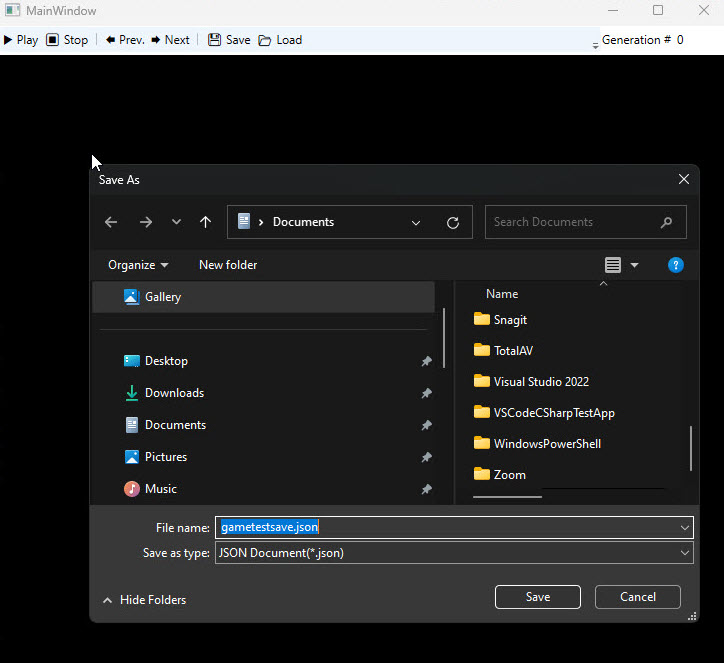

In this exercise, you'll explore what an exception is and how to set it up by inheriting from the generic .NET System.Exception class. You'll examine the JSONSerializationException class to learn how to create a custom exception. Then, you'll study the GameJSONSerializer class to understand how to use a Try…Catch block to throw a custom exception.

Finally, you'll create a custom exception and use it in a Try…Catch block in your serialization code when a game starts. You'll also use your custom exception and Try…Catch block when saving a game. Let’s get started!

> [!IMPORTANT]
> You need to have completed the Setup instructions in the previous unit, Prepare, before you begin this Exercise.

## Review a custom exception

All C# exception objects inherit from `System.Exception`. You create this inheritance relationship so that you can throw an exception for the class you create. In this case, a `JSONSerializationException` exception is being created, inheriting from
`System.Exception`.

1. Select the WPF --> JSON folder

1. Open the `JSONSerializationException.cs` file.

    ```csharp
    using System;
    
    namespace Json
    {
        public class JSONSerializationException : Exception
        {
            public JSONSerializationException(string? message, Exception? innerException) : base(message, innerException) { }
        }
    }
    ```

The custom class JSONSerializationException is created by inheriting from the .NET Exception class and passing a message and innerException information to the base class. This is how you create a basic custom exception: by creating a class that inherits from the .NET Exception class and passing information about the exception to the constructor of the derived class. Let’s see how to use a custom exception in a Try…Catch block.

## Review a custom exception used in a Try...Catch block

Typically, you use exceptions in a Try...Catch block. In the Try block, you surround the code that can potentially cause an error, as shown here. In the header of the Catch block, you include your exception type, along with the name of the exception variable.

1. Select the `GameJSONSerializer.cs` file in the WPF --> JSON folder.

1. Review the `GameJSONSerializer` class.

    ```csharp
    using System;
    using System.Text.Json;
    using LangtonsAnt;
    
    namespace Json
    {
        public static class GameJSONSerializer
        {
            public static string ToJson(IGame game)
            {
                string json;
                var serializeOptions = new JsonSerializerOptions
                {
                    WriteIndented = true,
                    Converters = {
                        new MultiDimensionalArrayConverter(),
                        new InterfaceConverterFactory(typeof(GeneralizedAnt), typeof(IAnt)),
                    }
                };
    
                try
                {
                    json = JsonSerializer.Serialize((Game)game, serializeOptions);
                }
                catch (Exception ex)
                {
                    throw new JSONSerializationException("Could not save game state to JSON", ex);
                }
                return json;
            }
    
            public static Game FromJson(string jsonString)
            {
                Game game;
                var serializeOptions = new JsonSerializerOptions
                {
                    WriteIndented = true,
                    Converters = {
                        new MultiDimensionalArrayConverter(),
                        new InterfaceConverterFactory(typeof(GeneralizedAnt), typeof(IAnt)),
                    }
                };
    
                try
                {
                    game = JsonSerializer.Deserialize<Game>(jsonString, serializeOptions) ?? throw new Exception("Game deserialized from JSON is Null");
                }
                catch (Exception ex)
                {
                    throw new JSONSerializationException("Could not load game state from JSON", ex);
                }
                return game;
            }
        }
    }
    ```

The `GameJSONSerializer` class is a utility class, meaning that it performs specific, often repetitive, functions used throughout an application. In this case, the class is a utility for serializing a class 'to' and 'from' the JSON format. By serializing, or writing to the hard disk, the state of the `Game` object, you can preserve the state of a game to play later.

Notice that both the `ToJson` and `FromJson` methods contain a Try…Catch block. Indeed, when serializing the `IGame` object, an exception can occur. When you deserialize the `Game` object in the `FromJson` method, an error can also occur. By using a Try…Catch block in these situations, you can catch any possible serialization exceptions.

## Add exception handling when loading the game

Knowing when to throw an exception, such as `JSONSerializationException` or `IOException`, allows you to catch and handle specific exceptions. In your exception handling code, you'll handle a `JSONSerializationException` and `IOException` and show an appropriate message to the user.

1. Open `MainWindow.xaml.cs` in the WPF folder.

1. Locate the `btnLoad_Click` method.

    ```csharp
    private void btnLoad_Click(object sender, RoutedEventArgs e)
    {
        PlayUIState = PlayUIMode.Paused;
    
        string fileName;
        var openFileDialog = new OpenFileDialog() { Filter = "JSON Document(*.json)|*.json" };
    
        if (openFileDialog.ShowDialog() == true)
        {
            fileName = openFileDialog.FileName;
            string json = File.ReadAllText(fileName);
            game = GameJSONSerializer.FromJson(json);
            UpdateGameView(game);
        }
    }
    ```

1. Add a Try...Catch block to the `btnLoad_Click` method.

    You'll add a `JSONSerializationException` and an `IOException` as your `catch` clauses. You'll then add a MessageBox to display a message to the user if loading the game from JSON was unsuccessful.

    ```csharp
    private void btnLoad_Click(object sender, RoutedEventArgs e)
    {
        PlayUIState = PlayUIMode.Paused;
    
        string fileName;
        var openFileDialog = new OpenFileDialog() { Filter = "JSON Document(*.json)|*.json" };
    
        if (openFileDialog.ShowDialog() == true)
        {
            fileName = openFileDialog.FileName;
    
            try
            {
                string json = File.ReadAllText(fileName);
                game = GameJSONSerializer.FromJson(json);
                UpdateGameView(game);
            }
            catch (JSONSerializationException ex)
            {
                MessageBox.Show(ex.Message);
            }
            catch (IOException ex)
            {
                MessageBox.Show($"Could not load JSON file from disk. {ex}");
            }
        }
    }
    ```

## Add exception handling when saving a game

In this example, you surround your serialization functionality when saving a game with a Try...Catch block.

1. Locate the `btnSave_Click` method in the `MainWindow.xaml.cs` file.

    ```csharp
    private void btnSave_Click(object sender, RoutedEventArgs e)
    {
        if (game == null)
            throw new InvalidOperationException("Cannot save the game when current game state is null");

        PlayUIState = PlayUIMode.Paused;

        var saveFileDialog = new SaveFileDialog() { Filter = "JSON Document(*.json)|*.json" };
        if (saveFileDialog.ShowDialog() == true)
        {
            string jsonString = null;
            jsonString = GameJSONSerializer.ToJson(game);
            File.WriteAllText(saveFileDialog.FileName, jsonString);
        }
    }
    ```

1. Add a Try...Catch block to the `btnSave_Click` method.

    ```csharp
    private void btnSave_Click(object sender, RoutedEventArgs e)
    {
        if (game == null)
            throw new InvalidOperationException("Cannot save the game when current game state is null");

        PlayUIState = PlayUIMode.Paused;

        var saveFileDialog = new SaveFileDialog() { Filter = "JSON Document(*.json)|*.json" };
        if (saveFileDialog.ShowDialog() == true)
        {
            try
            {
                string jsonString = GameJSONSerializer.ToJson(game);
                File.WriteAllText(saveFileDialog.FileName, jsonString);
            }
            catch (JSONSerializationException ex)
            {
                MessageBox.Show(ex.Message);
                //return;
            }
            catch (IOException ex)
            {
                MessageBox.Show($"Could not save JSON file to disk. {ex}");
                //return;
            }
        }
    }
    ```

1. Save your work, press Ctrl-S.

## Check your work

1. From the view menu in VS Code, select Terminal to open a terminal window.

1. If you’re not already in the WPF directory, Enter cd starter\wpf  to change directories to WPF.

1. Enter `dotnet build` to verify the code still builds successfully.

1. Find `File.ReadAllText(fileName)` call in the `btnLoad_Click` method in `MainWindow.xaml.cs`.

1. Replace `fileName` with `"abcd"` for the file's name.

1. Enter Ctrl-S, to save your change.

1. Enter `dotnet run`.

1. Select the Save button and enter `gametestsave.json` in the Save As window.

    

1. Now select the Load button to ensure that the code throws an exception, displaying the corresponding error message.

1. Open the `gametestsave.json` file you just saved. The error handling code you just added should throw an `IOException` exception and appear in a popup window.

1. Change `string json = File.ReadAllText("abcd");` back to `string json = File.ReadAllText(fileName);`.

1. Enter `dotnet build` to make sure the code builds.

1. Enter `dotnet run` to run the code once more and verify the game loads and is working correctly.
