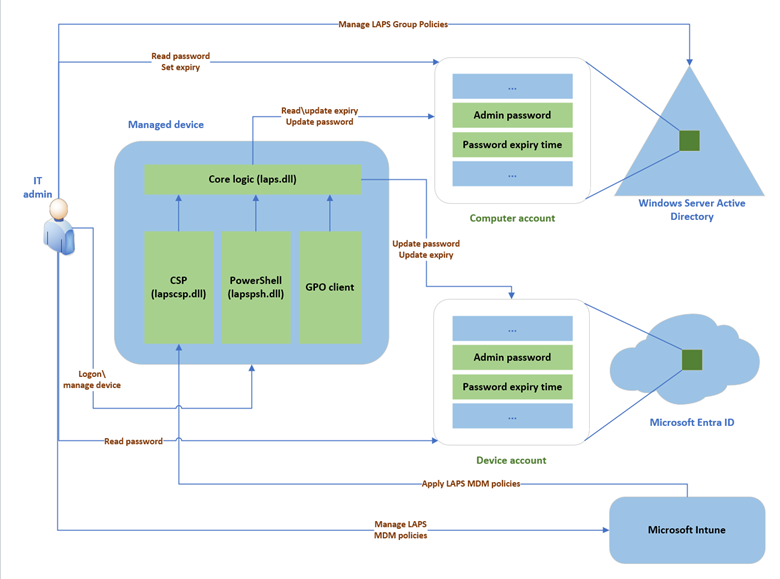

Each computer that is member of a domain keeps a local Administrator account. This is the account that you configure when you first deploy the computer manually. The local Administrator account allows IT staff to sign in to the computer if they cannot establish connectivity to the domain.

Managing local Administrator passwords across an organization is complex. In a 5,000-device environment that means 5,000 unique accounts. To simplify, many organizations use a single shared password—but this often gets discovered by non-IT staff, leading to unauthorized admin access.

## What is Windows LAPS?

Windows Local Administrator Password Solution (LAPS) provides a centralized repository for managing local administrator passwords on domain-joined machines. Built into Windows Server 2025, 2022, and 2019, it automates the management and backup of both local admin and Directory Services Restore Mode (DSRM) account passwords on domain controllers—no separate installation required.

The following exhibit depicts the Windows LAPS architecture.



The Windows LAPS architecture has several key components:

- **IT Admin**: Represents the various roles involved in a Windows LAPS deployment; configuring policies, retrieving or expiring stored passwords, and managing devices.

- **Managed Device**: A Microsoft Entra-joined or Active Directory-joined device where the local admin account is managed. Key components include:

  - laps.dll for core logic
  - lapscsp.dll for configuration service provider (CSP) integration
  - lapspsh.dll for PowerShell cmdlet logic
  
    Devices respond to Group Policy Object (GPO) changes and can also be domain controllers configured to back up Directory Services Repair Mode (DSRM) passwords.

- **Windows Server Active Directory**: On-premises Windows Server AD DS environment.

- **Microsoft Entra ID**: Cloud-based identity platform.

- **Microsoft Intune**: Cloud-based device policy management solution, preferred for configuring Windows LAPS.

> [!IMPORTANT]
> The legacy Microsoft LAPS product is deprecated as of Windows 11 23H2 and later. Installation of the legacy Microsoft LAPS Microsoft Installer (MSI) package is blocked on newer OS versions, and Microsoft no longer considers code changes for the legacy Microsoft LAPS product.

## Benefits of using Windows LAPS

Using Windows LAPS to regularly rotate and manage local administrator account passwords provides these benefits:

- Protection against pass-the-hash and lateral-traversal attacks
- Improved security for remote help desk scenarios
- Ability to sign in to and recover devices that are otherwise inaccessible
- A fine-grained security model (access control lists and optional password encryption) for securing passwords that are stored in Windows Server Active Directory
- Support for the Microsoft Entra role-based access control model for securing passwords that are stored in Microsoft Entra ID

Microsoft strongly recommends that you upgrade to the latest available operating system on clients, servers, and domain controllers in order to take advantage of the latest features and security improvements.

## How Windows LAPS works

The Windows LAPS runs a built-in background task (by default, every hour) to evaluate whether the local Administrator password has expired. If it has:

1. A new random password is generated based on policy settings.
1. The password and its expiration timestamp are securely backed up to either:
    - Active Directory (on-premises), or
    - Microsoft Entra ID (cloud), depending on configuration.
1. The expiration timestamp is stored locally and used to determine when the next rotation is needed.

You can also manually trigger this process using the **Invoke-LapsPolicyProcessing** PowerShell cmdlet. Group Policy and Intune are both supported for configuring Windows LAPS policies.

## Configure and manage passwords using Windows LAPS

There are some prerequisite tasks you must perform before configuring local administrator passwords using LAPS. These include updating the Active Directory schema, backing up managed account passwords to Active Directory, and copying the Windows LAPS Group Policy template files to the central store.

### Update the Windows Server Active Directory schema

Before using Windows LAPS, you must update the Active Directory schema by running the **Update-LapsADSchema** cmdlet—a one-time operation for the entire forest. This can be done locally on a Windows Server 2019 or later domain controller with Windows LAPS installed.

The person running this cmdlet must be a member of the Schema Admins group, and this cmdlet should be run on a computer that's in the same AD DS site as the computer hosting the Schema Master FSMO role for the forest.

### Prepare Active Directory

Before enabling Windows LAPS on AD-joined or hybrid-joined devices, you must back up managed account passwords to Active Directory to ensure a secure and valid storage location. This requires extending the AD schema to support the necessary attributes. Without this backup target, Windows LAPS won’t rotate passwords, preventing potential lockouts and ensuring policy enforcement functions correctly.

  1. If you're using Group Policy Central Store, manually copy the Windows LAPS Group Policy template files to the central store.
  1. Analyze, determine, and configure the appropriate AD permissions for password expiration and password retrieval.
  1. Analyze and determine the appropriate authorized groups for decrypting passwords.
  1. Create a new Windows LAPS policy that targets the managed device(s) with the appropriate settings as determined in the previous steps.

> [!NOTE]
> If you are planning to only backup passwords to Microsoft Entra ID, you do not need to perform any of these steps, including extending the AD schema.

### Configuring Windows LAPS for Entra-Joined Devices

There are some differences in how you configure Windows LAPS for Microsoft Entra ID-joined devices.

1. Enable Windows LAPS at the tenant level in Microsoft Entra ID. By default, Entra ID blocks password backups until this is explicitly turned on.
1. Deploy policy using Intune (preferred) via the Windows LAPS Configuration Service Provider (CSP). If Intune isn’t available, you can use local Group Policy or registry edits.
1. Set the BackupDirectory policy to 1 to indicate that passwords should be backed up to Microsoft Entra ID.
1. Optionally configure other settings like **PasswordLength**, **PasswordAgeDays**, and **AdministratorAccountName**.** If you specify a custom admin account, you must ensure it exists—Windows LAPS won’t create it for you.

Windows LAPS supports password backup to either Microsoft Entra ID or Active Directory, but not both—devices must be configured for one or the other. Only Entra-joined or hybrid-joined devices are supported; Entra-registered or workplace-joined devices are not eligible. Unlike legacy solutions, Windows LAPS does not rely on Microsoft Entra Connect—passwords are backed up directly to Entra ID over HTTPS, with no sync dependency.

### Grant the managed device permission to update its password

When using Windows LAPS to manage a device password, the device must have permission to update its own password. You can grant this by setting inheritable permissions on the organizational unit (OU) containing the device.

For example, to allow computers in the Sydney OU with expired passwords to update their passwords by using LAPS, use the following command:

```powershell
Set-LapsADComputerSelfPermission -Identity "Sydney"

```

### Grant password query permissions

Users must be granted permission in order to query the passwords from Active Directory. You can perform this action by setting inheritable permissions on the organizational unit (OU) that contains the device.

For example, to assign the Sydney_ITOps group the ability to find the local administrator password on computers in the Sydney OU, use the following command:

```powershell
Set-AdmPwdReadPasswordPermission -Identity "Sydney" -AllowedPrincipals "Sydney_ITOps"

```

## Configure device policy

The first step is to choose how to apply policy on your devices.

Most environments use Windows LAPS Group Policy to deploy the required settings to their Windows Server Active Directory-domain-joined devices.

If your devices are also hybrid-joined to Microsoft Entra ID, you can deploy policy by using Microsoft Intune with the Windows LAPS configuration service provider (CSP).

### Configure specific policies

At a minimum, you must configure the **BackupDirectory** setting by assigning it the value 2. This value is used to back up passwords to Windows Server Active Directory.

If you don't configure the **AdministratorAccountName** setting, Windows LAPS manages the default built-in local administrator account by default. This built-in account is automatically identified by using its well-known relative identifier (RID). It should never be identified by using its name. The name of the built-in local administrator account varies depending on the default locale of the device.

If you want to configure a custom local administrator account, you should configure the **AdministratorAccountName** setting with the name of that account.

## Password encryption

Protecting credentials is just as critical as managing them. With Windows LAPS, understanding encryption ensures local administrator passwords remain secure—even when stored in Active Directory.

The Windows LAPS password encryption feature is based on the Cryptography API: Next Generation Data Protection API (CNG DPAPI). CNG DPAPI supports multiple encryption modes, but Windows LAPS supports encrypting passwords against only a single Windows Server Active Directory security principal (user or group).

Use the **ADPasswordEncryptionPrincipal** policy setting to specify a security principal for password encryption. If not set, Windows LAPS defaults to the Domain Admins group of the device’s domain. Before encrypting, the device verifies that the specified user or group is resolvable.

### Password protection in Microsoft Entra ID scenarios

In Microsoft Entra ID environments, Windows LAPS shifts from encryption-based protection to a role-based access control (RBAC) model. Instead of encrypting passwords for a specific user or group, access is governed by Entra roles such as Cloud Device Administrator, Intune Administrator, and Helpdesk Administrator. These roles grant specific permissions—like reading or rotating local administrator passwords—ensuring that only authorized personnel can retrieve credentials. This approach aligns with modern identity governance practices, emphasizing least privilege and centralized access control without the need for encryption keys.

## Why migrate to Windows LAPS

Migrating to Windows LAPS is a strategic move for organizations looking to modernize their local administrator password management. Unlike legacy LAPS, Windows LAPS supports advanced features like password backup to Microsoft Entra ID, Active Directory password encryption, and improved policy flexibility. These enhancements align with modern security practices and help reduce the risk of credential exposure in hybrid environments.

There are two supported approaches for transitioning existing devices: immediate transition and side-by-side coexistence.

### Immediate transition

This method involves disabling the legacy LAPS policy and simultaneously applying a Windows LAPS policy—ideally targeting the same local account. Once the new policy is active, the device immediately rotates the password. After confirming a successful transition, the legacy LAPS software can be safely removed.

### Side-by-side coexistence

For a more gradual rollout, both legacy and Windows LAPS can run concurrently, each managing a different local account. This allows time to validate the new setup before retiring the legacy configuration. While this approach adds flexibility, the long-term goal should still be full migration to Windows LAPS.

This video shows you how to use Windows Local Administrator Password Solution, or LAPS, to configure and manage the credentials of local administrator accounts of domain joined computers.

> [!VIDEO https://learn-video.azurefd.net/vod/player?id=6706e445-0232-434a-a7ee-f6aa5095662d]


