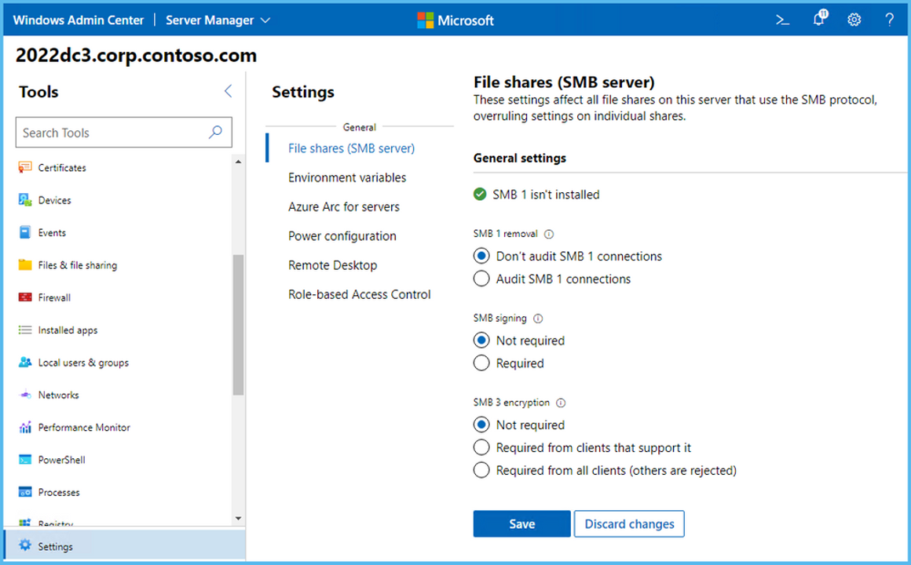

Server Message Block (SMB) protocol is a network protocol primarily used for file sharing. Along with its common file-sharing use, it's also frequently used by printers, scanners, and email servers. The original version of SMB, SMB 1.0 does not support encryption. SMB encryption was introduced with version 3.0.

Encryption is important whenever sensitive data is moved by using the SMB protocol. SMB encryption also lets file services provide secure storage for server applications such as Microsoft SQL Server and is generally simpler to use than dedicated hardware-based encryption.

## What is SMB 3.1.1 protocol security?

SMB 3.0 introduced end-to-end encryption to the SMB (Server Message Block) protocol. SMB encryption provides for data packet confidentiality and helps prevent a malicious hacker from tampering with or eavesdropping on any data packet.

SMB 3.1.1, introduced in Windows Server 2016, provides several enhancements to SMB 3.0 security, including preauthentication integrity checks and encryption improvements. The version of SMB included with Windows Server 2019 is SMB 3.1.1.c.

## Preauthentication integrity

With preauthentication integrity, while a session is being established the “negotiate” and "session setup" messages are protected by using a strong (SHA-512) hash. This helps prevent man-in-the-middle attacks that tamper with the connection. The resulting hash is used as input to derive the session’s cryptographic keys, including its signing key. The final session setup response is signed with this key. If any tampering has occurred to the initial packets, the signature validation fails, and the connection would not be established. This enables the client and server to mutually trust the connection and session properties.

## SMB encryption improvements

SMB 3.1.1 provides improvements to the following security features:

- SMB encryption. Introduces support for Advanced Encryption Standard (AES) Galois/Counter Mode (GCM) 128-bit encryption, along with continued support for AES 128-bit encryption.

- Directory Caching. Allows Windows to cache larger directories—up to 500,000 entries—and attempts to directory queries with 1-megabyte (MB) buffers to improve performance.

- Rolling cluster upgrade support. Allows SMB appear to support different max versions of SMB for clusters during upgrade.

- Support for FileNormalizedNameInformation API calls. Adds native support for querying the normalized name of a file. The normalized name is the exact name, including letter casing of files as stored on the disk.

SMB 3.1.1.c provides the following improvements to SMB 3.0 encryption:

- Write-through to disk. This feature allows write operations to ensure that writes to a file share make it to the physical disk. This feature is new to SMB 3.1.1.c.

- Guest access to file shares. The SMB client no longer allows Guest accounts to access a remote server or Fallback to Guest account when invalid credentials are provided.

- SMB global mapping. Maps remote SMB shares to drive letters accessible to all users on the local host, including containers. This allows containers to write to remote shares.

- SMB dialect control. Allows administrators to set the minimum and maximum SMB versions (also known as dialect), used on the system.

## SMB 3.1.1 encryption requirements

Windows Server systems support multiple versions of SMB (Server Message Block). This enables them to communicate with servers and clients running other operating systems and other Windows versions. To use SMB 3.1.1, both your host server and the system it communicates with must support SMB 3.1.1.

Preauthentication with SMB 3.1.1 is not compatible with devices that modify SMB packets, such as some wide area network (WAN) accelerators. Therefore, you might need to replace some network equipment to use SMB 3.1.1.

When communicating with other supported operating systems, Windows Server will negotiate the following versions of SMB:

- Windows 10 and Windows Server 2016 or later – SMB 3.1.1

- Windows 8.1 and Windows Server 2012 R2 -SMB 3.02

- Windows 8 and Windows Server 2012 – SMB 3.0

> [!NOTE]
> SMB encryption is not related to Encrypted File System (EFS) or BitLocker Drive Encryption.

## Configure SMB encryption on SMB shares

SMB (Server Message Block) encryption Verify.is not enabled by default, because encryption adds some overhead to network communications. If you want to use SMB encryption, you can configure it on a per-share basis or for an entire file server. Where you enable SMB encryption depends on your security needs. Enabling it restricts the file share or file server to only SMB 3.x clients for the protected shares.

To use Windows PowerShell to enable SMB encryption on an existing file share, use the following command from the server hosting the share:

```powershell
Set-SmbShare –Name <sharename> -EncryptData $true

```

To encrypt all shares on a file server, from the server use the following command:

```powershell
Set-SmbServerConfiguration –EncryptData $true

```

To create a new SMB file share on a server and enable SMB encryption at the same time, use the following command:

```powershell
New-SmbShare –Name <sharename> -Path <pathname> –EncryptData $true

```

To allow connections that don't use SMB 3 encryption, such as when older servers and clients are still in your network, use the following command:

```powershell
Set-SmbServerConfiguration –RejectUnencryptedAccess $false

```

> [!NOTE] 
> You can also configure SMB encryption using Windows Admin Center as shown in the exhibit.



