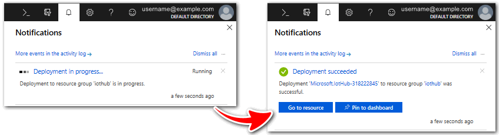
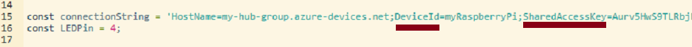
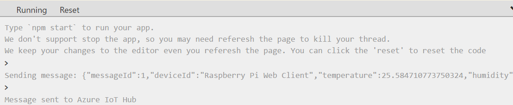
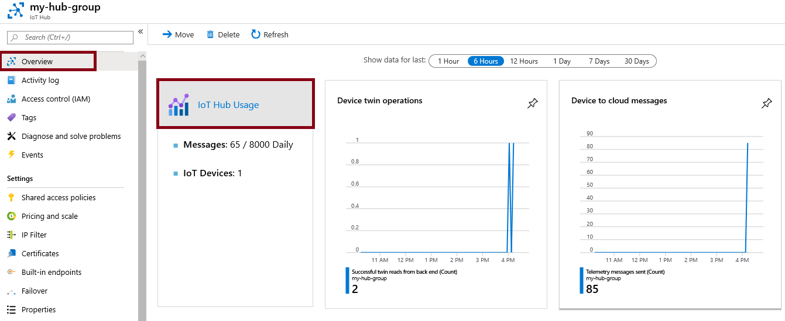

## Exercise - Azure IoT Hub

> [!NOTE]
> A sandbox is provided to allow you to complete this lab.  Otherwise, this Lab requires an Azure subscription.

---

## Lab - Implement an Azure IoT Hub

In this walkthrough, we will configure a new Azure IoT Hub in Azure portal, and then authenticate a connection to an IoT device using the online Raspberry Pi device simulator. Sensor data and messages are passed from the Raspberry Pi simulator to your Azure IoT Hub, and you view metrics for the messaging activity in Azure portal.

### Task 1: Create an IoT Hub 

In this task, we will create an IoT Hub. 

1. Sign in to the [Azure portal (https://portal.azure.com)](https://portal.azure.com?azure-portal=true).

2. From the **All services** blade, search for and select **IoT Hub** and then click **+ Add**.

3. On the **Basics** tab of the **IoT Hub** blade, fill in the fields with the following details (replace **xxxx** in the name of the storage account with letters and digits such that the name is globally unique):

    | Settings | Value |
    |--|--|
    | Subscription | **Choose your subscription** |
    | Resource Group |  **myRGIoT** (create new)|
    | Region | **East US** |
    | IoT Hub Name | **my-hub-groupxxxx** |
    | | |	

4. Move to the **Size and scale** tab, use the dropdown list to set the **Pricing and scale tier** to **S1: Standard tier**. 

5. Click the **Review + create** button.

6. Click the **Create** button to begin creating your new Azure IoT Hub instance.

7. Wait until the Azure IoT Hub instance is deployed. 

### Task 2: Add an IoT device

In this task, we will add an IoT device to the IoT Hub. 

1. When the deployment has completed, click **Go to resource** from the deployment blade. Alternatively, from the **All services** blade, search for and select **IoT Hub** and locate your new IoT Hub instance

	

2. To add a new IoT device, scroll down to the **Explorers** section and click **IoT Devices**. Then, click **+ New**.

	:::image type="content" source="../media/0602.png" alt-text="Screenshot of the IoT devices pane, highlighted within the IoT Hub navigation blade, in Azure portal. The New button is highlighted to illustrate how to add a new IoT device identity to IoT Hub.":::

3. Provide a name for your new IoT device, **myRaspberryPi**, and click the **Save** button. This will create a new IoT device identity in your Azure IoT Hub.

4. If you do not see your new device, **Refresh** the IoT Devices page. 

5. Select **myRaspberryPi** and copy the **Primary Connection String** value. You will use this key in the next task to authenticate a connection to the Raspberry Pi simulator.

	

### Task 3: Test the device using the Raspberry Pi Simulator

In this task, we will test our device using the Raspberry Pi Simulator. 

1. Open a new tab in the web browser and browse to the [online Raspberry Pi simulator](https://azure-samples.github.io/raspberry-pi-web-simulator/#Getstarted?azure-portal=true). 

2. Read about the Raspberry Pi simulator. If there is an overview pop-up select "**X**" to close the window.

3. In the code area, right side, locate the line with 'const connectionString ='. Replace it with the connection string you copied from the Azure portal. Note that the connection sting includes the DeviceId (**myRaspberryPi**) and SharedAccessKey entries.

	

4. Click **Run** (below the code area) to run the application. The console output should show the sensor data and messages that are sent from the Raspberry Pi simulator to your Azure IoT Hub. Data and messages are sent each time the Raspberry Pi simulator LED flashes. 

	

5. Click **Stop** to stop sending data.

6. Return to the Azure portal and your IoT Hub.

7. Switch the IoT Hub **Overview** blade and scroll down to the **IoT Hub Usage** information.

	

Congratulations! You have set up Azure IoT Hub to collect sensor data from an IoT device.

> [!NOTE]
> To avoid additional costs, you can remove this resource group. Search for resource groups, click your resource group, and then click **Delete resource group**. Verify the name of the resource group and then click **Delete**. Monitor the **Notifications** to see how the delete is proceeding.