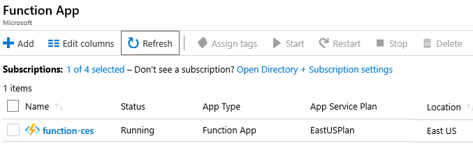
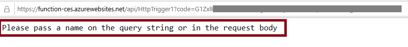

## Exercise - Azure Functions

> [!NOTE]
> A sandbox is provide to aid in your completion of this lab.  Otherwise, this Lab requires an Azure subscription.

---

## Lab - Implement Azure Functions

In this walkthrough, we will create a Function App to display a Hello message when there is an HTTP request. 

### Task 1: Create a Function app

In this task, we will create a Function app.

1. Sign in to the [Azure portal (https://portal.azure.com)](https://portal.azure.com?azure-portal=true).

2. From the **All services** blade, search for and select **Function App** and then click **+ Add**.

3. On the **Basic** tab of the **Function App** blade, fill in the Azure Function App settings fields (replace **xxxx** in the name of the function with letters and digits such that the name is globally unique). Leave the defaults for everything else. 

    | Settings | Value |
    | -- | --|
    | Subscription | **Choose your subscription** |
    | Resource group | **myRGFunction** (Create new) |
    | Function App name | **function-xxxx** |
    | Publish | **Code** |
    | Runtime stack | **.NET Core** |
    | Region | **East US** |
    | | |	

4. Click **Review + Create** and, after verification, click **Create** to begin provisioning and deploying your new Azure Function App.

5. Wait for the Notification that the resource has been created.

6. **Refresh** the Function App page and verify your new resource is *running*. 

    

### Task 2: Create an HTTP triggered function and test

In this task, we will use the Webhook + API function to display a message when there is an HTTP request. 

1. Browse to the newly created Function app in Azure portal. 

2. Click the "**+**" button next to **Functions**, and then, on the getting started page, scroll down and click **In-portal**. Notice your other choices for developing in Visual Studio and VS Code. Click **Continue**. 

    

3. Click **WebHook + API**, and then click **Create**. This will run a function whenever the app receives an HTTP request. Review other templates that you can choose from.

    

4. Notice the code is designed to run an HTTP request and log information. Also, notice the function returns a Hello message with a name. 

    

5. Click **Get function URL** from the top section of function editor. 

6. Ensure that the value in the **Key** drop-down list is set to **default (Function key)**. Then, click **Copy** to copy the function URL. 

    

7. Open a new browser tab and paste the copied function URL into your web browser's address bar. When the page is requested the function will run. Notice the returned message stating that the function requires a name in the request body.

    

8. Append **&name=yourname** to the end of the URL.

    > [!NOTE]
    > Replace **yourname** with your first name. For example, if your name is Cindy, the final URL will resemble the following `https://azfuncxxx.azurewebsites.net/api/HttpTrigger1?code=X9xx9999xXXXXX9x9xxxXX==&name=cindy`

    

9. When your function runs, trace information is written to log files in Azure. To view the logs in Azure portal, return to the function editor and, at the bottom of the page, click **Logs**.

     

    > [!NOTE]
    > If no log information was collected, retun to the browser tab where you pasted the function app URL, refresh the page and then return to the Logs view.

Congratulations! You have created a Function App to display a Hello message when there is an HTTP request. 

> [!NOTE]
> To avoid additional costs, you can remove this resource group. Search for resource groups, click your resource group, and then click **Delete resource group**. Verify the name of the resource group and then click **Delete**. Monitor the **Notifications** to see how the delete is proceeding.
