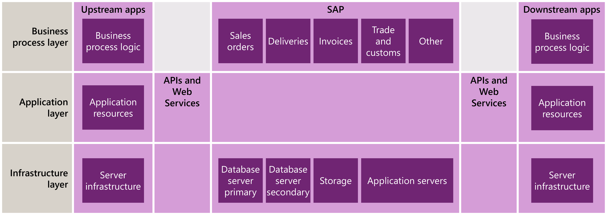
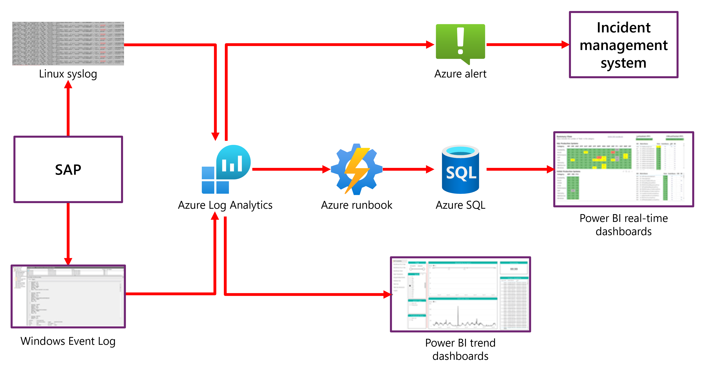

Microsoft’s own internal SAP infrastructure monitoring is based on an architecture of four distinct layers. These layers separate the functional, operational, and management structures within our SAP environment:

- The **business process layer** defines the individual processes that SAP supports. Examples include sales orders, invoices, deliveries, and import/export functions.

- The **SAP application layer** contains the individual SAP components that support business processes. These components include the SAP kernel, batch job processes, and queues.

- The **SAP infrastructure layer** includes the underlying virtual machines and other technical components that support the application layer.

- The **Web services and application programming interface (API) layer** integrates with the application and infrastructure layers to connect SAP to upstream and downstream systems. The API layer creates a connection between SAP and the outside world, so that our entire organization can capture important data from SAP and feed external data into the SAP ecosystem. It also helps us integrate our business processes with other applications outside our SAP systems, and allows data flow between environments and applications.

This image depicts the SAP monitoring multilayer telemetry structure.

## Solution architecture

The Microsoft SAP solution architecture relies on Azure Monitor and supporting cloud technologies to fully instrument the infrastructure and application foundation layers. There are >900 Azure virtual machines that run within our SAP environment, and we monitor all of them. We use both Windows VMs running Microsoft SQL Server and Linux VMs running SAP HANA. Our monitoring process includes the following:

* The **data capture process** is the same across platforms: The **Azure Monitor Log Analytics agent** installed on the VM captures the event and metric information (from the **EventLog** in Windows and the **Syslog** in Linux). By default, a large amount of SAP telemetry data is written to these logs, including SAP system log information (such as short dumps or failed updates), and infrastructure data (such as CPU usage, network usage, and memory usage).

* **Data ingestion** for the SAP monitoring telemetry repository is handled by Log Analytics. Log Analytics provides a solution for storing and retrieving event and metrics data for any downstream alert or reporting functionality. We’ve established a common schema within Log Analytics that allows us to cross-correlate data across multiple SAP platforms, data sources, and usage scenarios. The Log Analytics agent writes event information to Log Analytics in a JSON format that is parsed and then broken down into data that adheres to the common schema.

* We use Azure Monitor to configure and manage **alerts** throughout the monitoring environment. We maintain alerts across all four layers of SAP functionality, ensuring that the system identifies business process, application, infrastructure, and API issues quickly, and notifies the owner(s) at the appropriate layer. We can easily aggregate and correlate alerts to identify dependencies and issues that could impact end-to-end functionality. Alerts can also trigger ticket creation in our enterprise Service Management tool, to enable efficient issue resolution and documentation.

* **Reporting** is maintained in two primary paths for SAP monitoring. Both solutions use **Microsoft Power BI**, a cloud-based platform that our service and business process owners can use for simple and effective reporting tasks:

    - **Historical and trend reporting**. Power BI reports directly against our Log Analytics repository for trend reporting. We maintain six months of historical data for weekly and monthly trend analysis. Reports and dashboards exist at each layer of the SAP environment.

    - **Real-time dashboards**. We use **Power BI DirectQuery** against the Azure SQL databases to create easily customizable Power BI dashboards at each layer of functionality and ownership. These help service owners and management teams understand the current state of the SAP environment.

This image depicts the SAP monitoring architecture.

## Considerations and best practices

Microsoft’s internal application of monitoring for SAP on Azure is a continually evolving process. We’ve identified several considerations and best practices that have helped us optimize the SAP monitoring environment, including:

- Adopting a layered approach provides end-to-end high-level visibility and granular exposure of specific components.

- Azure Monitor provides the core functionality for our SAP monitoring capability, and is a single scalable platform for all monitoring needs.

- Monitoring the monitoring solution itself is critical. We put significant effort into ensuring that our SAP monitoring solution is running effectively and efficiently. As our SAP environment grows and changes, we track alert thresholds and critical data streams to provide the most accurate and relevant reporting and alerting to our end users.

- Monitoring data can be used to measure and ensure desired state configuration. The depth of monitoring data that we collect allows us to examine aspects of environment configuration such as SQL or HANA database parameters, VM configuration, and application settings. By tracking this information, we can measure the configuration state across our environment, to ensure that all components remain in a state that supports efficient SAP system operation.

- Using a single platform provides universal benefit in understanding relationships and dependencies between SAP components and business processes, and all metrics and data come from a single source.

