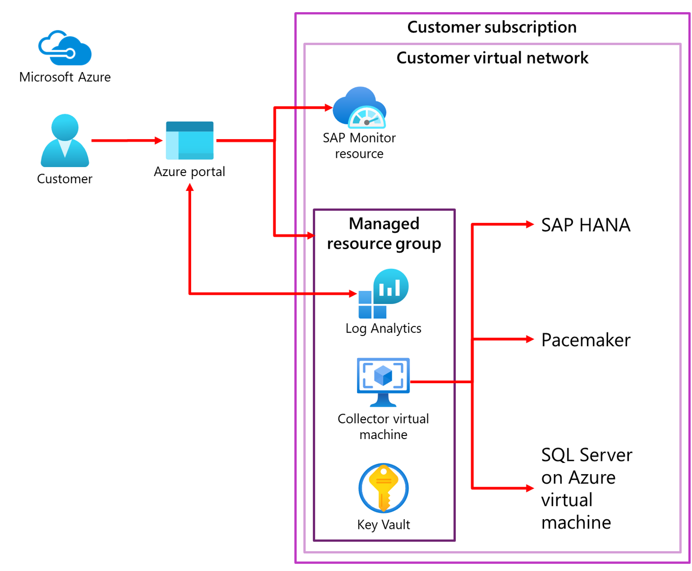

Azure Monitor for SAP Solutions uses existing [Azure Monitor](https://docs.microsoft.com/azure/azure-monitor/overview) features such as Log Analytics and [Workbooks](https://docs.microsoft.com/azure/azure-monitor/platform/workbooks-overview) to provide more monitoring capabilities. For example:

- Use an Azure Log Analytics workspace to:

    - Create [custom visualizations](https://docs.microsoft.com/azure/azure-monitor/platform/workbooks-overview) by editing default Workbooks

    - Write [custom queries](https://docs.microsoft.com/azure/azure-monitor/log-query/log-analytics-tutorial)

    - Creating [custom alerts](https://docs.microsoft.com/azure/azure-monitor/learn/tutorial-response)

- Take advantage of the [flexible retention period](https://docs.microsoft.com/azure/azure-monitor/platform/manage-cost-storage)

- Connect monitoring data with their ticketing system.

## What data does Azure Monitor for SAP Solutions collect?

Data collection in Azure Monitor for SAP Solutions depends on the providers that you configure. During Public Preview, the following data is being collected.

### High-availability Pacemaker cluster telemetry

- Node, resource, and SBD device status

- Pacemaker location constraints

- Quorum votes and ring status

- [Others](https://github.com/ClusterLabs/ha_cluster_exporter/blob/master/doc/metrics.md)

### SAP HANA telemetry

- CPU, memory, disk, and network utilization

- HANA System Replication (HSR)

- HANA backup

- HANA host status

- Index server and Name server roles

### Microsoft SQL server telemetry

- CPU, memory, disk utilization

- Hostname, SQL Instance name, SAP System ID

- Batch Requests, Compilations, and page Life Expectancy over time

- Top 10 most expensive SQL statements over time

- Top 12 largest tables in the SAP system

- Problems recorded in the SQL Server error log

- Blocking processes and SQL Wait Statistics over time

## Data sharing with Microsoft

Azure Monitor for SAP Solutions collects system metadata to provide improved support for our SAP on Azure customers. No PII/EUII is collected. To enable data sharing with Microsoft when creating an Azure Monitor for SAP Solutions resource, select **Share** from the drop-down.

We recommend that you enable data sharing, as it helps Microsoft provide improved support to our mission-critical SAP on Azure customers.

## Architecture overview

At a high level, the following diagram explains how Azure Monitor for SAP Solutions collects telemetry from SAP HANA databases. The architecture is agnostic to whether SAP HANA is deployed on Azure virtual machines or Azure Large Instances.

### Key components of the architecture

- You can navigate to the marketplace within the **Azure portal** and discover Azure Monitor for SAP Solutions.

- The **Azure Monitor for SAP Solutions resource** is a landing place for you to view monitoring telemetry.

- The managed resource group is deployed automatically as part of the Azure Monitor for SAP Solutions resource deployment. The resources deployed within the managed resource group help in the collection of your telemetry. The key resources deployed are:

    - The **Azure virtual machine** (also known as the *collector VM*): The main purpose of this Standard_B2ms VM is to host the *monitoring payload*. This refers to the logic of collecting telemetry from the source systems and transferring it to the monitoring framework. In the diagram above, the monitoring payload contains the logic to connect to SAP HANA database over a SQL port.

    - [Azure Key Vault](https://docs.microsoft.com/azure/key-vault/general/basic-concepts): Deployed to securely hold SAP HANA database credentials and to store information about [providers](https://docs.microsoft.com/azure/virtual-machines/workloads/sap/azure-monitor-providers).

    - **Log Analytics Workspace**: The destination where the telemetry data is stored.

        - Visualization is built on top of telemetry in Log Analytics using [Azure Workbooks](https://docs.microsoft.com/azure/azure-monitor/platform/workbooks-overview). You can customize how your telemetry is displayed, and also pin your Workbooks or specific visualizations to the Azure dashboard. The visualization will autorefresh on the dashboard, with intervals as low as 30 minutes.

        - If you want to use your existing workspace within the same subscription as the SAP monitor resource, you can do so by choosing that option at the time of deployment.

        - You can use Kusto Query Language (KQL) to run [queries](https://docs.microsoft.com/azure/azure-monitor/log-query/log-query-overview) against the raw tables inside Log Analytics workspace.

### Architecture highlights

- **Multi-instance**: You can create monitoring for multiple instances of a given component type across multiple SAP SIDs within a VNET, with a single resource of Azure Monitor for SAP Solutions.

- **Multi-provider**: The architecture diagram above shows the SAP HANA provider as an example. You can configure more providers to collect data from other components.

- **Open source**: The source code of Azure Monitor for SAP Solutions is available in [GitHub](https://github.com/Azure/AzureMonitorForSAPSolutions). You can refer to the provider code and learn more about the product, contribute, or share feedback.

- **Extensible query framework**: SQL queries to collect telemetry data are written in [JSON](https://github.com/Azure/AzureMonitorForSAPSolutions/blob/master/sapmon/content/SapHana.json). You can easily add more SQL queries to collect more telemetry data. You can request specific telemetry data to be added to Azure Monitor for SAP Solutions, by leaving feedback through the link at the end of this document or contacting your account team.

## Monitoring requirements of Azure for SAP Workloads

According to SAP Note #2015553, “*for full support, you must enable built-in SAP monitors to retrieve information about configuration and resource utilization from the underlying Azure infrastructure.*” You must set up every Azure instance that hosts SAP software and related DBMS systems such that:

- The **Azure Monitoring Extension for SAP** is deployed and correctly configured.

- Data from the Azure Monitoring Extension for SAP is visible in the SAP NetWeaver system.

The following are technical requirements for using the Azure Monitoring Extension for SAP:

- **The Azure virtual machine instance has an active route to the Internet** (required for accessing the Azure Extension Pool). You may need to set up Internet proxies for the virtual machine instance before you deploy the extension.

- **SAP Enhanced Monitoring is deployed**. To include Azure performance counters in the SAP enhanced monitoring, SAP has enhanced the SAP Host Agent and its monitoring transaction ST06. Be sure to check the configuration, the required versions, and minimum support package levels. For more information, see the following SAP Notes:

    - **Windows**: SAP Note #1409604 (Virtualization on Windows: Enhanced monitoring)

    - **Linux**: SAP Note #1102124 (SAPOSCOL on Linux: Enhanced function)

