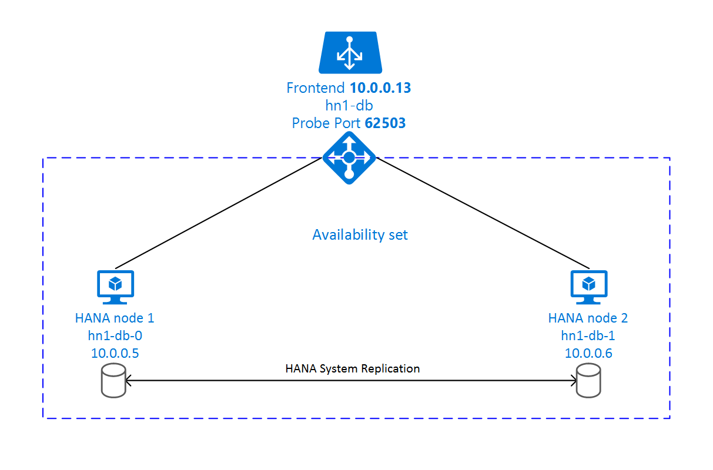

For on-premises development, you can use either HANA System Replication or use shared storage to establish high availability for SAP HANA. On Azure virtual machines (VMs), HANA System Replication on Azure is currently the only supported high availability function. SAP HANA Replication consists of one primary node and at least one secondary node. Changes to the data on the primary node are replicated to the secondary node synchronously or asynchronously.

This unit describes how to deploy and configure Azure VMs running SUSE Linux Enterprise Server, install the cluster framework, and install and configure SAP HANA System Replication. In the example configurations, installation commands, instance number 03, and HANA System ID HN1 are used.

For instructions regarding the equivalent procedure for Azure VMs running Red Hat Enterprise Linux, refer to High availability of SAP HANA on Azure VMs on Red Hat Enterprise Linux at [https://docs.microsoft.com/azure/virtual-machines/workloads/sap/sap-hana-high-availability-rhel](https://docs.microsoft.com/azure/virtual-machines/workloads/sap/sap-hana-high-availability-rhel) 

To achieve high availability, SAP HANA is installed on two virtual machines. The data is replicated by using HANA System Replication.

SAP HANA System Replication setup uses a dedicated virtual hostname and virtual IP addresses. On Azure, a load balancer is required to use a virtual IP address. The following list shows the configuration of the load balancer:

* Front-end configuration: IP address 10.0.0.13 for hn1-db

* Back-end configuration: Connected to primary network interfaces of all virtual machines that should be part of HANA System Replication

* Probe Port: Port 62503

* Load-balancing rules: 30313 TCP, 30315 TCP, 30317 TCP

## Provision Azure resources

The resource agent for SAP HANA is included in SUSE Linux Enterprise Server for SAP Applications. The Azure Marketplace contains an image for SUSE Linux Enterprise Server for SAP Applications 12 that you can use to deploy new virtual machines.

## Deploy with a template

You can use one of the quickstart templates that are on GitHub to deploy all the required resources. To deploy the template, follow these steps:

1. Open the database template or the converged template on the Azure portal. The database template creates the load-balancing rules for a database only. The converged template also creates the load-balancing rules for an ASCS/SCS and ERS (Linux only) instance. If you plan to install an SAP NetWeaver-based system and you want to install the ASCS/SCS instance on the same machines, use the converged template.

2. Enter the following parameters:

* **Sap System ID**: Enter the SAP system ID of the SAP system you want to install. The ID is used as a prefix for the resources that are deployed.

* **Stack Type**: (This parameter is applicable only if you use the converged template.) Select the SAP NetWeaver stack type.

* **Os Type**: Select one of the Linux distributions. For this example, select SLES 12.

* **Db Type**: Select HANA.

* **Sap System Size**: Enter the number of SAPS that the new system is going to provide. If you're not sure how many SAPS the system requires, ask your SAP Technology Partner or System Integrator.

* **System Availability**: Select HA.

* **Admin Username and Admin Password**: A new administrative user account that can be used to sign in to the operating system.

* **New Or Existing Subnet**: Determines whether a new virtual network and subnet should be created or an existing subnet used. If you already have a virtual network that's connected to your on-premises network, select Existing.

* **Subnet ID**: If you want to deploy the VM into an existing VNet where you have a subnet defined the VM should be assigned to, name the ID of that specific subnet. The ID usually looks like: `/subscriptions/subscription ID/resourceGroups/resource group name/providers/Microsoft.Network/virtualNetworks/virtual network name/subnets/subnet name.`

## Manual deployment using the Azure portal

1. **Create a resource group**.

2. **Create a virtual network**.

3. **Create an availability set**.

- Set the max update domains.

4. **Create a load balancer (internal)**.

- Select the virtual network created in step 2.

5. **Create virtual machine 1**.

- Use a SLES4SAP image in the Azure gallery that is supported for SAP HANA on the VM type you selected.

- Select the availability set created in step 3.

6. **Create virtual machine 2**.

- Use a SLES4SAP image in the Azure gallery that is supported for SAP HANA on the VM type you selected.

- Select the availability set created in step 3.

7. **Add data disks**.

8. **Configure the load balancer. First, create a front-end IP pool**:

- Open the load balancer blade, select frontend IP pool, and select Add.

- Enter the name of the new front-end IP pool (for example, hana-frontend).

- Set the Assignment to Static and enter the IP address (for example, 10.0.0.13).

- After the new front-end IP pool is created, note the pool IP address.

9. **Next, create a back-end pool**:

- Open the load balancer, select backend pools, and select Add.

- Enter the name of the new back-end pool (for example, hana-backend).

- Select Add a virtual machine.

- Select the availability set created in step 3.

- Select the virtual machines of the SAP HANA cluster.

10. **Next, create a health probe**:

- Open the load balancer, select health probes, and select **Add**

- Enter the name of the new health probe (for example, hana-hp).

- Select TCP as the protocol and port 62503. Keep the Interval value set to 5, and the Unhealthy threshold value set to 2.

- Select **OK**.

11. **For SAP HANA 1.0, create the load-balancing rules**:

- Open the load balancer, select load balancing rules, and select **Add**

- Enter the name of the new load balancer rule (for example, hana-lb-30315).

- Select the front-end IP address, the back-end pool, and the health probe that you created earlier (for example, hana-frontend).

- Keep the Protocol set to TCP,and enter port 30315.

- Increase the idle timeout to 30 minutes.

- Make sure to enable Floating IP.

- Repeat these steps for port 30317.

12. **For SAP HANA 2.0, create the load-balancing rules for the system database**:

- Open the load balancer, select load balancing rules, and select Add

- Enter the name of the new load balancer rule (for example, hana-lb-30313).

- Select the front-end IP address, the back-end pool, and the health probe that you created earlier (for example, hana-frontend).

- Keep the Protocol set to TCP, and enter port 30313.

- Increase the idle timeout to 30 minutes.

- Make sure to enable Floating IP.

- Repeat these steps for port 30314.

13. **For SAP HANA 2.0, first create the load-balancing rules for the tenant database**:

- Open the load balancer, select load balancing rules, and select Add

- Enter the name of the new load balancer rule (for example, hana-lb-30340).

- Select the frontend IP address, backend pool, and health probe you created earlier (for example, HANA-frontend).

- Keep the Protocol set to TCP, and enter port 30340.

- Increase the idle timeout to 30 minutes.

- Make sure to enable Floating IP.

- Repeat these steps for ports 30341 and 30342.

For more information about the required ports for SAP HANA, refer to SAP Note #2388694.

> [!IMPORTANT]
> Do not enable TCP timestamps on Azure VMs placed behind Azure Load Balancer. Enabling TCP timestamps will cause the health probes to fail. Set parameter net.ipv4.tcp_timestamps to 0. 

## Create a Pacemaker cluster

Follow the steps in Setting up Pacemaker on Red Hat Enterprise Linux in Azure at [https://docs.microsoft.com/azure/virtual-machines/workloads/sap/high-availability-guide-rhel-pacemaker](https://docs.microsoft.com/azure/virtual-machines/workloads/sap/high-availability-guide-rhel-pacemaker) to create a basic Pacemaker cluster for this HANA server. You can use the same Pacemaker cluster for SAP HANA and SAP NetWeaver (A)SCS.

