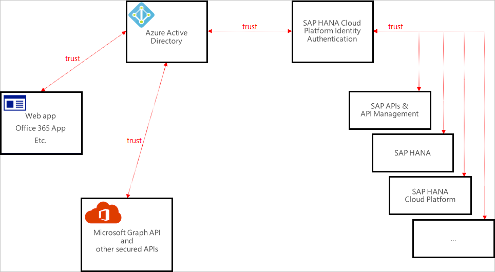

The SAP Cloud Platform Identity Authentication and Active Directory Federation Services enable you to implement SSO across applications or services that are protected by Azure AD (as an IdP) with SAP applications and services that are protected by SAP Cloud Platform Identity Authentication.

Currently, SAP Cloud Platform Identity Authentication acts as a Proxy Identity Provider to SAP applications. Azure Active Directory in turn acts as the leading Identity Provider in this setup.

The following diagram illustrates this relationship:

With this setup, your SAP Cloud Platform Identity Authentication tenant is configured as a trusted application in Azure Active Directory. All SAP applications and services that you want to protect this way are subsequently configured in the SAP Cloud Platform Identity Authentication management console. Therefore, the authorization for granting access to SAP applications and services needs to take place in SAP Cloud Platform Identity Authentication (as opposed to Azure Active Directory). By configuring SAP Cloud Platform Identity Authentication as an application through the Azure Active Directory Marketplace, you don't need to configure individual claims or SAML assertions.

Note that at the time of authoring this content, only Web SSO has been tested by both parties. The flows that are necessary for App-to-API or API-to-API communication should work but have not been tested yet. 

## Add SAP Cloud Platform Identity Authentication from the gallery

To configure the integration of SAP Cloud Platform Identity Authentication into Azure AD, first add SAP Cloud Platform Identity Authentication from the Azure AD application gallery to your list of managed SaaS apps.

## Implement Azure AD single sign-on

Next, you need to configure and test Azure AD-based SSO by using the following sequence of steps:

1. Configure Azure AD Single Sign-On - to enable your users to use this feature.

2. Configure SAP Cloud Platform Identity Authentication Single Sign-On - to configure the Single Sign-On settings on application side.

3. Assign Azure AD users to SAP Cloud Platform Identity Authentication.

## Configure Azure AD single sign-on

In the Azure portal, on the SAP Cloud Platform Identity Authentication application integration page, select Single sign-on.

On the Select a Single sign-on method page, select SAML/WS-Fed mode to enable single sign-on.

On the Set up Single Sign-On with SAML page, click Edit icon to open Basic SAML Configuration dialog.

On the Basic SAML Configuration section, to configure IDP initiated mode, specify the SAP Cloud Platform IAS tenant identifier (Entity ID) and the corresponding Reply URL (Assertion Consumer Service URL). To configure the application in SP initiated mode, click Set additional URLs and provide the Sign-on URL. 

To obtain these values, you can contact the SAP Cloud Platform Identity Authentication Client support team at [https://cloudplatform.sap.com/capabilities/security/trustcenter.html](https://cloudplatform.sap.com/capabilities/security/trustcenter.html) .

SAP Cloud Platform Identity Authentication application expects the SAML assertions in a specific format. Configure the relevant claims for this application, including givenname, surname, emailaddress, name, and Unique User Identifier. You can manage the values of these attributes from the User Attributes section on application integration page. 

## Configure SAP Cloud Platform Identity Authentication Single Sign-On

To configure SSO for your application, navigate to the SAP Cloud Platform Identity Authentication administration console. Under Identity Providers, choose the Corporate Identity Providers tile. Choose the Add button to create an Azure AD corporate identity provider. Under SAML 2.0, choose SAML 2.0 Configuration. 

Upload Azure AD metadata XML file or configure manually the following fields: 

* Name: the entity ID of the corporate identity provider. 

* Single Sign-On Endpoint URL : the URL of the identity provider single sign-on endpoint that receives authentication requests. For Binding, choose the one that corresponds to respective single sign-on endpoint. 

* Single Logout Endpoint URL : the URL of the identity provider's single logout endpoint that receives logout messages. For Binding, choose the one that corresponds to respective single logout endpoint. 

* Signing Certificate : the base64-encoded certificate used by the identity provider to digitally sign SAML protocol messages sent to Identity Authentication.

## Assign Azure AD users

In the Azure portal, select Enterprise Applications, select All applications, then select SAP Cloud Platform Identity Authentication. In the applications list, select SAP Cloud Platform Identity Authentication.

In the Azure portal, select Users and groups. Click the Add user button, then select users and groups you intend to assign to the application in the Add Assignment dialog. If you are expecting any role value in the SAML assertion then in the Select Role dialog select the appropriate role for the user from the list, then click the Select button at the bottom of the screen. In the Add Assignment dialog click the Assign button.

Note that you don't need to create a user in SAP Cloud Platform Identity Authentication. Users who are in the Azure AD user store can use the SSO functionality. SAP Cloud Platform Identity Authentication supports the Identity Federation option. This option allows the application to check whether users who are authenticated by the corporate identity provider exist in the user store of SAP Cloud Platform Identity Authentication. The Identity Federation option is disabled by default. If Identity Federation is enabled, only the users that are imported in SAP Cloud Platform Identity Authentication can access the application.

To verify the outcome, click the SAP Cloud Platform Identity Authentication tile in the Access Panel. You should be automatically signed in to the SAP Cloud Platform Identity Authentication for which you set up SSO.
