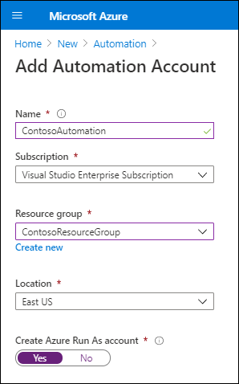
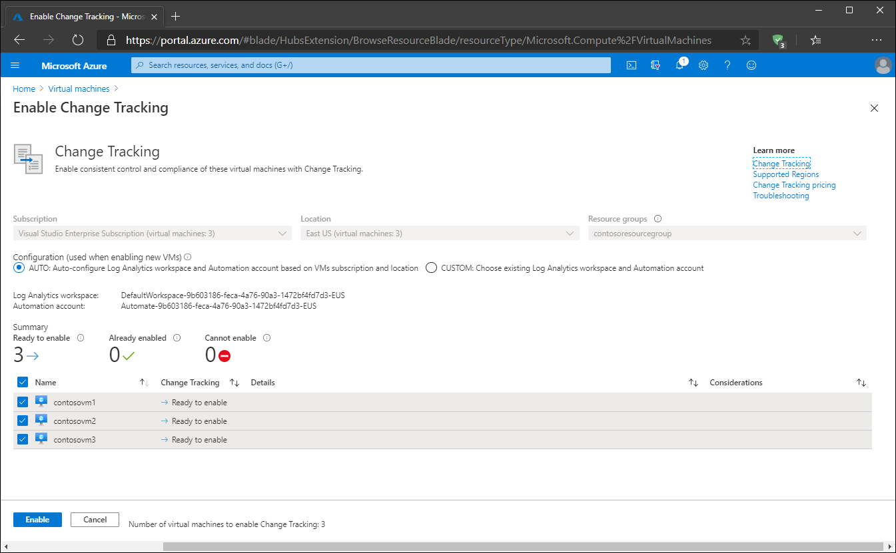

Any VMs that you deploy as part of Contoso's Azure subscription need to be secure. You can use the Change Tracking and Inventory feature, part of Azure Automation, to help secure Contoso's Windows Server IaaS VMs **in Azure**.

## What is Change Tracking and Inventory?

*Azure Change Tracking and Inventory* is a feature that enables you to track changes in both your VMs and your server infrastructure. This can help you to pinpoint operational and environmental issues with software managed by the Distribution Package Manager. You can track the following Windows Server items using Change Tracking and Inventory:

- Windows software
- Windows files
- Windows registry keys
- Microsoft services

In addition, you can track the following Linux components:

- Linux daemons
- Linux software (packages)
- Linux files

Azure Tracking and Inventory relies on Log Analytics to collect information on monitoring components to a Log Analytics workspace. If you connect your VMs to a Log Analytics workspace, on monitored servers, you can use Log Analytics agents to collect data about changes to:

- Installed software
- Microsoft services
- Windows registry and files

The Log Analytics agents send collected data to Azure Monitor for processing. Azure Monitor then applies logic to the that data, records the data and makes it available to you.

> [!NOTE]  
> Change Tracking and Inventory obtains its data from [Azure Monitor](https://aka.ms/azure-monitor-overview?azure-portal=true).

### Limitations

Change Tracking and Inventory doesn't support certain items and has some limitations, as detailed in the following table.

|Issue|Details|
|----|----|
|No support|There is no support for Windows registry tracking recursion support, network file systems, or Windows executable (*.exe) files.|
|Limitations|The Max File Size column and values are unused in the current implementation; if you collect more than 2,500 files in a 30-minute collection cycle, Change Tracking and Inventory performance might be degraded. When network traffic is high, change records can take up to six hours to display. If you modify a configuration while a computer is shut down, the computer might post changes belonging to the previous configuration.|

## Requirements for Change Tracking and Inventory<!-- Can we add a sentence between these headings? -->

### Automation account

Change Tracking and Inventory relies on Azure Automation. When you start Azure Automation for the first time, you must create an Automation account. The Automation account enables you to isolate your Automation resources and related items from the resources relating to other accounts. An Azure Automation account is different from both your Microsoft account and any accounts you create in your Azure subscription. you create an Azure Automation account in the Azure portal, **Azure Automation account** blade.

To learn how to create an Automation account, visit [Create an Azure Automation account](/azure/automation/quickstarts/create-azure-automation-account-portal).

### Supported operating systems

Change Tracking and Inventory supports all Windows OSs that meet the Log Analytics agent requirements. These operating systems are:

- Windows Server 2019
- Windows Server 2016, version 1709 and 1803
- Windows Server 2012 and Windows Server 2012 R2
- Windows 10 Enterprise (including multi-session) and Windows 10 Pro
- Windows 8.1 Enterprise and Windows 8.1 Pro

> [!NOTE]  
> Change Tracking and Inventory is also supported on a number of Linux operating systems.

### Network requirements

Change Tracking and Inventory also has a number of network requirements based on the requirements of both the underlying Log Analytics workspace and Linux and Windows agents. The agent communicates with the Azure Monitor service using TCP port 443. If the monitored server connects through a firewall or proxy server, you must ensure that your configuration matches that displayed in the following diagram. 

 

Typical settings for on-premises servers being monitored are described in the following table.

|Component|Traffic description|
|----|----|
|Windows agent|Uses TCP port 5723 to communicate with Microsoft Operations Manager, which monitors services, devices, and operations for many computers from a single console.|
|Linux agent|Uses TCP port 22 and TCP port 1270 to communicate with Operations Manager.|
|Operations Manager|Uses TCP port 8080 to communicate with the Log Analytics gateway. The Log Analytics gateway sends data to Azure Automation and a Log Analytics workspace in Azure Monitor on behalf of the computers that cannot directly connect to the internet.|
|VMs|Use TCP port 8080 to communicate with the Log Analytics gateway.|
|Log Analytics gateway| Uses TCP port 443 to communicate with the configured Log Analytics workspace.|

### Firewall requirements

Change Tracking and Inventory requires access through your firewall to certain resources as outlined in the following table.

|Azure Resource|Ports|Direction|Bypass HTTPS inspection|
|----|----|----|----|
| `*.ods.opinsights.azure.com` | Port 443 | Outbound |Yes |
| `*.oms.opinsights.azure.com` | Port 443 | Outbound|Yes |
| `*.blob.core.windows.net` | Port 443 |Outbound |Yes |
| `*.azure-automation.net` | Port 443 |Outbound |Yes |

### Azure region requirements

You must link Change Tracking and Inventory to a Log Analytics workspace and an Automation account in your Azure subscription. However, only certain regions are supported for these links, as described in the following table.

|Log Analytics workspace region|Azure Automation region|
|----|----|
|EastUS|EastUS2|
|WestUS2|WestUS2|
|WestCentralUS|WestCentralUS|
|CanadaCentral|CanadaCentral|
|AustraliaSoutheast|AustraliaSoutheast|
|SoutheastAsia|SoutheastAsia|
|CentralIndia|CentralIndia|
|ChinaEast2|ChinaEast2|
|JapanEast|JapanEast|
|UKSouth|UKSouth|
|WestEurope|WestEurope|
|USGovVirginia|USGovVirginia|
|USGovArizona|USGovArizona|

> [!TIP] 
> Your Log Analytics workspace and Automation account must be in the same subscription as one another.

## Enable Change Tracking and Inventory

You can enable Change Tracking and Inventory in a number of ways:

- By using the Azure portal
- By using an Azure VM
- From an Automation account
- From a runbook

### Enable Change Tracking and Inventory from the Azure portal

Use the following high-level procedure to enable Change Tracking and Inventory using the Azure portal:

1. In the Azure portal, navigate to **Virtual machines**.
2. Use the checkboxes to choose the virtual machines to add to Change Tracking and Inventory.
3. Select **Services**, and then select **Change Tracking** or **Inventory**.

   

   > [!TIP] 
   > Azure filters the list of VMs to list only the VMs that are in the same subscription and location. You can change this behavior.

4. Azure selects an existing Log Analytics workspace and Automation account (if available). If you want to use a different Log Analytics workspace and Automation account, select **CUSTOM** to select them from the Custom Configuration page.
5. Select **Enable** to enable the feature you've selected.

   > [!NOTE] 
   > The setup can take up to 15 minutes to complete.

   

## Additional reading

To learn more, review the following documents:

- [Enable Change Tracking and Inventory from an Azure VM](https://aka.ms/enable-changes-from-vm?azure-portal=true)
- [Enable Change Tracking and Inventory from an Automation account](https://aka.ms/enable-changes-from-auto-acct?azure-portal=true)
- [Enable Change Tracking and Inventory from a runbook](https://aka.ms/enable-changes-from-runbook?azure-portal=true)
- [Operations Manager](https://aka.ms/scom-welcome?azure-portal=true).
- [Connect computers without internet access by using the Log Analytics gateway in Azure Monitor](https://aka.ms/Log-Analytics-gateway?azure-portal=true).
- [Create a Log Analytics workspace in the Azure portal](https://aka.ms/quick-create-workspace?azure-portal=true).
- [Log Analytics agent overview](https://aka.ms/log-analytics-agent?azure-portal=true).

