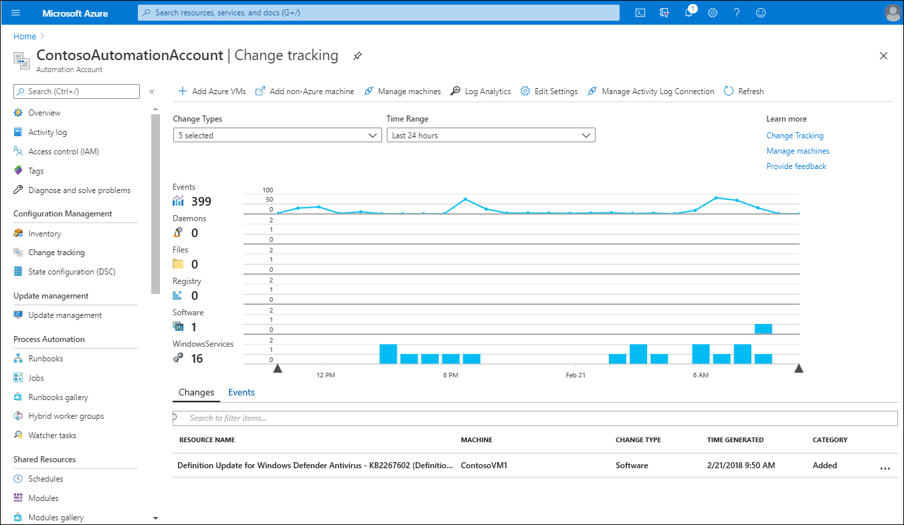
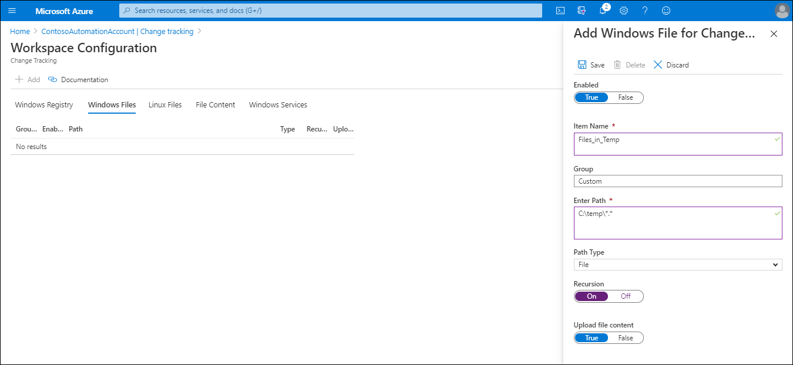
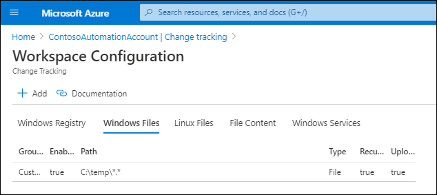
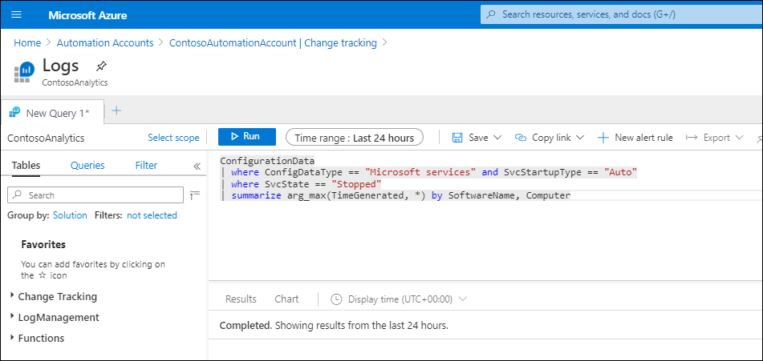

Having enabled Change Tracking and Inventory on your Azure VM workloads, you must now configure and manage the required settings. You can use Change Tracking and Inventory to track changes to files, the registry, software, and Microsoft services running on your VMs. In this unit, you'll learn how to modify Change Tracking and Inventory settings, how to track Windows files, how to track Windows Registry changes, and how to search logs for change records.

## Change Tracking and Inventory user interface

You can use the Azure portal to configure and manage Change Tracking and Inventory settings. Use the following high-level procedure:

1. In the Azure portal, select **Automation Accounts**.
2. Select the appropriate automation account, and then under the **Configuration Management** heading, select **Change tracking** .
3. Use the **Change Types** and **Time Range** drop-down lists to select areas of particular interest for review.
4. You can select a change or event to bring up its details. The available change types are:

   - Daemons
   - Files
   - Registry
   - Software
   - Microsoft services


Events automatically display on the timeline, as displayed in the graphic. 



To access inventory information, from the automation account page, in the navigation pane, select **Inventory**. You can review the inventory changes in the corresponding chart that opens.

### Modify Change Tracking or Inventory settings

You can modify the settings for both Change Tracking and Inventory from the automation account page. Beneath the **Configuration Management** heading, select either **Change Tracking** or **Inventory**. Then on the toolbar next to the chart, select **Edit Settings**.

You can then modify the settings for the following Change Tracking elements:

- Windows Files
- Linux Files
- Windows Registry
- Windows Services
- File Content

The following table has the data collection frequency for these various tracked elements.

|Change Type|Frequency|
|----|----|
|Windows registry|50 minutes|
|Windows file|30 minutes|
|Linux file|15 minutes|
|Windows services|10 seconds to 30 minutes, default: 30 minutes|
|Linux daemons|5 minutes|
|Windows software|30 minutes|
|Linux software|5 minutes|

> [!TIP] 
> You can adjust the Windows Services value using a slide on the **Windows Services** tab in Workspace Configuration.

> [!NOTE] 
> The typical Log Analytics data usage for a machine with Change Tracking and Inventory enabled is about 40 megabytes (MB) per month.

#### Track Windows files

Use the following procedure to configure tracking for Windows files:

1. On the **Workspace Configuration** blade, select the **Windows Files** tab.
2. On the toolbar, select **Add**.

   

3. On the **Add Windows File for Change Tracking** blade, enter the required information, and then select **Save**.

   

The following table lists the configurable properties and explains their meaning.

| Property | Explanation |
| -------- | ----------- |
|Enabled|True if the setting is applied, and False otherwise.|
|Item Name|Friendly name of the file to be tracked.|
|Group|A group name for logically grouping files.|
|Enter Path|The path to check for the file, for example, `c:\temp\*.txt`. You can also use environment variables, such as `%winDir%\System32` |
|Path Type|The type of path. Possible values are File and Folder.|
|Recursion|True if recursion is used when searching for the item to be tracked, and False otherwise.|
|Upload file content|True to upload file content on tracked changes, and False otherwise.|

> [!TIP] 
> Ensure that you specify True for Upload file content. This setting enables file content tracking for the indicated file path.

#### Track Windows Registry

To track changes to the Registry, use the following procedure:

1. In the Azure portal, select **Automation Accounts**.
2. Select the appropriate automation account, and then under the **Configuration Management** heading, select **Change tracking** .
3. On the toolbar, select **Edit Settings**, and then on the **Workspace Configuration** page, select the **Windows Registry** tab.
4. On the toolbar, select **Add**.
5. On the **Add Windows Registry for Change Tracking** blade, enter the required information, and then select **Save**.

   

The following table lists the configurable properties and explains their meaning.

| Property             | Explanation                                                  |
| -------------------- | ------------------------------------------------------------ |
| Enabled              | True if the setting is applied, and False otherwise.         |
| Item Name            | Friendly name of the registry key to track.                  |
| Group                | A group name for logically grouping registry keys.           |
| Windows Registry Key | Key name with path, for example: `HKEY_LOCAL_MACHINE\SOFTWARE\Microsoft\Windows\CurrentVersion\Explorer\User Shell Folders\Common Startup`. |

To review  the list of preconfigured tracked registry keys and their meaning, visit [Tracking of registry keys](https://aka.ms/tracking-of-registry-keys?azure-portal=true).

#### Search logs for change records

You can use the Azure Monitor logs to search for change records. On the **Change Tracking** blade, select **Log Analytics**. On the **Logs** blade, you can enter your log searches.



The following sample query returns the most recent inventory records for Microsoft services that were set to Auto, but were reported as being Stopped.

```
ConfigurationData
| where ConfigDataType == "Microsoft services" and SvcStartupType == "Auto"
| where SvcState == "Stopped"
| summarize arg_max(TimeGenerated, *) by SoftwareName, Computer
```

> [!NOTE] 
> Results are limited to the most recent record for the specified software name and computer.

The following example query returns change records for removed software.

```
ConfigurationChange
| where ConfigChangeType == "Software" and ChangeCategory == "Removed"
| order by TimeGenerated desc
```
