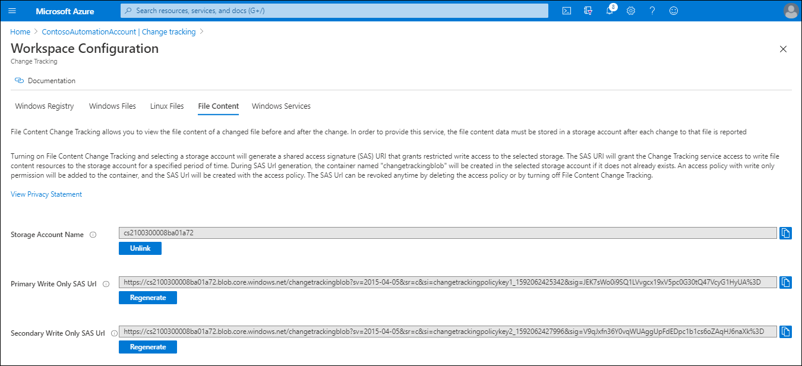
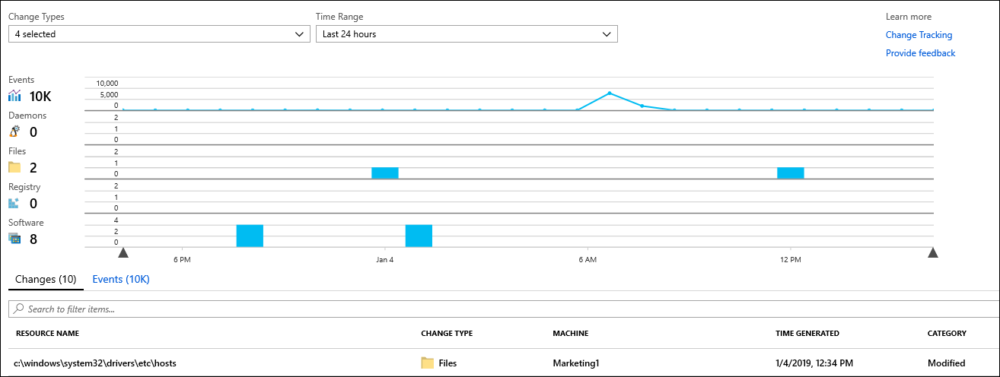
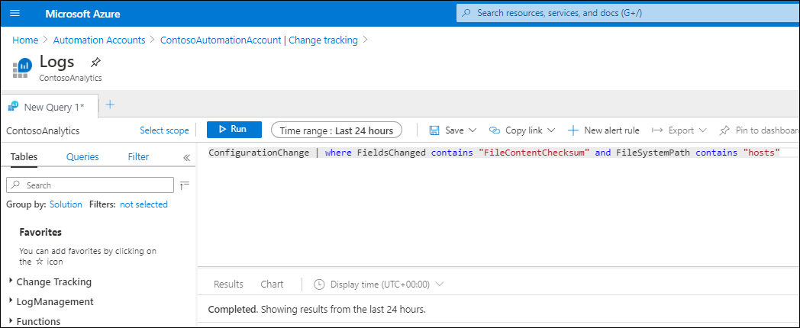
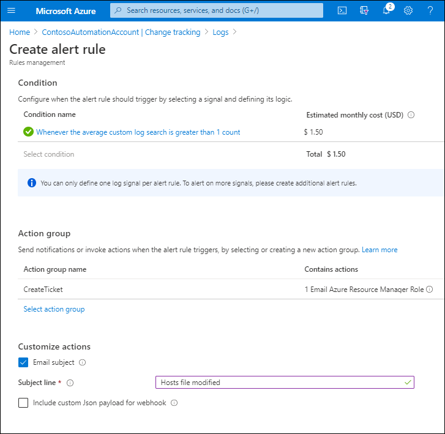

It is important to know  whether your files have been modified. It's also important to know how they've been changed. In this unit, you'll learn how to enable file content tracking, how to view file modified file content, and how to enable alerts on file changes in your Windows VMs.

## Enable file content tracking

With file content tracking, you can compare file contents before and after a tracked change. To enable and use file content tracking, use the following procedure:

1. In the Azure portal, select **Automation Accounts**.
2. Select the appropriate automation account, and then under the **Configuration Management** heading, select **Change tracking**.
3. On the toolbar, select **Edit Settings**, and then on the **Workspace Configuration** blade, select the **File Content** tab.
4. Select **Link**, and then select the appropriate subscription and Storage account.
5. If you want to enable file content tracking for all existing tracked files, for the **Upload file content for all settings** setting, select **On**, and then select **Save**.

> [!TIP] 
> You must create a storage account to use file content tracking.  

[](../media/m10-file-content.png#lightbox)

### Review the contents of a tracked file

After Change Tracking and Inventory detects a change for a tracked file, you can review the file contents on the **Change Details** pane. Use the following procedure:

1. In the Azure portal, open your **Automation account**, and then under **Configuration Management**, select **Change Tracking**.
2. Choose a file in the list of changes and then select **View File Content Changes** to review the file contents.

  > [!NOTE] 
  > The change details pane displays the before and after file information for each property.

3. By default, you review the file contents in a side-by-side layout. Select **Inline** to review an inline layout of the changes.

   

### Create alerts on changes

You can configure alerts on file changes. For example, if someone edited the Hosts file on a VM, that would impact the way that name resolution occurred on that VM. It would be important to know that this change had occurred.



To configure an alert on a file change similar to this, use the following procedure:

1. In your automation account, on the **Change tracking** blade, select **Log Analytics**.

2. In the Logs search, enter the following query:

   ```
   ConfigurationChange | where FieldsChanged contains "FileContentChecksum" and FileSystemPath contains "hosts"
   ```

   

3. When the query is complete, select **New alert rule** in the log search to open the **Alert creation** page. Check your query again and modify the **alert logic**.

   > [!TIP] 
   > In this case, because the file is critical, you want the alert to be triggered if there's even one change detected across all the machines in the environment.

4. Configure the Action group settings, and then customize actions. In this example, an action group called CreateTicket will run and prompt Azure to email the Azure Resource Manager Role holder.

   

## Additional reading

To learn more, review the following document.

- [Create and manage action groups in the Azure portal](https://aka.ms/action-groups?azure-portal=true).
