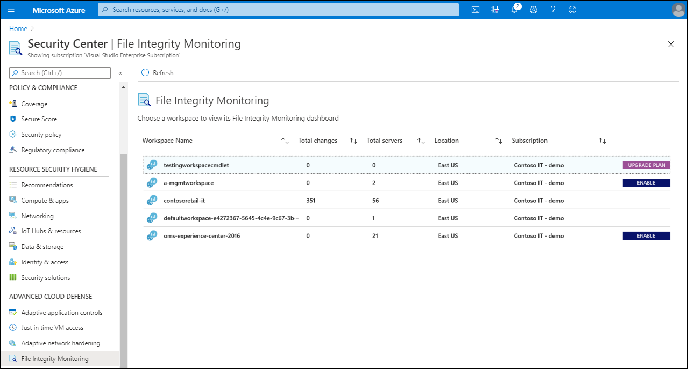
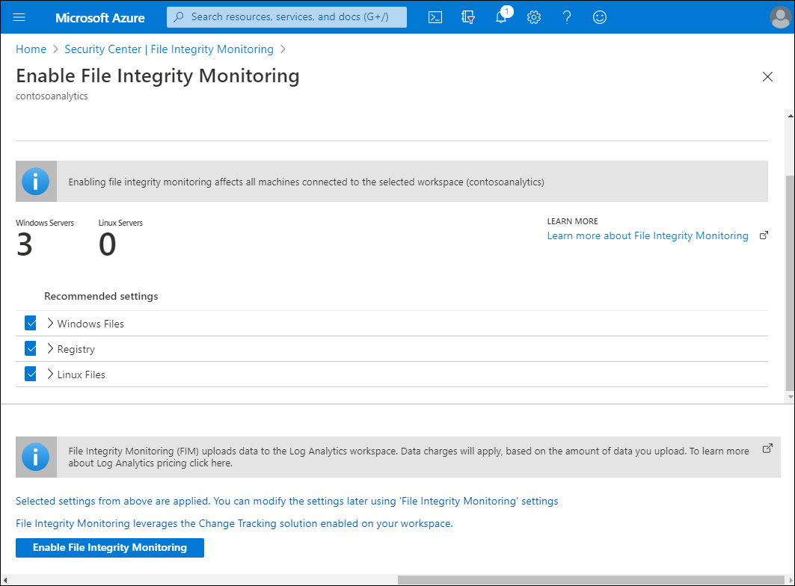
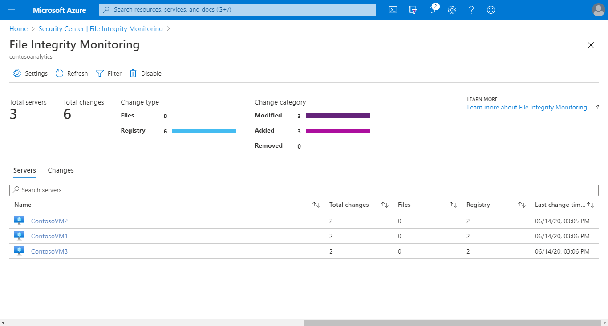
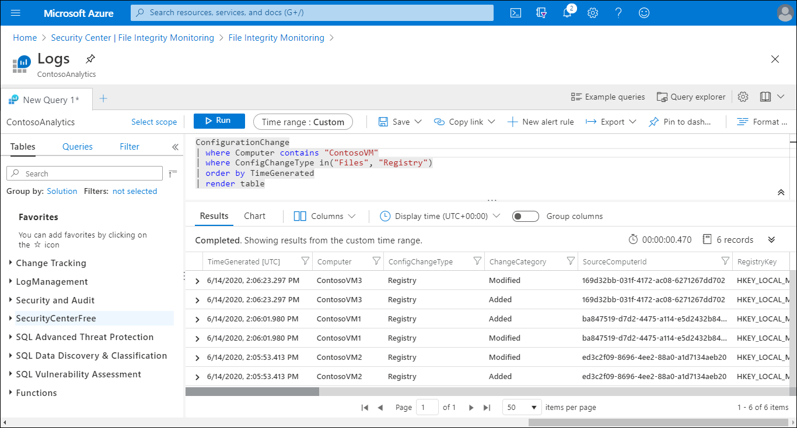
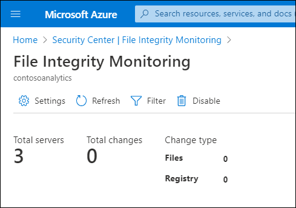

File Integrity Monitoring enables you to leverage Change Tracking and Inventory to identify changes that might indicate potential security problems. Because cloud security  is critical to Contoso management, you decide to implement and test File Integrity Monitoring.

## What is File Integrity Monitoring?

File Integrity Monitoring, also known as *change monitoring*, examines files and registries of operating system, application software, and others for changes that might indicate an attack.

> [!NOTE] 
> Change Tracking and Inventory uses Azure Security Center File Integrity Monitoring. 

When File Integrity Monitoring discovers changes, it uses a comparative method to help to determine whether the current state of the file differs from the last scan of the file. If File Integrity Monitoring discovers that there are differences, <!-- Verify -->a designated administrator is notified and can then take action to determine if these changes are legitimate, or if they indicate a possible security problem.

You can use File Integrity Monitoring to validate the integrity of the following object types:

- Windows files
- Windows registry values
- Linux files

You access File Integrity Monitoring from Azure Security Center. Security Center enables you to specify the object types that you want to monitor. Security Center monitors files with File Integrity Monitoring enabled for activity such as:

- File and Registry creation and removal.
- File modifications (changes in file size, access control lists (ACLs), and hash of the content).
- Registry modifications (changes in size, access control lists, type, and the content).

## Enable File Integrity Monitoring

To use a Log Analytics workspace for File Integrity Monitoring, the workspace must be running under the Security Center Standard tier. If it isn't, any workspaces that are on the File Integrity Monitoring node will have an **UPGRADE PLAN** link.

> [!TIP] 
> Those workspaces that are already in the Security Center Standard tier are indicated with an ENABLE link.

To upgrade the workspace to Security Center Standard tier, use the following procedure:

1. Select the **UPGRADE PLAN** link, and on the **What is File Integrity Monitoring** page, select try **File Integrity Monitoring**.
2. On the File Integrity Monitoring node, select the appropriate workspace, and then select **Upgrade**.
3. On the **Install agent automatically** page, select **Install agents**. The Microsoft Monitoring Agent is automatically installed on all the VMs in selected subscription.

> [!TIP] 
> If you've already configured your VMs for Change Tracking and Inventory, you don't need to install the agent as it will already be present.

After you have upgraded the required workspaces:

1. Return to the list of workspaces.
1. Select **ENABLE** for any workspaces that you want to enable for File Integrity Monitoring.

   The Enable File Integrity Monitoring page opens, listing the number of Windows and Linux machines under the workspace.

   

3. Review the Recommended settings: Windows Files, Registry, and (if applicable), Linux Files.
4. Clear the check box for any items you don't want to track, and then select **Enable File Integrity Monitoring**.

## Configure File Integrity Monitoring

After you have enabled File Integrity Monitoring, on the File Integrity Monitoring dashboard in Security Center, the following information is provided for each workspace:

- Total number of changes that occurred in the last week
- Total number of computers and VMs reporting to the workspace
- Geographic location of the workspace
- Azure subscription that the workspace is under

You can filter the returned summary to return results from the last:

- 30 minutes
- One hour
- Six hours
- 24 hours
- 7 days
- 30 days

To review any changes in detail, select the appropriate VM. The logs detail displays. On this page, you can review the changes. You can also modify the query used to return the list of changes to suit your requirements.

## Disable File Integrity Monitoring

If you no longer want to use File Integrity Monitoring, use the following procedure to disable it:

1. Return to the File Integrity Monitoring dashboard.
2. Select a workspace.
3. Under **File Integrity Monitoring**, select **Disable**.
4. Select **Remove** to disable.

