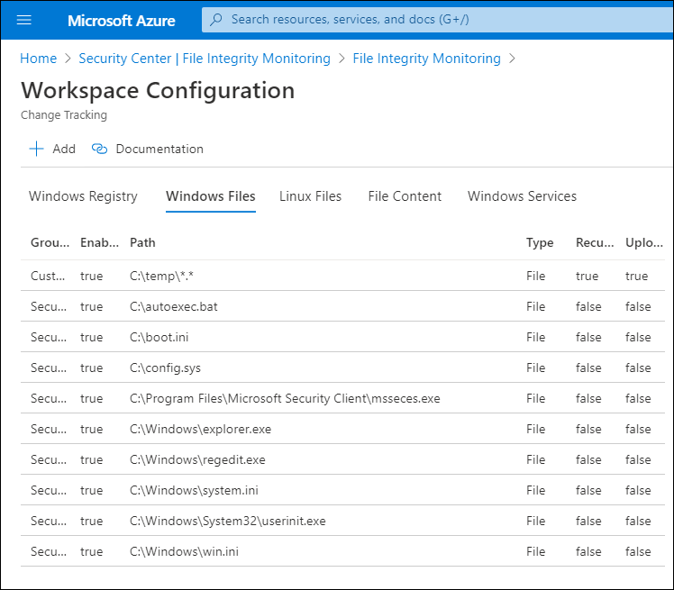
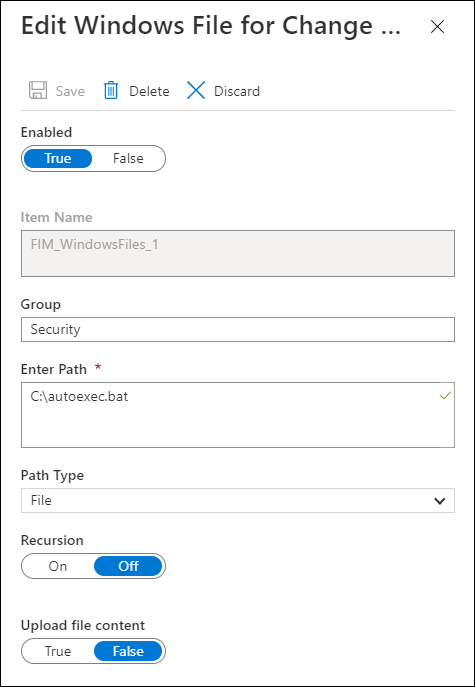
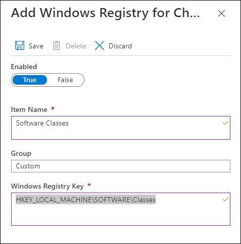
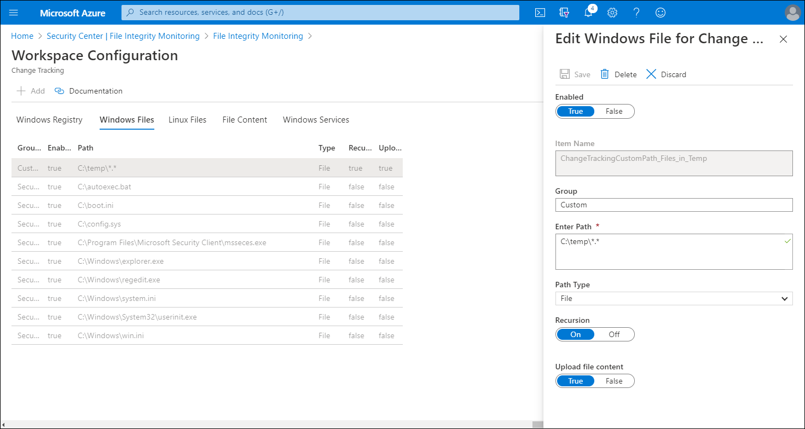

As system administrator at Contoso, you need to decide which entities to monitor; this includes considering which files and registry entries are critical to the company's operating systems, and the applications that employees need to run. You also know that many files and registry entries should remain unchanged; therefore, changes to those objects might indicate suspicious activity which you should investigate.

Conversely, there are many files and registry keys that you might reasonably expect to change, sometimes frequently. Monitoring those changes is not efficient, and probably provides little, if any, benefit for security monitoring purposes.

## Which Windows objects should be monitored?

Security Center makes recommendations of entities to monitor. These include files and Windows registry keys. All the registry keys are under HKEY_LOCAL_MACHINE. However, you can also define your own File Integrity Monitoring policies or entities to monitor.

To review the default monitored items, refer to [File Integrity Monitoring in Azure Security Center, Which files should I monitor?](https://aka.ms/which-files-should-i-monitor?azure-portal=true).

## Edit monitored entities

To edit the monitored entities, from the File Integrity Monitoring dashboard, select **Settings**.

> [!TIP] 
> There are a number of files listed by default that are probably not very significant any longer. These are: autoexec.bat, boot.ini, config.sys, and both win.ini and system.ini.

Workspace Configuration opens, displaying five tabs, each of which lists the entities that you can edit within that category:

- Windows Registry
- Windows Files
- Linux Files
- File Content
- Windows Services

 For each listed entity, Security Center identifies whether File Integrity Monitoring is enabled (true) or not enabled (False). You can edit the entity, and then enable or disable File Integrity Monitoring for that entity.

Next, you select an identity protection. In this example, the **autoexec.bat** is selected on the **Edit Windows Files for Change Tracking** blade.

Under **Edit for Change Tracking** you can:

- **Enable** (True) or **Disable** (False) File Integrity Monitoring.
- Provide or change the entity name.
- Provide or change the value or path.
- Delete the entity.
- Discard the change.
- Save the change.

## Add a new entity to monitor

To add a new entity to monitor, return to the File Integrity Monitoring dashboard. Then use the following procedure:

1. On the toolbar, select **Settings**.
2. In Workspace Configuration, select the appropriate tab. For example, select **Windows Registry** to add a new registry setting<!-- Verify. -->.
3. On the toolbar, select **Add**.
4. In the **Add Windows Registry for Change Tracking** blade, enter the following information, and then select **Save**.
    - Enabled: True or False
    - Item name: Provide a meaningful name
    - Group: (defaults to Custom)
    - Windows Registry Key: Enter a key path

## Disable monitored entities

To disable an entry, from File Integrity Monitoring dashboard, select the appropriate workspace. Then use the following procedure:

1. Select **Settings**.
2. Select the appropriate tab. For example, select **Windows Files**.
3. Select the entry from the list of Windows Files for which the Enabled value is **true**.
4. In the **Edit Windows File for Change Tracking** blade, under **Enabled**, select **False** and then select **Save**.

## Folder and path monitoring using wildcards

The file system in Windows Server is extensive. Manually configuring individual files for monitoring would take an extended period of time. Instead, you can use wildcards to help simplify tracking across directories. When you use wildcards, the following rules apply:

- Wildcards are required for tracking multiple files.
- Wildcards can only be used in the last segment of a path, such as `C:\folder\file`.
- If an environment variable includes a path that isn't valid, validation will succeed but the path will fail when inventory runs.
- When setting the path, avoid general paths such as `c:\*.*` which will result in too many folders being traversed.

