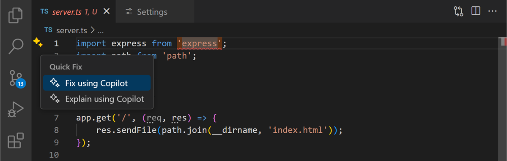
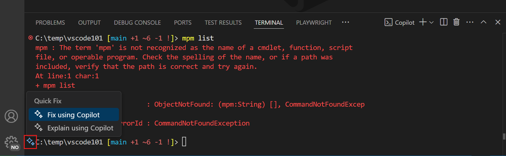

GitHub Copilot provides quick fix options that address coding issues, test failures, and problems detected in the command terminal. Quick fix options include:

- Smart action: The **Fix** smart action is a contextual action that can be used to fix coding errors without writing a prompt.
- Slash command: The `/fix` slash command is available in ask mode, Inline Chat sessions, and the Quick Chat window.
- Code actions: "Fix" code actions, such as **Fix using Copilot**, are displayed in the Visual Studio Code interface when Copilot detects certain issues.

## Fix coding issues using the Fix smart action

The **Fix** smart action is accessible from the Copilot context menu in the editor, and can be used to address coding issues without writing a prompt.

To fix a coding issue using the **Fix** smart action:

1. Open your application code file.

1. Select the code you want to fix.

1. Right-click the selected code, select **Copilot**, and then select **Fix**.

    Copilot opens an Inline Chat session to display a code update suggestion directly in the editor. Select **Accept** or **Close** to accept or discard the suggested fix.

1. Optionally, refine the suggested code update by submitting a prompt that provides additional context.

Alternatively, if there's a compile or linting problem in a code file, Copilot shows a **Fix using Copilot** code action (sparkle icon) in the editor when you hover the mouse pointer over the issue.

## Fix testing errors

Copilot integrates with the Test Explorer in VS Code and can help with fixing failing tests.

1. In the Test Explorer, hover over a failing test.

1. Select the **Fix Test Failure** button (sparkle icon).

1. Review and apply Copilot's suggested fix.

Alternatively, you can:

1. Open the Chat view.

1. Enter the `/fixTestFailure` command.

1. Follow Copilot's suggestions to fix the test.

> [!NOTE]
> Agent mode monitors the test output when running tests, and automatically attempts to fix and rerun failing tests. Using agent mode to monitor test output can help you quickly identify and resolve issues in your code. However, when you use agent mode, GitHub Copilot may make multiple premium requests to complete a single task. Premium requests can be used by user-initiated prompts and follow-up actions Copilot takes on your behalf. The total premium requests used depends on the complexity of the task, the number of steps involved, and the model selected.

## Fix terminal errors

When a command fails to run in the terminal, Copilot displays a sparkle icon in the gutter that offers a Quick Fix to explain what happened.

## Summary

GitHub Copilot provides quick fix options that address coding issues, test failures, and problems detected in the command terminal. Quick fix options include the Fix smart action, the `/fix` slash command, and "Fix" code actions. The Fix smart action is accessible from the Copilot context menu in the editor, and can be used to address coding issues without writing a prompt. The Fix smart action can also be used to fix testing errors and terminal errors.
