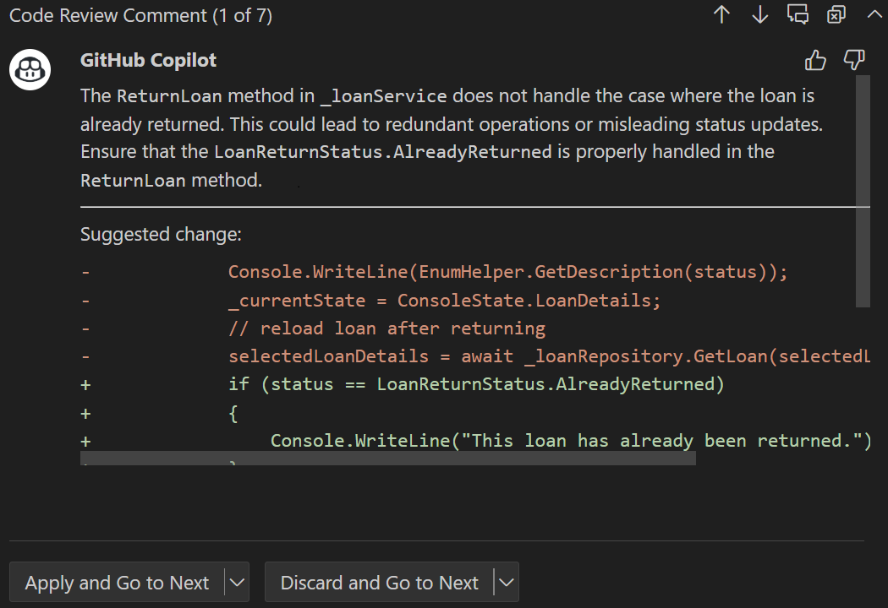
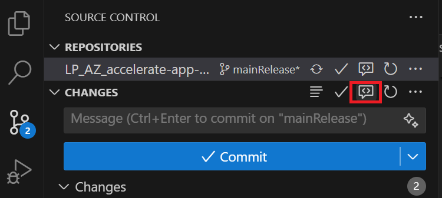

GitHub Copilot can review your code and provide feedback.

Copilot code review in Visual Studio Code supports two types of review:

- Review selection: Highlight code and ask for an initial review.
- Review changes: Request a deeper review of all your changes.

The current functionality and availability of the two types of review is summarized in the following table:

| Feature                        | Review selection                                                                 | Review changes                                                                                                                                         |
|---------------------------------|---------------------------------------------------------------------------------|--------------------------------------------------------------------------------------------------------------------------------------------------------|
| **Available in**                | Visual Studio Code                                                              | Visual Studio Code and the GitHub website                                                                                                              |
| **Premium/standard feature**    | Standard feature available to all Copilot subscribers                           | Premium feature. Available with the Copilot Pro, Copilot Pro+, Copilot Business, and Copilot Enterprise plans. Per-person monthly quota applies.       |
| **Description**                 | Initial review of a highlighted section of code with feedback and suggestions   | Deeper review of all changes                                                                                                                           |
| **Language support**            | All                                                                             | C, C#, C++, Go, Java, JavaScript, Kotlin, Markdown, Python, Ruby, Swift, TypeScript.                   |
| **Custom coding guidelines support** | No              | Yes                |

## Code review monthly quota

The review changes type of Copilot code review is a premium feature with a per-person monthly quota.

> [!NOTE]
> The per-person quota for Copilot code review will commence on June 4, 2025.

When you assign Copilot as a reviewer for a pull request, one premium request is deducted from your monthly quota each time Copilot posts comments to the pull request.

If a repository is configured to automatically request a code review from Copilot for all new pull requests, the premium request usage is applied to the quota of the pull request author. If a pull request is created by GitHub Actions or by a bot, the usage will apply to the user who triggered the workflow (if identifiable), or to a designated billing owner.

When you reach your monthly quota you will not be able to get a code review from Copilot until your quota resets - unless you upgrade your Copilot plan or enable more premium requests.

> [!WARNING]
> Copilot isn't guaranteed to spot all problems or issues in a pull request, and sometimes it makes mistakes. Always validate Copilot's feedback carefully, and supplement Copilot's feedback with a human review.

## Use the code review features

Copilot can help with reviewing your code, either for a code block that you select in the editor or all changes included in a pull request (requires the GitHub Pull Requests extension).

### Review a selected code block in the code editor

The **Review and Comment** smart action provides a way to review and analyze your code. It can help you identify areas for improvement, suggest refactoring updates, and provide guidance on best practices. The suggestions generated by the code review feature can help you improve the quality, reliability, performance, and security of your code.

1. Open a code file in the editor.

1. Select the code you want to review.

1. Right-click the selected code, select **Copilot**, and then select **Review and Comment**.

    The code review agent creates review comments in the COMMENTS panel (below the code editor) and displays suggested updates inline in the code editor.

1. Navigate through the suggestions and either apply or discard the updates.

    

### Review all changes to your codebase

The **Copilot Code Review - Changes** feature provides a way to review all staged or unstaged changes to your codebase. It can help you identify areas for improvement, suggest refactoring updates, and provide guidance on best practices. The suggestions generated by the code review feature can help you improve the quality, reliability, performance, and security of your code.

1. In Visual Studio Code, switch to the Source Control view.

1. To request a review of your unstaged changes, hover the mouse pointer over **CHANGES**, and then select the **Copilot Code Review - Uncommitted Changes** button.

    

1. Wait for Copilot to review your changes. This usually takes less than 30 seconds.

1. If Copilot has any comments, they will be shown inline in your file(s), and in the Problems tab.

## Summary

GitHub Copilot can review your code and provide feedback. Copilot code review in Visual Studio Code supports two types of review: review selection and review changes. The **Review and Comment** smart action provides a way to review and analyze selected code. It can help you identify areas for improvement, suggest refactoring updates, and provide guidance on best practices. The **Copilot Code Review - Changes** feature provides a way to review staged or unstaged changes using Visual Studio Code's Source Control view.
