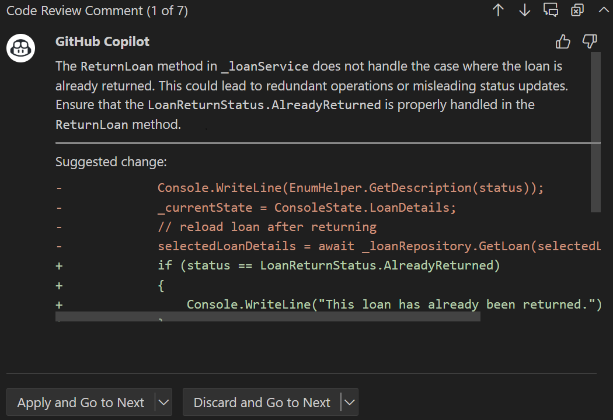
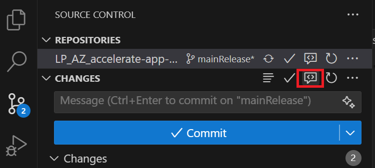

GitHub Copilot can review your code and provide feedback.

GitHub Copilot code review in Visual Studio Code supports two types of review:

- Review selection: Highlight code and ask for an initial review.
- Review changes: Request a deeper review of all your changes.

The current functionality and availability of the two types of review is summarized in the following table:

| Feature                        | Review selection                                                                 | Review changes                                                                                                                                         |
|---------------------------------|---------------------------------------------------------------------------------|--------------------------------------------------------------------------------------------------------------------------------------------------------|
| **Available in**                | Visual Studio Code                                                              | Visual Studio Code and the GitHub website                                                                                                              |
| **Premium/standard feature**    | Standard feature available to all GitHub Copilot subscribers                           | Premium feature. Available with the GitHub Copilot Pro, GitHub Copilot Pro+, GitHub Copilot Business, and GitHub Copilot Enterprise plans. Per-person monthly quota applies.       |
| **Description**                 | Initial review of a highlighted section of code with feedback and suggestions   | Deeper review of all changes                                                                                                                           |
| **Language support**            | All                                                                             | C, C#, C++, Go, Java, JavaScript, Kotlin, Markdown, Python, Ruby, Swift, TypeScript.                   |
| **Custom coding guidelines support** | No              | Yes                |

## Code review monthly quota

The review changes type of GitHub Copilot code review is a premium feature with a per-person monthly quota. The quota is currently active.

When you assign GitHub Copilot as a reviewer for a pull request, one premium request is deducted from your monthly quota each time GitHub Copilot posts comments to the pull request.

If a repository is configured to automatically request a code review from GitHub Copilot for all new pull requests, the premium request usage is applied to the quota of the pull request author. If a pull request is created by GitHub Actions or by a bot, the usage will apply to the user who triggered the workflow (if identifiable), or to a designated billing owner.

When you reach your monthly quota you will not be able to get a code review from GitHub Copilot until your quota resets - unless you upgrade your GitHub Copilot plan or enable more premium requests.

> [!WARNING]
> GitHub Copilot isn't guaranteed to spot all problems or issues in a pull request, and sometimes it makes mistakes. Always validate GitHub Copilot's feedback carefully, and supplement GitHub Copilot's feedback with a human review.

## Use the code review features

GitHub Copilot can help with reviewing your code, either for a code block that you select in the editor or all changes included in a pull request (requires the GitHub Pull Requests extension).

### Review a selected code block in the code editor

The **Review** smart action provides a way to review and analyze your code. It can help you identify areas for improvement, suggest refactoring updates, and provide guidance on best practices. The suggestions generated by the code review feature can help you improve the quality, reliability, performance, and security of your code.

1. Open a code file in the editor.

1. Select the code you want to review.

1. Right-click the selected code, and then select **Generate Code > Review**.

    The code review agent creates review comments in the COMMENTS panel (below the code editor) and displays suggested updates inline in the code editor.

    > [!NOTE]
    > The Visual Studio Code context menu for GitHub Copilot is actively being updated. The **Review** smart action may appear at the top level of the context menu (alongside **Explain**) rather than under **Generate Code**. If the **Review** option isn't available in the context menu, you can perform the same action by selecting your code and entering a prompt like "review this code" directly in the Chat view.

1. Navigate through the suggestions and either apply or discard the updates.

    

    Where possible, Copilot's feedback includes suggested code changes. Use **Apply and Go To Next** to accept a suggestion, or **Discard and Go to Next** to reject it. Applied changes aren't automatically committed.

### Review all changes to your codebase

The **GitHub Copilot Code Review** feature provides a way to review all staged or unstaged changes to your codebase. It can help you identify areas for improvement, suggest refactoring updates, and provide guidance on best practices. The suggestions generated by the code review feature can help you improve the quality, reliability, performance, and security of your code.

1. In Visual Studio Code, switch to the Source Control view.

1. To request a review of your unstaged changes, hover the mouse pointer over **CHANGES**, and then select the **GitHub Copilot Code Review - Uncommitted Changes** button.

    

1. Wait for GitHub Copilot to review your changes. This usually takes less than 30 seconds.

1. If GitHub Copilot has any comments, they will be shown inline in your file(s), and in the Problems tab.

    Where possible, Copilot's feedback includes suggested code changes. Use **Apply and Go To Next** to accept a suggestion, or **Discard and Go to Next** to reject it. Applied changes aren't automatically committed.

## Customize code review with coding guidelines

You can customize how Copilot reviews your code by adding custom instructions to your repository. This is supported for the **Review changes** type of review.

Specify repository-wide custom instructions in a `.github/copilot-instructions.md` file. For example:

```text
When performing a code review, focus on readability and avoid nested ternary operators.
When performing a code review, flag any use of hardcoded credentials.
```

You can also create path-specific instructions in `.github/instructions/**/*.instructions.md` files that Copilot uses only when reviewing files that match a specified path.

> [!NOTE]
> Copilot code review reads only the first 4,000 characters of any custom instruction file. Instructions beyond this limit don't affect the reviews generated.

## Summary

GitHub Copilot can review your code and provide feedback. GitHub Copilot code review in Visual Studio Code supports two types of review: review selection and review changes. The **Review** smart action provides a way to review and analyze selected code. It can help you identify areas for improvement, suggest refactoring updates, and provide guidance on best practices. The **GitHub Copilot Code Review** feature provides a way to review staged or unstaged changes using Visual Studio Code's Source Control view.
