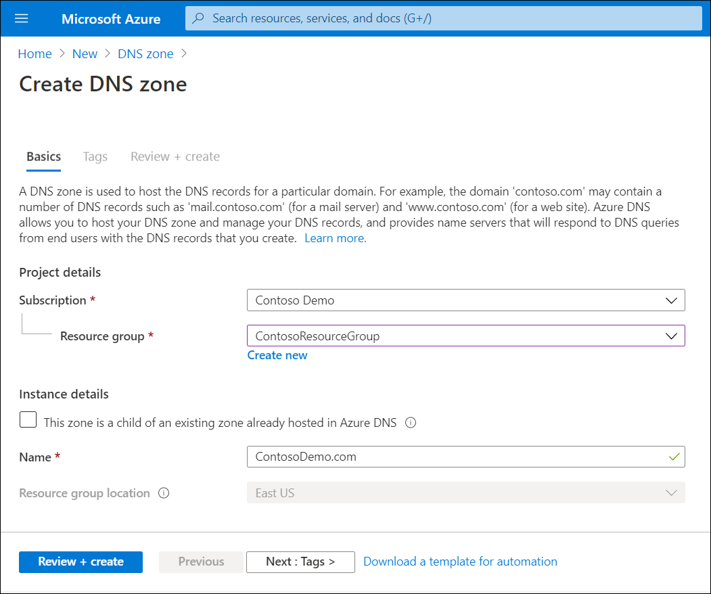
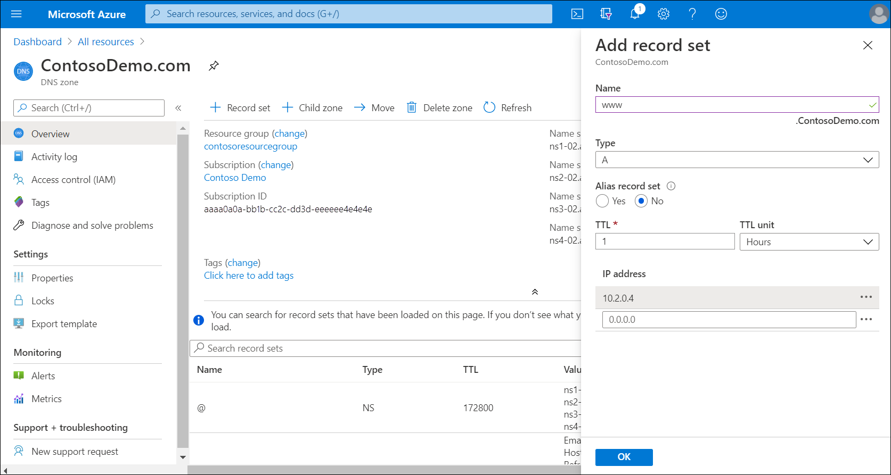
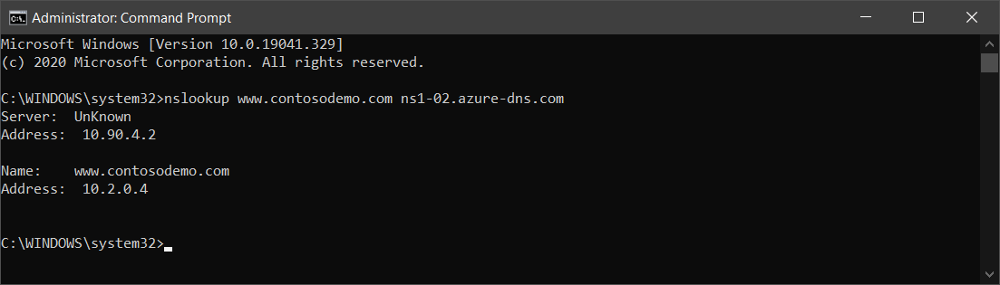
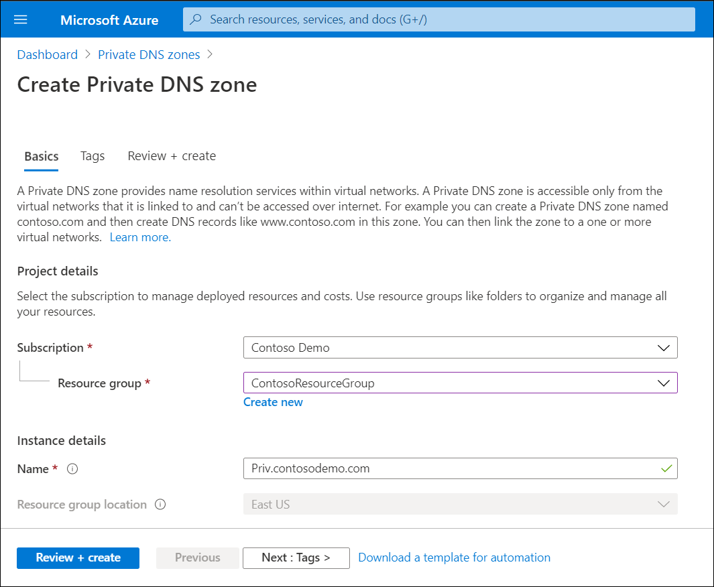
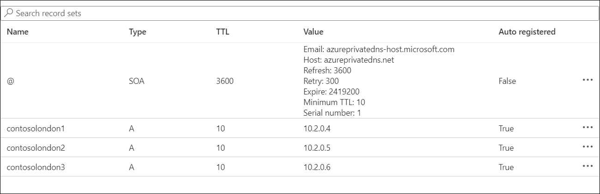

Having learned about public and private Azure DNS zones, the Contoso infrastructure team needs to know how to create and manage them  complete the transition to Azure. In the unit, you'll learn how to create a public zone, populate it with records, and then test name resolution. You'll also learn how to create a private DNS zone, link it to a VNet, and review automatically generated records in that zone.

## Configure a public DNS zone

You can create and manage public DNS zones in Azure by using the Azure portal, Azure PowerShell, or the Azure CLI.

### Create the public zone

To create a public DNS zone in Azure using the Azure portal, use the following procedure:

1. From the home page, select **Create a resource**.
2. Search the marketplace for **DNS zone**.
3. Select **DNS zone** from the returned results, and then select **Create**.
4. Select an appropriate resource group, and then in the **Name** text box, enter the name of your DNS zone. If the zone is a child of an existing zone, select the check box labeled **This zone is a child of an existing zone already hosted in Azure DNS**.

   

5. Select **Review + create**, and then select **Create**.

### Add records to the public zone

To add a record to your zone, use the following procedure:

1. In the Azure portal, navigate to **All resources**, and then locate and select the zone you just created.
2. On the toolbar, select **+ Record set**.
3. Enter the required information as described in the following table, and then select **OK**.

|Values|Description|
|-----|------------------------------------------------------------|
|Name|This is the record name. If this is a host, then enter the hostname.|
|Type|Select the appropriate record type. Available types are: A, AAAA, CAA, CNAME, MX, NS, SRV, TXT, and PTR.|
|Alias record set|Select Yes or No. This value is only supported for A, AAAA, and CNAME record types.|
|TTL and TTL unit|Select the Time to Live (TTL) value using these two values.|
|IP address|Enter the appropriate IP address for the record. This field is only relevant for host records.|
|Alias|This is for CNAME records only. Enter the hostname this alias (CNAME) record identifies.|
|Preference and Mail exchange|This is for MX records only. Enter the preference value and the FQDN of the mail exchange server.|

> [!NOTE] 
> Other record types have different value fields.

### Test name resolution in the public zone

To test name resolution, for example, for a server named `www.contosodemo.com` use the following procedure:

1. In the Azure portal, copy the name of one of the name servers listed on the overview page of your new zone.

   

2. Open a command prompt, and run the following command: `nslookup www.contosodemo.com ns1-02.azure-dns.com`, replacing both the FQDN and name server name with the information relevant to your environment.

   

## Configure an Azure private DNS zone

You can use a private DNS zone to host the DNS records for a particular domain. The first step is to create a DNS zone for your domain. To make a private DNS zone available to Azure resources, you must publish the zone to your VNets. The VNets to which you link the zone are called *linked VNets*. If you also enable autoregistration, Azure DNS updates the zone records whenever you create a new VM, remove a VM, or a VM's IP address changes. As with public DNS zones, you can use the Azure portal, the Azure CLI, or Azure PowerShell to create and manage your zones.

### Create the private zone

Use the following procedure to create your private DNS zone:

1. Search for private DNS zones in the search box, and then from the returned list, select **Private DNS zones**.
2. Select **Create private DNS zone**.
3. Select the appropriate resource group, and then enter the instance name.

   

4. Select **Review + Create**, and then select **Create**.

### Link VNets

To link VNets to your new private DNS zone, use the following procedure:

1. Search for your newly created zone in **All resources**, and then open the new zone.
2. Under **Settings**, select **Virtual network links**.
3. On the toolbar, select **+ Add**.
4. Enter the **Link name**, and then select (or create) the appropriate **Virtual network**.
5. Optionally, you can select the **Enable auto registration** check box.
6. Select **OK**.

### Managing records

To add records to the zone, you use the same procedure as for a public DNS zone. However, if you enabled autoregistration, your zone will be automatically populated with DNS records for the Azure resources (such as VMs) that are connected to the VNet that is linked to private DNS zone.

### Test name resolution in the private zone

Testing is a little different for a private zone. Rather than using **nslookup** from an internet-connected computer, you must test name resolution from one of the VMs connected to a linked VNet. Steps are provided at [Quickstart: Create an Azure private DNS zone using the Azure portal, Test the private zone](https://aka.ms/test-the-private-zone?azure-portal=true).
