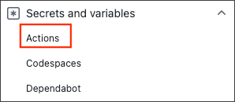

In order for GitHub Actions for Azure to access resources secured by a Microsoft Entra tenant, that access requires representation by a security principal. This requirement is true for both users (user principal) and applications (service principal). 

The security principal defines the access policy and permissions for the user/application in the Microsoft Entra tenant. This enables core features such as authentication of the user/application during sign-in, and authorization during resource access.

There are three types of service principal:

*   **Application** - This type of service principal is the local representation, or application instance, of a global application object in a single tenant or directory. A service principal is created in each tenant where the application is used and references the globally unique app object. The service principal object defines what the app can actually do in the specific tenant, who can access the app, and what resources the app can access.

    When you register an application, a service principal is created automatically. You can also create service principal objects in a tenant using Azure PowerShell, Azure CLI, Microsoft Graph, and other tools.

*   **Managed identity** - Managed identities provide an identity for applications to use when connecting to resources that support Microsoft Entra authentication. When a managed identity is enabled, a service principal representing that managed identity is created in your tenant. Service principals representing managed identities can be granted access and permissions, but can't be updated or modified directly.

*   **Legacy** - This type of service principal represents a legacy app, which is an app created before app registrations were introduced or an app created through legacy experiences. A legacy service principal can have credentials, service principal names, and other properties that an authorized user can edit. But, it doesn't have an associated app registration. The service principal can only be used in the tenant where it was created.

## Use the Azure Login action with a service principal secret

To use Azure login with a service principal, you first need to add your Azure service principal as a secret to your GitHub repository. The following examples show you hot to create a service principal, add the principal as a GitHub secret, and use that secret in the Azure Login action.

### Create a service principal

The following command can be run in either the Azure Cloud Shell or Azure CLI locally. The service principal must be assigned with an appropriate role.

```azurecli
az ad sp create-for-rbac --name "myApp" --role contributor \
    --scopes /subscriptions/{subscription-id}/resourceGroups/{resource-group} \ 
    --json-auth
```

The command generates a JSON object for your service principal. Be sure to copy the information it can't be retrieved later.

```json
{
    "clientId": "<GUID>",
    "clientSecret": "<secret>",
    "subscriptionId": "<GUID>",
    "tenantId": "<GUID>",
    (...)
}
```

### Add service principal as a GitHub secret

The following steps show how to create a secret named `AZURE_CREDENTIALS` that you can use to authenticate with Azure.

* In [GitHub](https://github.com/), go to your repository.

* Go to **Settings** in the navigation menu.

* Select **Security > Secrets and variables > Actions**.

    

* Select **New repository secret**.

* Paste the entire JSON output from the Azure CLI command into the secret's value field. Give the secret name `AZURE_CREDENTIALS`.

*   Select **Add secret**.

### Use the Azure Login action

The following workflow example authenticates using the Azure Login action with the service principal details stored in `secrets.AZURE_CREDENTIALS`.

```yml
on: [push]

name: AzureLoginSample

jobs:
  build-and-deploy:
    runs-on: ubuntu-latest
    steps:
      - name: Checkout repository
        uses: actions/checkout@v2

      - name: Log in with Azure
        uses: azure/login@v1
        with:
          creds: '${{ secrets.AZURE_CREDENTIALS }}'
```

