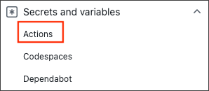

GitHub Actions for Azure uses a security principal to access resources secured by a Microsoft Entra tenant. A security principal represents either a user through a user principal or an application through a service principal.

Microsoft Entra uses the security principal to define access policies and permissions for the user or application. The principal enables authentication during sign-in and authorization during resource access.

There are three types of service principal:

* **Application:** This type of service principal is the local representation, or application instance, of a global application object in a single tenant or directory. When you register an application, Microsoft Entra automatically creates a service principal. You can also create service principal objects in a tenant using Azure PowerShell, Azure CLI, Microsoft Graph, and other tools.

* **Managed identity:** Managed identities provide an identity for applications to use when connecting to resources that support Microsoft Entra authentication. When you enable a managed identity, Microsoft Entra creates a service principal that represents the identity in your tenant. You can grant access and permissions to the service principal, but you can't update or modify it directly.

* **Legacy:** This type of service principal represents an app created before app registrations were introduced or through a legacy experience. An authorized user can edit its credentials, service principal names, and other properties, but the principal doesn't have an associated app registration. You can use the service principal only in the tenant where it was created.

You also assign the security principal appropriate Azure roles to grant access to resources. This unit covers the following ways of signing into Azure from a GitHub workflow:

* Sign-in with OpenID Connect and a federated identity credential. This recommended method exchanges GitHub's short-lived token for an Azure access token without storing a client secret.
* Sign-in with a service principal and a client secret. This method isn't recommended because it requires you to store and rotate a long-lived credential.

You can create a service principal using the Azure portal or Azure CLI.

Authentication establishes the workflow's identity, while Azure role-based access control (Azure RBAC) determines what that identity can do. Assign the least-privileged role at the narrowest practical scope. The examples in this unit use the **Website Contributor** role scoped to one Azure App Service web app. For other Azure services, select the appropriate [Azure built-in role](/azure/role-based-access-control/built-in-roles). Use the broader **Contributor** role only when the workflow must manage multiple resource types and no narrower role meets its requirements.

## Sign in with OpenID Connect

The following examples show you how to create a service principal and configure it for OpenID Connect using the Azure portal. The examples include configuring the scoped role, adding the secrets to GitHub, and using the secrets in the Azure Login action.

### Create a service principal

An app registration creates an application object and a corresponding service principal in your tenant. You can then add a federated credential that identifies the GitHub repository and branch allowed to request an Azure access token. The following steps configure the app registration and federated credential in the Azure portal.

1. In the Azure portal, you can search for **Microsoft Entra ID** and navigate to the service.

1. In the left navigation pane, you can select **App registrations** in the **Manage** group.

1. You can select **+ New registration** in the main panel, enter a name, and then select **Register**.

    > [!NOTE]
    > Record the **Application (client) ID** and **Directory (tenant) ID** values in the **Essentials** section. You use these values and your **Subscription ID** in the GitHub workflow.

1. In the left navigation pane, you can select **Certificates & secrets** in the **Manage** group. In the main window, you can then select **Federated credentials**.

1. You can select **Add a credential** and then select **GitHub Actions deploying Azure resources** in the dropdown.

1. You can enter information about your GitHub account in the form. The following table shows the fields you use to restrict actions to a specific branch in your repository. The fields are case-sensitive.

    | Field | Action |
    |--|--|
    | Organization | Enter your user or organization name. |
    | Repository | Enter the name of the repository. |
    | Entity type | Select **Branch**. |
    | GitHub branch name | Enter **main**, or the name of the branch that represents your deployment. |

1. In the **Credential details** section, you can give your credential a name and then select **Add**.

### Assign a role

You can assign a role to the service principal to grant it permission to access resources in your Azure account. The following Azure CLI example assigns the *Website Contributor* role scoped to a specific Azure App Service web app. You can use the application client ID as the assignee value.

```azurecli
az role assignment create --assignee <application-client-id> \
  --role "Website Contributor" \
  --scope /subscriptions/{subscription-id}/resourceGroups/{resource-group}/providers/Microsoft.Web/sites/{web-app-name}
```

### Add OpenID Connect secrets to GitHub

The Azure Login action needs the client, tenant, and subscription identifiers to request an Azure access token. You can store these values as repository secrets and reference them through the `secrets` context. The following steps add the required values to your GitHub repository.

1. In [GitHub](https://github.com/), you can go to your repository.
1. You can go to **Settings** in the navigation menu.
1. You can select **Security > Secrets and variables > Actions**.

    

1. You can select **New repository secret**.
1. You can add the secrets shown in the following table.

    | Name | Secret |
    |--|--|
    | AZURE_CLIENT_ID | Enter the **Application (client) ID**. |
    | AZURE_TENANT_ID | Enter the **Directory (tenant) ID**. |
    | AZURE_SUBSCRIPTION_ID | Enter your subscription ID. You can retrieve your ID with the `az account show` command. |

### Use the Azure Login action

The following workflow example authenticates using the Azure Login action with the OpenID Connect details stored in GitHub. The `permissions` block allows the workflow to request an ID token and read the repository contents.

```yml
on: [push]

name: AzureLoginSample

permissions:
  id-token: write # Requires write permission to fetch a token.
  contents: read  # This is required for actions/checkout

jobs:
  build-and-deploy:
    runs-on: ubuntu-latest
    steps:
      - name: Checkout repository
        uses: actions/checkout@v7

      # Sign in to Azure by using OpenID Connect.
      - name: Azure Login
        uses: azure/login@v3
        with:
          client-id: ${{ secrets.AZURE_CLIENT_ID }}
          tenant-id: ${{ secrets.AZURE_TENANT_ID }}
          subscription-id: ${{ secrets.AZURE_SUBSCRIPTION_ID }}
```

## Sign in with a service principal and a secret

The following examples show you how to create a service principal and configure it with a scoped role. They also show how to add the principal as a GitHub secret and use that secret in the Azure Login action.

### Create a service principal

Azure CLI can create a service principal and assign its Azure role in one command. This approach returns the credential details that Azure Login needs for client-secret authentication. The following command assigns the *Website Contributor* role scoped to a specific Azure App Service web app.

```azurecli
az ad sp create-for-rbac --name "myApp" \
  --role "Website Contributor" \
  --scopes /subscriptions/{subscription-id}/resourceGroups/{resource-group}/providers/Microsoft.Web/sites/{web-app-name} \
  --json-auth
```

The command generates a JSON object for your service principal. This output is the secret you add to your GitHub repository. Copy the client secret when the command returns it because you can't retrieve the client secret later. The client, subscription, and tenant IDs remain available in Azure.

```json
{
    "clientId": "<GUID>",
    "clientSecret": "<secret>",
    "subscriptionId": "<GUID>",
    "tenantId": "<GUID>",
    (...)
}
```

### Add service principal as a GitHub secret

Azure Login accepts the complete service principal JSON object through its `creds` input. You can store the object as one repository secret instead of configuring each property separately. The following steps create a secret named `AZURE_CREDENTIALS`.

1. In [GitHub](https://github.com/), you can go to your repository.
1. You can go to **Settings** in the navigation menu.
1. You can select **Security > Secrets and variables > Actions**.

    

1. You can select **New repository secret**.
1. You can paste the entire JSON output from the Azure CLI command into the secret's value field and name the secret `AZURE_CREDENTIALS`.

1. You can select **Add secret**.

### Use the Azure Login action

The following workflow example authenticates using the Azure Login action with the service principal details stored in `secrets.AZURE_CREDENTIALS`. The `creds` input reads the JSON object from the repository secret and supplies it to Azure Login.

```yml
on: [push]

name: AzureLoginSample

jobs:
  build-and-deploy:
    runs-on: ubuntu-latest
    steps:
      - name: Checkout repository
        uses: actions/checkout@v7

      - name: Log in with Azure
        uses: azure/login@v3
        with:
          creds: '${{ secrets.AZURE_CREDENTIALS }}'
```

