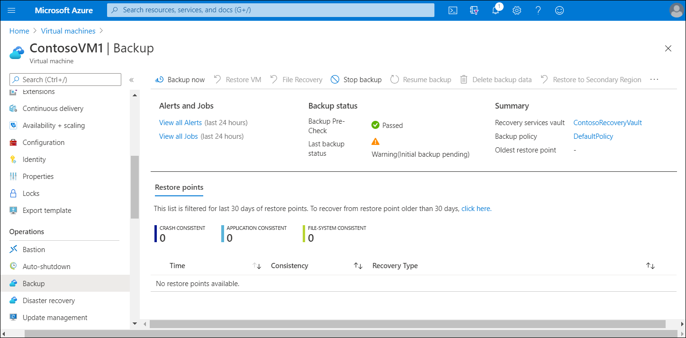
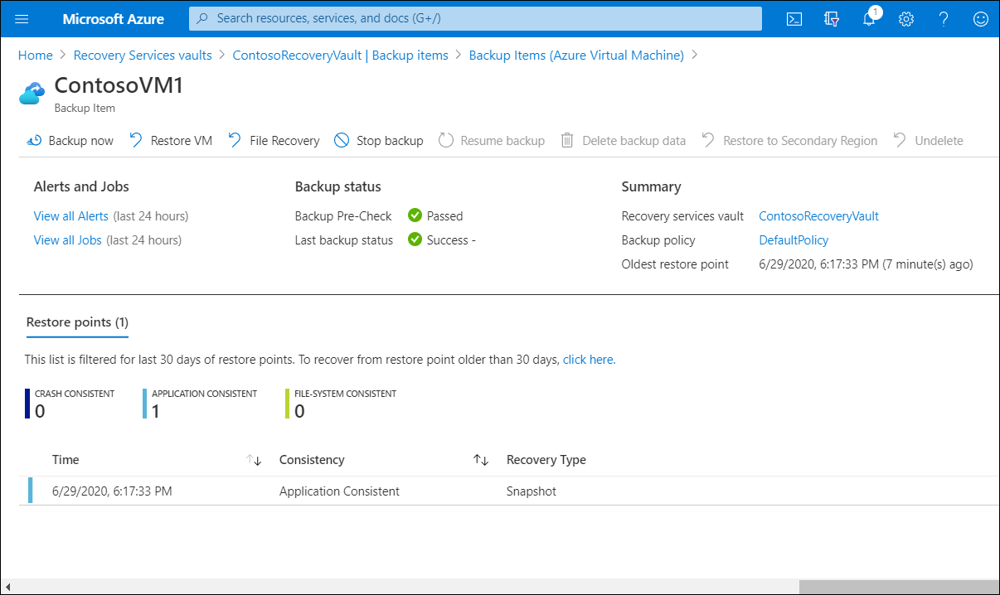

You can protect your data by making backups at regular intervals. There are several backup options available for VMs, depending on your use-case, as described in the following table.

|Backup option|Description|
|----|----|
|VM backups|For backing up Azure VMs running production workloads, use Azure Backup. Azure Backup supports application-consistent backups for both Windows and Linux VMs. Azure Backup creates recovery points that are stored in geo-redundant recovery vaults. When you restore from a recovery point, you can restore the entire VM or just specific files.|
|Azure Site Recovery|Azure Site Recovery protects your VMs from a major disaster scenario when an entire region experiences an outage. You can configure Azure Site Recovery for your VMs so that you can recover your application in a matter of minutes. You can replicate to an Azure region of your choice.|
|Managed snapshots|In development and test environments, snapshots provide a quick and simple option for backing up VMs that use Managed Disks. A *managed snapshot* is a read-only full copy of a managed disk. Snapshots exist independent of the source disk and can be used to create new managed disks for rebuilding a VM. They are billed based on the used portion of the disk. For example, if you create a snapshot of a managed disk with provisioned capacity of 64 gigabytes (GB) and actual used data size of 10 GB, you are billed only for the used data size of 10 GB in the snapshot.|

## How to back up VMs

Backing up Azure VMs using Azure Backup is straightforward and follows the logical process:

1. Create a Recovery Services vault. To back up your files and folders, you need to create a Recovery Services vault in the region where you want to store the data. You also need to determine how you want your storage replicated, either GRS or LRS.

   >[!TIP]
   > If you are using Azure as a primary backup storage endpoint, use the default GRS. If you are using Azure as a non-primary backup storage endpoint, then choose LRS, which will reduce the cost of storing data in Azure.

2. Use the Portal to define the backup. Protect your data by taking snapshots of your data at defined intervals. These snapshots are known as *recovery points*, and are stored in Recovery Services vaults. If or when it's necessary to repair or rebuild a VM, you can restore the VM from any of the saved recovery points. A backup policy defines a matrix of when the data snapshots are taken, and how long those snapshots are retained. When defining a policy for backing up a VM, you can trigger a backup job once a day.
3. Back up the VM. The Azure VM Agent must be installed on the Azure VM for the Backup extension to work. However, if your VM was created from the Azure Marketplace, then the VM Agent is already on the VM.

   >[!TIP]
   > VMs that you migrate from on-premises data centers would not have the VM Agent installed. In such a case, you need to install the VM Agent.

   

## How to restore VMs

After your VM snapshots are safely in the Recovery Services vault recovering them is also a straightforward process. After you trigger the restore operation, the Backup service creates a job for tracking the restore operation. The Backup service also creates and temporarily displays notifications, so you can monitor how the backup is proceeding. To restore a VM, use the following procedure:

1. Select the appropriate VM in the Azure portal, and then select **Backup**. Alternatively, select the appropriate **Recovery Services vault**, and then select **Backup Items**.
2. Select either **File recovery** or **Restore VM**.
3. Follow the on-screen prompts to complete the process.

   

## Azure Disk Level backup and restore

A VM consists mainly of two parts: a compute server and the persistent disks. Both affect the fault tolerance of a VM. If the Azure VM experiences a hardware failure, which is rare, Azure will automatically restore the VM on another server. In this scenario, your VM will restart, and the VM comes back up after some time. Azure automatically detects such hardware failures and executes recoveries to help ensure the customer VM is available as soon as possible.

Azure Backup works with managed and unmanaged disks. You can create a backup job with time-based backups, easy VM restoration, and backup retention policies.

If you use premium Solid State Drives (SSD), managed disks, or other types of disks with the LRS option, it's especially important to make periodic backups. Azure Backup stores the data in your recovery services vault for long-term retention. Choose the GRS option for the backup Recovery Services vault. That option ensures that backups are replicated to a different Azure region for safeguarding from regional disasters.

For unmanaged disks, you can use the LRS type for such disks. However, be sure to verify that Azure Backup is enabled with the GRS option for the Recovery Services vault. 

Backing up and restoring business-critical data is complicated by the fact that business-critical data must be backed up while the applications that produce the data are running. To address this issue, Azure Backup provides application-consistent backups for Microsoft workloads by using the volume shadow service to ensure that data is written correctly to storage.
