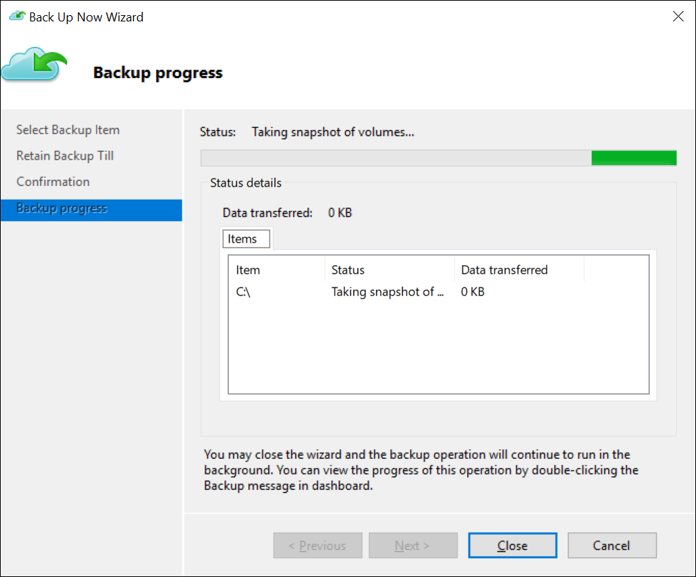

You need to know how to back up files and folders to an Azure Recovery vault, and when necessary, how to restore those files and folders.

## Back up files and folders

Backing up files and folders to Azure Backup is straightforward, and follows a relatively simple process:

1. Create a Recovery Services vault. To back up your files and folders, you need to create a Recovery Services vault in the region where you want to store the data. You also need to determine how you want your storage replicated, either geo-redundant (default) or locally redundant. By default, your vault has GRS. If you are using Azure as a primary backup storage endpoint, use the default GRS. If you are using Azure as a non-primary backup storage endpoint, then choose LRS, which will reduce the cost of storing data in Azure.
2. Download files. Download the Backup Agent for Windows Server or Windows Client, and the vault credentials. The vault credentials will be used in the next step to register the Backup Agent.
3. Install and register the Backup Agent. Enabling backup through the Azure portal is coming soon. Currently, you use the on-premises Azure Recovery Services agent to back up your files and folders.
4. Back up your files and folders. Your initial backup includes two key tasks: schedule the backup, and back up the files and folders for the first time.

## Restore files and folders

After you have created your backup, you can use the Backup Agent to recover data. When you are restoring data, you can:

- Select **Recovery Mode**. Identify the server where the backup was originally created.
- Select **Volume and Date**. You can restore from any point in time. First, select the date, and then select the time.
- Select **Items to Recover**. Select the files and folders you want to restore.
- Specify **Recovery Options**. You can restore to the original location or to another location in the same machine. If the file or folder you want to restore exists in the target location, you can create copies (two versions of the same file), overwrite the files in the target location, or skip the recovery of the files which exist in the target. It is highly recommended that you leave the default option of restoring the access control lists (ACLs) on the files that you are recovering.

## Additional reading

For more information, review the following document:

- [Azure Backup - Frequently asked questions](https://aka.ms/backup-azure-backup-faq?azure-portal=true)
