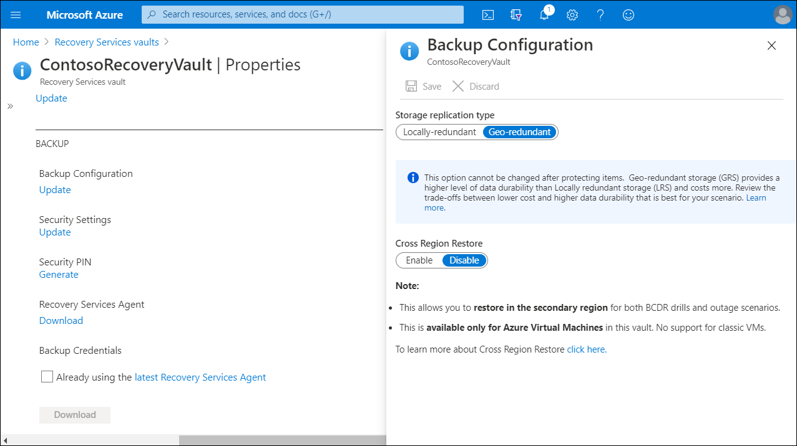

The Azure Backup service provides simple, secure, and cost-effective solutions to back up your data and recover it from the Azure cloud.

## Before you start

You'll need to do the following:
- Make sure that you have an Azure account if you will need to back up a server or client to Azure. If you don't have an account, you can create a free one in just a few minutes.
- Verify internet access on the machines that you want to back up.
- Ensure the user performing the MARS agent installation and configuration has local administrator privileges on the server to be protected.

> [!NOTE]
> The data that's available for backup depends on where the agent is installed.

## Modify storage replication

By default, vaults use GRS. If the vault is your primary backup mechanism, we recommend that you continue to use GRS. You can use LRS to reduce Azure storage costs. To modify the storage replication type, use the following procedure:

1. In the new vault, in the **Settings** section, select **Properties**.
2. On the **Properties** page, within **Backup Configuration**, select **Update**.
3. Select the storage replication type, and then select **Save**.

> [!CAUTION]
> You can't modify the storage replication type after you set up the vault and it contains backup items. If you want to do this, you need to re-create the vault.

## Download, install, and register the MARS agent

Download the MARS agent so that you can install it on the machines that you want to back up. If you've already installed the agent on any machines, make sure that you're running the latest version of the agent. Find the latest version in the Azure portal, or go directly to the download. Next, run the **MARSagentinstaller.exe** file on the machines that you want to back up, and complete the registration process.

## Run an on-demand backup

You can also run a backup at any time. To run an on-demand backup, use the following procedure:

1. In the MARS agent, select **Back Up Now**.

2. If the MARS agent version is 2.0.9169.0 or newer, then you can set a custom retention date. In the **Retain Backup Till** section, choose a date from the calendar.

3. On the **Confirmation** page, review the settings, and then select **Back Up**.

4. Select **Close** to close the wizard. If you close the wizard before the backup finishes, the wizard will continue to run in the background.

After the initial backup finishes, the Job completed status displays in the **Backup** console.

## Restore files to Windows Server using the MARS Agent

There are two main ways you can restore files using the MARS Agent. 

### Use Azure Instant Restore to recover data to the same machine

If you accidentally delete a file and want to restore it to the same machine from which the backup was taken, the following steps will help you recover the data.

1. Open the Microsoft Azure Backup snap-in. If you don't know where the snap-in was installed, search the computer or server for **Microsoft Azure Backup**. The desktop app should display in the search results.
2. Select **Recover Data** to start the wizard.
3. On the **Getting Started** page, to restore the data to the same server or computer, select **This server**, and then select **Next**.
4. On the **Select Recovery Mode** page, select **Individual files and folders**, and then select **Next**.

   > [!NOTE]
   > The option to restore individual files and folders requires Microsoft .NET Framework 4.5.2 or later. If you don't have the **Individual files and folders** option, you must upgrade .NET Framework to version 4.5.2 or later, and try again.

   > [!TIP]
   > The Individual files and folders option allows for quick access to the recovery point data. It's suitable for recovering individual files with sizes totaling less than 80 GB, and offers transfer or copy speeds up to 6 megabits per second (Mbps) during recovery. The Volume option recovers all backed up data in a specified volume. This option provides faster transfer speeds (up to 60 Mbps), which is ideal for recovering large-sized data or entire volumes.

5. On the **Select Volume and Date** page, select the volume that contains the files and folders you want to restore.
6. On the calendar, select a recovery point. Dates in **bold** indicate the availability of at least one recovery point. If multiple recovery points are available within a single date, choose the specific recovery point from the **Time** drop-down menu.
7. After choosing the recovery point to restore, select **Mount**. Azure Backup mounts the local recovery point, and uses it as a recovery volume.
8. On the **Browse and Recover Files** page, select **Browse** to open **File Explorer**, then browse to the files and folders you want to restore.
9. In Windows Explorer, copy the files and folders you want to restore, and then paste them to any location local to the server or computer. You can open or stream the files directly from the recovery volume, and verify that you are recovering the correct versions.
10. When you're finished, on the **Browse and Recover Files** page, select **Unmount**, and then select **Yes** to confirm that you want to unmount the volume.

### Use Instant Restore to restore data to an alternate machine

If your entire server is lost, you can still recover data from Azure Backup to a different machine. To understand the steps for completing the process, you must understand the terminology used with it:

- *Source machine*: This is the original machine from which the backup was taken, and which is currently unavailable.
- *Target machine*: This is the machine to which the data is being recovered.
- *Sample vault*: This is the Recovery Services vault to which the source machine and target machine are registered.

> [!TIP]
> You can't restore backups to a target machine that is running an earlier version of the operating system (OS). For example, a backup that you take from a Windows 10 computer can't be restored to a Windows 8 computer.

To recover data from Azure Backup to a different machine:

1. Open the **Microsoft Azure Backup** snap-in on the target machine.
2. Ensure that the target machine and the source machine are registered to the same Recovery Services vault.
3. Select **Recover Data**.
4. In the **Recover Data Wizard**, on the **Getting Started** page, select **Another server**.
5. Provide the vault credential file that corresponds to the sample vault, and then select **Next**. After you provide a valid vault credential, the name of the corresponding backup vault should display.

   > [!TIP]
   > If the vault credential file is invalid (or expired), download a new vault credential file from the sample vault in the Azure portal.

6. On the **Select Backup Server** page, select the source machine from the list of displayed machines, provide the passphrase, and then select **Next**.
7. On the **Select Recovery Mode** page, select **Individual files and folders**, and then select **Next**.
8. On the **Select Volume and Date** page, select the volume that contains the files and folders you want to restore.
9. On the calendar, select a recovery point. Dates in **bold** indicate the availability of at least one recovery point. If multiple recovery points are available within a single date, choose the specific recovery point from the **Time** drop-down menu.
10. Select **Mount** to locally mount the recovery point as a recovery volume on your target machine.
11. On the **Browse And Recover Files** page, select **Browse** to open **Windows Explorer**, and find the files and folders you want.
12. In Windows Explorer, copy the files and folders from the recovery volume, and paste them to your target machine location. You can open or stream the files directly from the recovery volume, and verify that the correct versions are recovered.
13. When you are finished, on the **Browse and Recover Files** page, select **Unmount**. Then select **Yes** to confirm that you want to unmount the volume.

   > [!NOTE]
   > If you don't select **Unmount**, the recovery volume will remain mounted for 6 hours from the time when it was mounted. However, the mount time is extended up to a maximum of 24 hours in case of an ongoing file-copy. No backup operations will run while the volume is mounted. Any backup operation scheduled to run during the time when the volume is mounted will run after the recovery volume is unmounted.
