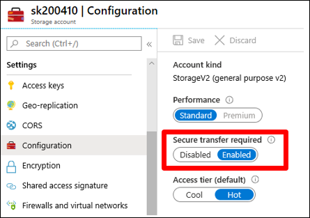
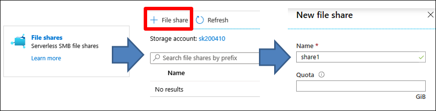

Before users at Contoso can access Azure Files they must first authenticate, and anonymous access isn't supported. As lead system engineer, you'll need to know the authentications methods that Azure Files supports, described in the following table.

|Authentication method|Description|
|------------------------------------------------------------|------------------------------------------------------------|
|Identity-based authentication over SMB| Preferable when accessing Azure Files, it provides the same seamless single sign-on (SSO) experience when accessing Azure file shares as accessing on-premises file shares. Identity-based authentication supports Kerberos authentication that uses identities from Azure AD or AD DS.|
|Access key| An access key is an older and less flexible option. An Azure storage account has two access keys that can be used when making a request to the storage account, including to Azure Files. Access keys are static and provide full control access to Azure Files. Access keys should be secured and not shared with users, because they bypass all access control restrictions. A best practice is to avoid sharing storage account keys and use identity-based authentication whenever possible.|
|A Shared Access Signature (SAS)| SAS is a dynamically generated Uniform Resource Identifier (URI) that's based on the storage access key. SAS provides restricted access rights to an Azure storage account, including to Azure Files. Restrictions include allowed permissions, start and expiry time, allowed IP addresses from where requests can be sent, and allowed protocols. An SAS is mostly used to provide API access from code.|

### Use identity-based authentication

You can enable identity-based authentication on Azure storage accounts. However, before you can do this you must first set up your domain environment. For Azure AD authentication, you must enable Azure AD DS. For AD DS authentication, you must ensure that AD DS is syncing with Azure AD and then domain join the storage account. In both cases, users can authenticate and access Azure file shares only from devices or VMs that are domain-joined.

![The diagram depicts how identity-based authentication works with Azure file shares. A client computer has two-way communication with Active Directory Domain Services (AD DS) and with Microsoft Azure AD Domain Services. AD DS and Azure AD Domain Services are mutually exclusive—a client can use only one of them as an identity store. When the client wants to access an Azure file share, it contacts AD DS or Azure AD Domain Services, where it gets authenticates and receives a Kerberos ticket for accessing the Azure file share. The client computer sends the Kerberos ticket to the Azure file share, which grants access to the share's content.](../media/m11-authenticate-identities-003.png)

After you enable identity-based authentication for a storage account, users can access files on the Azure file share with their sign-in credentials. When a user tries to access data in Azure Files, the request is sent to Azure AD for authentication. If authentication succeeds, Azure AD returns a Kerberos token. The user then sends a request that includes the Kerberos token, and the Azure file share uses that token to authorize the request. AD DS authentication works in the same way, where AD DS provides the Kerberos token.

### Configure Azure file share permissions

If you have enabled identity-based authentication, you can use role-based access control (RBAC) roles to control access rights (or, *permissions*) to Azure file shares. Azure includes the Azure file shares' related roles in the following table.

|Role|Description|
|------------------------------------------------|------------------------------------------------------------|
|Storage File Data SMB Share Contributor|Users in this role have read, write, and delete access in Azure Storage file shares over SMB.|
|Storage File Data SMB Share Elevated Contributor|Users in this role have read, write, delete, and modify NTFS permission access in Azure Storage file shares over SMB. This role has full control permissions to the Azure file share.|
|Storage File Data SMB Share Reader|Users in this role have read access to the Azure file share over SMB.|

If needed, you can also create and use custom RBAC roles. However, RBAC roles grant access to a share only. To access files, a user must also have file-level permissions.

Azure file shares enforce standard Windows file permissions at the folder and file level. You can mount the share and configure permissions over SMB in the same way as with on-premises file shares.

> [!IMPORTANT]
> Full administrative control of an Azure file share, including the ability to take ownership of a file, requires using the storage account key. Administrative control isn't supported with Azure AD credentials.

### Data encryption

All data that's stored in an Azure storage account (which includes the data on Azure file shares), is always encrypted at rest by using Storage Service Encryption (SSE). Data is encrypted as it's written in Azure datacenters, and it's automatically decrypted when you access it. By default, data encrypts by using Microsoft managed keys, but you can choose to bring your own encryption key.

By default, all Azure storage accounts have encryption-in-transit enabled. This ensures that all data is encrypted when transferring from the Azure datacenter to your device. Unencrypted access by using SMB 2.1 and SMB 3.0 without encryption or HTTP isn't allowed by default, and clients aren't able to connect to Azure file shares without encryption. This can be configured for an Azure storage account and is effective for all storage account services.

### Creating Azure file shares

Azure Files deploys as part of an Azure storage account. Settings that you specify when creating an Azure storage account—such as location, replication, and connectivity method—also apply to Azure Files. Some Azure storage account settings, such as performance and account type, can limit options that are available for Azure Files. For example, if you want to use premium file shares, which use SSDs, you must select premium performance and the FileStorage type of storage account when creating the Azure storage account.

After an Azure storage account is in place, you can create an Azure file share by using the Azure portal, Azure PowerShell, Azure Command-Line Interface (Azure CLI), or REST API. You can also create an Azure storage account by using Windows Admin Center when you're deploying Azure File Sync. When you're creating an Azure file share, you must provide the file share name and optionally set the quota. A quota limits the total size of files that can be stored on the file share.

To create an Azure file share, use the following procedure:

1. In the Azure portal, select the appropriate storage account.
2. In the navigation pane, under **File service**, select **File shares**.
3. In the details pane, on the toolbar, select **+ File share**.
4. In the **New file share** blade, enter the desired **Name** and **Quota** values, and then select **Create**.
